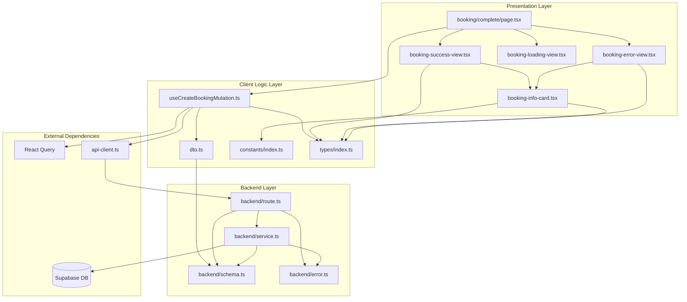

# booking-complete 페이지 모듈화 설계

## 개요

예약 완료 페이지는 사용자가 예약 정보 입력 후 '입력 완료하기' 버튼을 클릭하면 서버에서 트랜잭션으로 예매를 확정하고, 그 결과를 표시하는 페이지입니다.

### 주요 기능
1. 예매 확정 API 호출 (트랜잭션 기반)
2. 고유 예약번호 발급 및 표시
3. 예약 상세 정보 확인 (콘서트, 좌석, 예매자, 금액)
4. 성공/실패 처리 및 적절한 피드백
5. 네비게이션 제공 (홈으로, 예약 조회)

### 모듈 목록

| 모듈명 | 위치 | 설명 |
|--------|------|------|
| **Backend: Booking Route** | `src/features/bookings/backend/route.ts` | Hono 라우터 정의 (POST /bookings) |
| **Backend: Booking Service** | `src/features/bookings/backend/service.ts` | 예매 트랜잭션 비즈니스 로직 |
| **Backend: Booking Schema** | `src/features/bookings/backend/schema.ts` | Zod 스키마 (요청/응답) |
| **Backend: Booking Error** | `src/features/bookings/backend/error.ts` | 에러 코드 정의 |
| **Frontend: DTO** | `src/features/bookings/lib/dto.ts` | 클라이언트용 DTO 재노출 |
| **Frontend: Constants** | `src/features/bookings/constants/index.ts` | 상수 및 설정값 |
| **Frontend: Hook - Create Booking** | `src/features/bookings/hooks/useCreateBookingMutation.ts` | 예매 확정 Mutation Hook |
| **Frontend: Component - Complete Page** | `src/app/booking/complete/page.tsx` | 예약 완료 페이지 |
| **Frontend: Component - Success View** | `src/features/bookings/components/booking-success-view.tsx` | 예약 성공 UI |
| **Frontend: Component - Error View** | `src/features/bookings/components/booking-error-view.tsx` | 예약 실패 UI |
| **Frontend: Component - Loading View** | `src/features/bookings/components/booking-loading-view.tsx` | 처리 중 UI |
| **Frontend: Component - Info Card** | `src/features/bookings/components/booking-info-card.tsx` | 예약 정보 카드 (재사용 가능) |
| **Shared: Booking Types** | `src/features/bookings/types/index.ts` | 공통 타입 정의 |

---

## Diagram



---

## Implementation Plan

### 1. Backend: Booking Error Codes

**파일**: `src/features/bookings/backend/error.ts`

**목적**: 예매 프로세스에서 발생 가능한 모든 에러 코드를 정의

**구현 내용**:
```typescript
export const bookingErrorCodes = {
  validationError: 'BOOKING_VALIDATION_ERROR',
  seatUnavailable: 'SEAT_UNAVAILABLE',
  sessionExpired: 'SESSION_EXPIRED',
  sessionMismatch: 'SESSION_MISMATCH',
  concertNotFound: 'CONCERT_NOT_FOUND',
  transactionFailed: 'TRANSACTION_FAILED',
  hashingFailed: 'PASSWORD_HASHING_FAILED',
  databaseError: 'DATABASE_ERROR',
} as const;

export type BookingServiceError = typeof bookingErrorCodes[keyof typeof bookingErrorCodes];
```

**Unit Test**:
- 모든 에러 코드가 unique한지 확인
- 에러 코드 타입이 올바르게 추론되는지 확인

---

### 2. Backend: Booking Schema

**파일**: `src/features/bookings/backend/schema.ts`

**목적**: 예매 생성 요청/응답 스키마를 Zod로 정의

**구현 내용**:
```typescript
export const CreateBookingRequestSchema = z.object({
  concertId: z.string().uuid(),
  seatIds: z.array(z.string().uuid()).min(1).max(6),
  sessionId: z.string().min(1),
  bookerName: z.string().trim().min(1).max(100),
  phoneNumber: z.string().regex(/^010-\d{4}-\d{4}$/),
  password: z.string().regex(/^\d{4}$/),
});

export const BookingResponseSchema = z.object({
  id: z.string().uuid(),
  concertId: z.string().uuid(),
  concertTitle: z.string(),
  venue: z.string(),
  startDate: z.string(),
  bookerName: z.string(),
  phoneNumber: z.string(),
  seats: z.array(z.object({
    id: z.string().uuid(),
    section: z.string(),
    rowNumber: z.string(),
    seatNumber: z.string(),
    grade: z.string(),
    price: z.number(),
  })),
  totalAmount: z.number(),
  status: z.enum(['confirmed', 'cancelled']),
  createdAt: z.string(),
});

export type CreateBookingRequest = z.infer<typeof CreateBookingRequestSchema>;
export type BookingResponse = z.infer<typeof BookingResponseSchema>;
```

**Unit Test**:
- 유효한 요청 데이터가 파싱되는지 확인
- 잘못된 형식(전화번호, 비밀번호)이 거부되는지 확인
- seatIds가 1~6개 범위를 벗어나면 실패하는지 확인

---

### 3. Backend: Booking Service

**파일**: `src/features/bookings/backend/service.ts`

**목적**: 예매 트랜잭션 비즈니스 로직 구현

**구현 내용**:

```typescript
import type { SupabaseClient } from '@supabase/supabase-js';
import { match } from 'ts-pattern';
import bcrypt from 'bcryptjs';

export const createBooking = async (
  supabase: SupabaseClient,
  request: CreateBookingRequest,
): Promise<HandlerResult<BookingResponse, BookingServiceError>> => {
  // 1. Hash password
  let passwordHash: string;
  try {
    passwordHash = await bcrypt.hash(request.password, 10);
  } catch (error) {
    return failure(500, bookingErrorCodes.hashingFailed, '비밀번호 처리 중 오류가 발생했습니다.');
  }

  // 2. Start transaction
  const { data: transactionData, error: transactionError } = await supabase.rpc('begin_transaction');

  // 3. Verify seats with FOR UPDATE lock
  const { data: seats, error: seatError } = await supabase
    .from('seats')
    .select('*')
    .in('id', request.seatIds)
    .eq('status', 'reserved')
    .eq('session_id', request.sessionId)
    .for('update', { skipLocked: false });

  if (seatError || !seats || seats.length !== request.seatIds.length) {
    await supabase.rpc('rollback_transaction');
    return failure(409, bookingErrorCodes.seatUnavailable, '선택하신 좌석이 이미 예매되었습니다.');
  }

  // 4. Check session timeout
  const now = new Date();
  const hasExpired = seats.some(seat => {
    const reservedAt = new Date(seat.reserved_at);
    const diff = now.getTime() - reservedAt.getTime();
    return diff > 10 * 60 * 1000; // 10 minutes
  });

  if (hasExpired) {
    await supabase.rpc('rollback_transaction');
    return failure(400, bookingErrorCodes.sessionExpired, '예약 시간이 만료되었습니다.');
  }

  // 5. Calculate total amount
  const totalAmount = seats.reduce((sum, seat) => sum + seat.price, 0);

  // 6. Insert booking record
  const { data: booking, error: bookingError } = await supabase
    .from('bookings')
    .insert({
      concert_id: request.concertId,
      booker_name: request.bookerName,
      phone_number: request.phoneNumber,
      password_hash: passwordHash,
      total_amount: totalAmount,
      status: 'confirmed',
    })
    .select()
    .single();

  if (bookingError || !booking) {
    await supabase.rpc('rollback_transaction');
    return failure(500, bookingErrorCodes.transactionFailed, '예매 처리 중 오류가 발생했습니다.');
  }

  // 7. Update seats to booked
  const { error: updateError } = await supabase
    .from('seats')
    .update({
      status: 'booked',
      booking_id: booking.id,
      session_id: null,
      reserved_at: null,
    })
    .in('id', request.seatIds);

  if (updateError) {
    await supabase.rpc('rollback_transaction');
    return failure(500, bookingErrorCodes.transactionFailed, '좌석 상태 업데이트 중 오류가 발생했습니다.');
  }

  // 8. Commit transaction
  const { error: commitError } = await supabase.rpc('commit_transaction');

  if (commitError) {
    return failure(500, bookingErrorCodes.transactionFailed, '예매 완료 처리 중 오류가 발생했습니다.');
  }

  // 9. Fetch concert info
  const { data: concert, error: concertError } = await supabase
    .from('concerts')
    .select('title, venue, start_date')
    .eq('id', request.concertId)
    .single();

  if (concertError || !concert) {
    return failure(404, bookingErrorCodes.concertNotFound, '콘서트 정보를 찾을 수 없습니다.');
  }

  // 10. Return success
  return success({
    id: booking.id,
    concertId: request.concertId,
    concertTitle: concert.title,
    venue: concert.venue,
    startDate: concert.start_date,
    bookerName: request.bookerName,
    phoneNumber: request.phoneNumber,
    seats: seats.map(seat => ({
      id: seat.id,
      section: seat.section,
      rowNumber: seat.row_number,
      seatNumber: seat.seat_number,
      grade: seat.grade,
      price: seat.price,
    })),
    totalAmount,
    status: 'confirmed',
    createdAt: booking.created_at,
  }, 201);
};
```

**Unit Test**:
- 정상 플로우: 좌석 선점 → 예매 생성 → 좌석 booked 변경
- 엣지케이스 1: 세션 ID 불일치 시 409 반환
- 엣지케이스 2: 세션 타임아웃 시 400 반환
- 엣지케이스 3: 트랜잭션 실패 시 롤백 및 500 반환
- 엣지케이스 4: 비밀번호 해싱 실패 시 500 반환

---

### 4. Backend: Booking Route

**파일**: `src/features/bookings/backend/route.ts`

**목적**: POST /bookings 엔드포인트 정의

**구현 내용**:
```typescript
import type { Hono } from 'hono';
import { failure, respond } from '@/backend/http/response';
import { getLogger, getSupabase, type AppEnv } from '@/backend/hono/context';
import { bookingErrorCodes } from '@/features/bookings/backend/error';
import { createBooking } from '@/features/bookings/backend/service';
import { CreateBookingRequestSchema } from '@/features/bookings/backend/schema';

export const registerBookingRoutes = (app: Hono<AppEnv>) => {
  app.post('/bookings', async (c) => {
    const logger = getLogger(c);
    const body = await c.req.json();
    const parsed = CreateBookingRequestSchema.safeParse(body);

    if (!parsed.success) {
      logger.warn('예매 생성 요청 검증 실패', parsed.error.flatten());
      return respond(
        c,
        failure(400, bookingErrorCodes.validationError, '요청 데이터가 올바르지 않습니다.', parsed.error.format()),
      );
    }

    const supabase = getSupabase(c);
    const result = await createBooking(supabase, parsed.data);

    if (!result.ok) {
      logger.error('예매 생성 중 오류 발생', result.error.message);
    } else {
      logger.info('예매 생성 성공', { bookingId: result.data.id });
    }

    return respond(c, result);
  });
};
```

**Unit Test**:
- 유효한 요청이 서비스 레이어로 전달되는지 확인
- 스키마 검증 실패 시 400 반환 확인
- 서비스 레이어 에러가 올바르게 전파되는지 확인

---

### 5. Backend: Register Routes (Hono App)

**파일**: `src/backend/hono/app.ts`

**수정 내용**:
```typescript
import { registerBookingRoutes } from '@/features/bookings/backend/route';

// ... existing code ...

export const createHonoApp = () => {
  // ... existing middleware ...
  
  registerExampleRoutes(app);
  registerConcertRoutes(app);
  registerSeatRoutes(app);
  registerBookingRoutes(app); // 추가

  return app;
};
```

---

### 6. Frontend: Constants

**파일**: `src/features/bookings/constants/index.ts`

**구현 내용**:
```typescript
export const BOOKING_FEATURE_KEY = 'bookings';

export const BOOKING_CACHE_TIME_MS = 5 * 60 * 1000; // 5분

export const BOOKING_STATUS = {
  confirmed: 'confirmed',
  cancelled: 'cancelled',
} as const;

export const BOOKING_STATUS_LABELS = {
  [BOOKING_STATUS.confirmed]: '예매 확정',
  [BOOKING_STATUS.cancelled]: '예매 취소',
} as const;

export const SEAT_GRADE_LABELS = {
  vip: 'VIP석',
  r: 'R석',
  s: 'S석',
  a: 'A석',
} as const;
```

---

### 7. Frontend: Types

**파일**: `src/features/bookings/types/index.ts`

**구현 내용**:
```typescript
export type SeatGrade = 'vip' | 'r' | 's' | 'a';

export type SeatInfo = {
  id: string;
  section: string;
  rowNumber: string;
  seatNumber: string;
  grade: SeatGrade;
  price: number;
};

export type BookingInfo = {
  id: string;
  concertId: string;
  concertTitle: string;
  venue: string;
  startDate: string;
  bookerName: string;
  phoneNumber: string;
  seats: SeatInfo[];
  totalAmount: number;
  status: 'confirmed' | 'cancelled';
  createdAt: string;
};

export type CreateBookingPayload = {
  concertId: string;
  seatIds: string[];
  sessionId: string;
  bookerName: string;
  phoneNumber: string;
  password: string;
};
```

---

### 8. Frontend: DTO

**파일**: `src/features/bookings/lib/dto.ts`

**구현 내용**:
```typescript
export {
  CreateBookingRequestSchema,
  BookingResponseSchema,
  type CreateBookingRequest,
  type BookingResponse,
} from '@/features/bookings/backend/schema';
```

---

### 9. Frontend: Hook - Create Booking Mutation

**파일**: `src/features/bookings/hooks/useCreateBookingMutation.ts`

**구현 내용**:
```typescript
"use client";

import { useMutation } from '@tanstack/react-query';
import { apiClient, extractApiErrorMessage } from '@/lib/remote/api-client';
import {
  BookingResponseSchema,
  type CreateBookingRequest,
} from '@/features/bookings/lib/dto';

export const useCreateBookingMutation = () => {
  return useMutation({
    mutationFn: async (payload: CreateBookingRequest) => {
      try {
        const { data } = await apiClient.post('/api/bookings', payload);
        return BookingResponseSchema.parse(data);
      } catch (error) {
        const message = extractApiErrorMessage(error, '예매 처리 중 오류가 발생했습니다.');
        throw new Error(message);
      }
    },
  });
};
```

**Unit Test**:
- API 호출이 올바른 페이로드로 전송되는지 확인
- 성공 응답이 스키마로 파싱되는지 확인
- 에러 응답이 적절한 메시지로 변환되는지 확인

---

### 10. Frontend: Component - Booking Info Card

**파일**: `src/features/bookings/components/booking-info-card.tsx`

**목적**: 예약 정보를 표시하는 재사용 가능한 카드 컴포넌트

**구현 내용**:
```tsx
"use client";

import { Card, CardContent, CardHeader, CardTitle } from '@/components/ui/card';
import { SEAT_GRADE_LABELS } from '@/features/bookings/constants';
import type { SeatInfo } from '@/features/bookings/types';
import { format } from 'date-fns';
import { ko } from 'date-fns/locale';

type BookingInfoCardProps = {
  concertTitle: string;
  venue: string;
  startDate: string;
  seats: SeatInfo[];
  totalAmount: number;
  bookerName: string;
  phoneNumber: string;
  bookingId?: string;
  createdAt?: string;
};

export function BookingInfoCard({
  concertTitle,
  venue,
  startDate,
  seats,
  totalAmount,
  bookerName,
  phoneNumber,
  bookingId,
  createdAt,
}: BookingInfoCardProps) {
  const formattedStartDate = format(new Date(startDate), 'yyyy년 M월 d일 (E) HH:mm', { locale: ko });
  const formattedCreatedAt = createdAt
    ? format(new Date(createdAt), 'yyyy년 M월 d일 HH:mm:ss', { locale: ko })
    : null;

  return (
    <Card className="border-slate-700 bg-slate-800">
      <CardHeader>
        <CardTitle className="text-xl text-white">{concertTitle}</CardTitle>
      </CardHeader>
      <CardContent className="space-y-4 text-slate-200">
        <div className="space-y-2">
          <div className="flex justify-between text-sm">
            <span className="text-slate-400">공연 장소</span>
            <span>{venue}</span>
          </div>
          <div className="flex justify-between text-sm">
            <span className="text-slate-400">공연 일시</span>
            <span>{formattedStartDate}</span>
          </div>
        </div>

        <hr className="border-slate-700" />

        <div className="space-y-2">
          <h3 className="text-sm font-semibold text-slate-300">예매 좌석</h3>
          <div className="space-y-1">
            {seats.map((seat) => (
              <div key={seat.id} className="flex justify-between text-sm">
                <span className="text-slate-400">
                  {SEAT_GRADE_LABELS[seat.grade]} {seat.section}구역 {seat.rowNumber}행 {seat.seatNumber}번
                </span>
                <span>{seat.price.toLocaleString()}원</span>
              </div>
            ))}
          </div>
        </div>

        <hr className="border-slate-700" />

        <div className="flex justify-between text-base font-semibold">
          <span className="text-slate-300">총 결제 금액</span>
          <span className="text-amber-400">{totalAmount.toLocaleString()}원</span>
        </div>

        <hr className="border-slate-700" />

        <div className="space-y-2">
          <h3 className="text-sm font-semibold text-slate-300">예매자 정보</h3>
          <div className="flex justify-between text-sm">
            <span className="text-slate-400">이름</span>
            <span>{bookerName}</span>
          </div>
          <div className="flex justify-between text-sm">
            <span className="text-slate-400">휴대폰 번호</span>
            <span>{phoneNumber}</span>
          </div>
        </div>

        {bookingId && (
          <>
            <hr className="border-slate-700" />
            <div className="space-y-2">
              <div className="flex justify-between text-sm">
                <span className="text-slate-400">예약번호</span>
                <span className="font-mono text-xs text-amber-400">{bookingId}</span>
              </div>
              {formattedCreatedAt && (
                <div className="flex justify-between text-sm">
                  <span className="text-slate-400">예약 일시</span>
                  <span className="text-xs">{formattedCreatedAt}</span>
                </div>
              )}
            </div>
          </>
        )}
      </CardContent>
    </Card>
  );
}
```

**QA Sheet**:
| 항목 | 확인 내용 |
|------|----------|
| Props 검증 | 모든 필수 props가 올바르게 전달되는가? |
| 날짜 포맷 | 한국어 로케일로 날짜가 표시되는가? |
| 좌석 목록 | 모든 좌석 정보가 정확하게 렌더링되는가? |
| 가격 표시 | 천단위 구분자가 적용되는가? |
| 조건부 렌더링 | bookingId, createdAt이 없을 때 해당 섹션이 숨겨지는가? |
| 접근성 | 스크린리더로 모든 정보가 읽히는가? |

---

### 11. Frontend: Component - Booking Success View

**파일**: `src/features/bookings/components/booking-success-view.tsx`

**구현 내용**:
```tsx
"use client";

import { CheckCircle } from 'lucide-react';
import { Button } from '@/components/ui/button';
import { BookingInfoCard } from '@/features/bookings/components/booking-info-card';
import type { BookingInfo } from '@/features/bookings/types';
import { useRouter } from 'next/navigation';

type BookingSuccessViewProps = {
  booking: BookingInfo;
};

export function BookingSuccessView({ booking }: BookingSuccessViewProps) {
  const router = useRouter();

  return (
    <div className="mx-auto max-w-2xl space-y-6">
      <div className="flex flex-col items-center gap-4 text-center">
        <CheckCircle className="h-16 w-16 text-green-500" />
        <h1 className="text-2xl font-bold text-white">예약이 완료되었습니다!</h1>
        <p className="text-sm text-slate-300">
          예약번호를 안전하게 보관하시고, 예매 시 입력하신 휴대폰 번호와 비밀번호로 조회하실 수 있습니다.
        </p>
      </div>

      <BookingInfoCard
        concertTitle={booking.concertTitle}
        venue={booking.venue}
        startDate={booking.startDate}
        seats={booking.seats}
        totalAmount={booking.totalAmount}
        bookerName={booking.bookerName}
        phoneNumber={booking.phoneNumber}
        bookingId={booking.id}
        createdAt={booking.createdAt}
      />

      <div className="flex flex-col gap-3 sm:flex-row">
        <Button
          variant="outline"
          className="flex-1 border-slate-600 bg-slate-800 text-white hover:bg-slate-700"
          onClick={() => router.push('/')}
        >
          홈으로 돌아가기
        </Button>
        <Button
          className="flex-1 bg-amber-500 text-slate-950 hover:bg-amber-600"
          onClick={() => router.push('/lookup')}
        >
          예약 조회하기
        </Button>
      </div>
    </div>
  );
}
```

**QA Sheet**:
| 항목 | 확인 내용 |
|------|----------|
| 성공 아이콘 | CheckCircle 아이콘이 정상적으로 표시되는가? |
| 메시지 명확성 | 예약 완료 메시지가 사용자에게 명확한가? |
| 정보 카드 | BookingInfoCard가 올바른 데이터로 렌더링되는가? |
| 네비게이션 버튼 | 홈, 예약조회 버튼이 올바르게 동작하는가? |
| 반응형 디자인 | 모바일/데스크톱에서 레이아웃이 올바른가? |

---

### 12. Frontend: Component - Booking Error View

**파일**: `src/features/bookings/components/booking-error-view.tsx`

**구현 내용**:
```tsx
"use client";

import { XCircle } from 'lucide-react';
import { Button } from '@/components/ui/button';
import { Card, CardContent } from '@/components/ui/card';
import { useRouter } from 'next/navigation';

type BookingErrorViewProps = {
  errorMessage: string;
  errorCode?: string;
  onRetry?: () => void;
};

const getRedirectPath = (errorCode?: string) => {
  if (!errorCode) return '/';
  
  if (errorCode === 'SEAT_UNAVAILABLE' || errorCode === 'SESSION_EXPIRED' || errorCode === 'SESSION_MISMATCH') {
    return '/booking/seats';
  }
  
  return '/';
};

export function BookingErrorView({ errorMessage, errorCode, onRetry }: BookingErrorViewProps) {
  const router = useRouter();
  const redirectPath = getRedirectPath(errorCode);

  return (
    <div className="mx-auto max-w-2xl space-y-6">
      <div className="flex flex-col items-center gap-4 text-center">
        <XCircle className="h-16 w-16 text-red-500" />
        <h1 className="text-2xl font-bold text-white">예약 처리에 실패했습니다</h1>
        <p className="text-sm text-slate-300">
          {errorMessage}
        </p>
      </div>

      <Card className="border-red-800 bg-red-900/20">
        <CardContent className="pt-6">
          <div className="space-y-2 text-sm text-slate-300">
            <p>다음 사항을 확인해 주세요:</p>
            <ul className="list-inside list-disc space-y-1 pl-2">
              <li>선택하신 좌석이 여전히 예매 가능한지 확인하세요.</li>
              <li>네트워크 연결 상태를 확인하세요.</li>
              <li>잠시 후 다시 시도해 주세요.</li>
            </ul>
          </div>
        </CardContent>
      </Card>

      <div className="flex flex-col gap-3 sm:flex-row">
        {onRetry && (
          <Button
            variant="outline"
            className="flex-1 border-slate-600 bg-slate-800 text-white hover:bg-slate-700"
            onClick={onRetry}
          >
            다시 시도
          </Button>
        )}
        <Button
          className="flex-1 bg-amber-500 text-slate-950 hover:bg-amber-600"
          onClick={() => router.push(redirectPath)}
        >
          {redirectPath === '/booking/seats' ? '좌석 선택으로' : '홈으로 돌아가기'}
        </Button>
      </div>
    </div>
  );
}
```

**QA Sheet**:
| 항목 | 확인 내용 |
|------|----------|
| 에러 아이콘 | XCircle 아이콘이 정상적으로 표시되는가? |
| 에러 메시지 | 에러 메시지가 사용자에게 명확하게 전달되는가? |
| 에러 코드별 리다이렉트 | 에러 코드에 따라 적절한 페이지로 이동하는가? |
| 재시도 버튼 | onRetry가 제공될 때만 재시도 버튼이 표시되는가? |
| 가이드 메시지 | 사용자가 다음에 취할 행동이 명확한가? |

---

### 13. Frontend: Component - Booking Loading View

**파일**: `src/features/bookings/components/booking-loading-view.tsx`

**구현 내용**:
```tsx
"use client";

import { Loader2 } from 'lucide-react';

export function BookingLoadingView() {
  return (
    <div className="mx-auto flex max-w-2xl flex-col items-center gap-4 py-16 text-center">
      <Loader2 className="h-16 w-16 animate-spin text-amber-500" />
      <h1 className="text-2xl font-bold text-white">예약을 처리하고 있습니다</h1>
      <p className="text-sm text-slate-300">
        잠시만 기다려주세요. 좌석을 확정하고 예약번호를 발급하는 중입니다.
      </p>
      <p className="text-xs text-slate-400">
        이 창을 닫지 마세요.
      </p>
    </div>
  );
}
```

**QA Sheet**:
| 항목 | 확인 내용 |
|------|----------|
| 스피너 애니메이션 | Loader2 아이콘이 회전하는가? |
| 메시지 명확성 | 처리 중 메시지가 사용자에게 명확한가? |
| 경고 메시지 | 창을 닫지 말라는 경고가 표시되는가? |
| 레이아웃 정렬 | 중앙 정렬이 올바르게 적용되는가? |

---

### 14. Frontend: Page - Booking Complete

**파일**: `src/app/booking/complete/page.tsx`

**구현 내용**:
```tsx
"use client";

import { useEffect, useState } from 'react';
import { useSearchParams, useRouter } from 'next/navigation';
import { PrimaryHeader } from '@/components/layout/header';
import { BookingSuccessView } from '@/features/bookings/components/booking-success-view';
import { BookingErrorView } from '@/features/bookings/components/booking-error-view';
import { BookingLoadingView } from '@/features/bookings/components/booking-loading-view';
import { useCreateBookingMutation } from '@/features/bookings/hooks/useCreateBookingMutation';
import type { CreateBookingPayload } from '@/features/bookings/types';

export default function BookingCompletePage() {
  const router = useRouter();
  const searchParams = useSearchParams();
  const [hasAttempted, setHasAttempted] = useState(false);
  
  const mutation = useCreateBookingMutation();

  useEffect(() => {
    if (hasAttempted) return;

    // Parse query params (passed from booking-info page)
    const concertId = searchParams.get('concertId');
    const seatIds = searchParams.get('seatIds')?.split(',') ?? [];
    const sessionId = searchParams.get('sessionId');
    const bookerName = searchParams.get('bookerName');
    const phoneNumber = searchParams.get('phoneNumber');
    const password = searchParams.get('password');

    if (!concertId || seatIds.length === 0 || !sessionId || !bookerName || !phoneNumber || !password) {
      router.replace('/');
      return;
    }

    const payload: CreateBookingPayload = {
      concertId,
      seatIds,
      sessionId,
      bookerName,
      phoneNumber,
      password,
    };

    mutation.mutate(payload);
    setHasAttempted(true);
  }, [hasAttempted, searchParams, mutation, router]);

  return (
    <div className="min-h-screen bg-gradient-to-b from-slate-950 via-slate-950 to-slate-900 text-white">
      <PrimaryHeader />

      <main className="container mx-auto max-w-6xl px-4 py-10">
        {mutation.isPending && <BookingLoadingView />}
        
        {mutation.isSuccess && (
          <BookingSuccessView booking={mutation.data} />
        )}
        
        {mutation.isError && (
          <BookingErrorView
            errorMessage={mutation.error.message}
            onRetry={() => {
              setHasAttempted(false);
              mutation.reset();
            }}
          />
        )}
      </main>
    </div>
  );
}
```

**QA Sheet**:
| 항목 | 확인 내용 |
|------|----------|
| Query Params 검증 | 필수 파라미터가 없을 때 홈으로 리다이렉트하는가? |
| 자동 API 호출 | 페이지 진입 시 자동으로 예매 API가 호출되는가? |
| 중복 호출 방지 | hasAttempted로 중복 호출이 방지되는가? |
| 상태별 뷰 렌더링 | isPending, isSuccess, isError 상태에 따라 올바른 뷰가 표시되는가? |
| 재시도 기능 | 재시도 버튼 클릭 시 mutation이 재실행되는가? |
| 반응형 디자인 | 모바일/데스크톱에서 레이아웃이 올바른가? |

---

## 추가 고려사항

### 보안
- 비밀번호는 절대 URL 파라미터로 전달하지 않고, POST body로만 전송
- 예약 완료 페이지에서는 비밀번호를 표시하지 않음
- 비밀번호 해시는 bcrypt로 salt rounds 10 이상 사용

### 성능
- React Query의 mutation을 사용하여 캐싱 및 재시도 로직 활용
- 트랜잭션 타임아웃 설정으로 장기 대기 방지

### UX
- 로딩 중 "창을 닫지 마세요" 경고 표시
- 에러 발생 시 적절한 페이지로 자동 리다이렉트 가이드
- 예약번호는 복사 가능하도록 font-mono 스타일 적용

### 테스트
- E2E 테스트: 좌석 선택 → 정보 입력 → 예약 완료 전체 플로우
- 통합 테스트: 백엔드 트랜잭션이 실제로 롤백되는지 확인
- 부하 테스트: 동시 다발적 예약 요청 시 Race Condition 방지 확인

---

## 의존성 패키지

### 추가 필요 패키지
```bash
npm install bcryptjs
npm install --save-dev @types/bcryptjs
```

### 기존 사용 패키지
- `@tanstack/react-query`: 서버 상태 관리
- `axios`: HTTP 클라이언트
- `zod`: 스키마 검증
- `date-fns`: 날짜 포맷팅
- `lucide-react`: 아이콘
- `next`: 라우팅 및 페이지
- `react`: UI 렌더링

---

## 완료 체크리스트

- [ ] Backend: error.ts 생성
- [ ] Backend: schema.ts 생성 및 단위 테스트
- [ ] Backend: service.ts 생성 및 단위 테스트
- [ ] Backend: route.ts 생성 및 통합 테스트
- [ ] Backend: Hono app에 라우터 등록
- [ ] Frontend: constants/index.ts 생성
- [ ] Frontend: types/index.ts 생성
- [ ] Frontend: lib/dto.ts 생성
- [ ] Frontend: hooks/useCreateBookingMutation.ts 생성 및 테스트
- [ ] Frontend: components/booking-info-card.tsx 생성 및 QA
- [ ] Frontend: components/booking-success-view.tsx 생성 및 QA
- [ ] Frontend: components/booking-error-view.tsx 생성 및 QA
- [ ] Frontend: components/booking-loading-view.tsx 생성 및 QA
- [ ] Frontend: app/booking/complete/page.tsx 생성 및 QA
- [ ] E2E 테스트 작성 및 실행
- [ ] 문서 업데이트 (README, API 문서)
