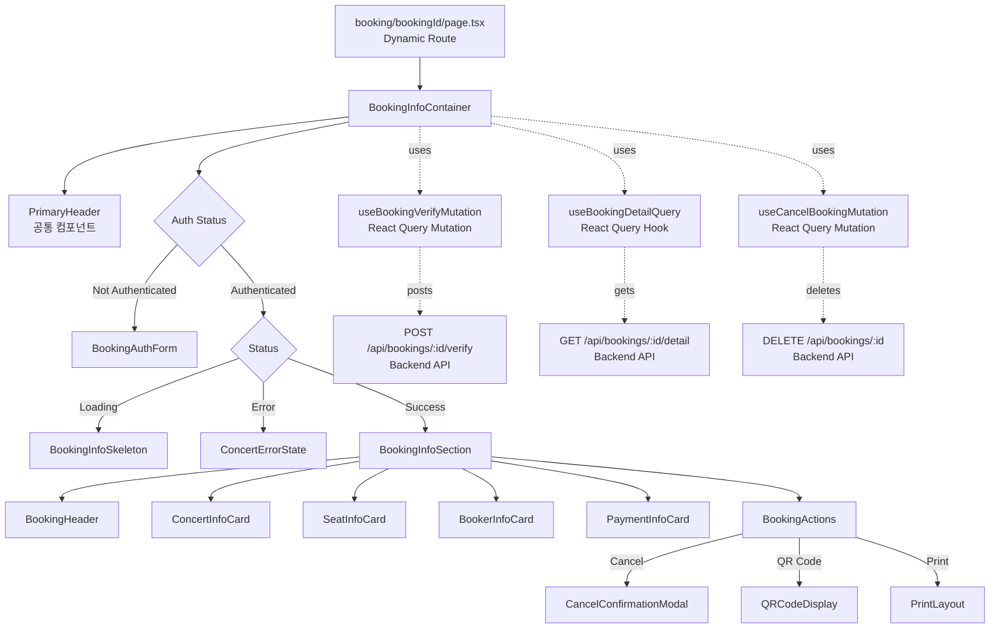
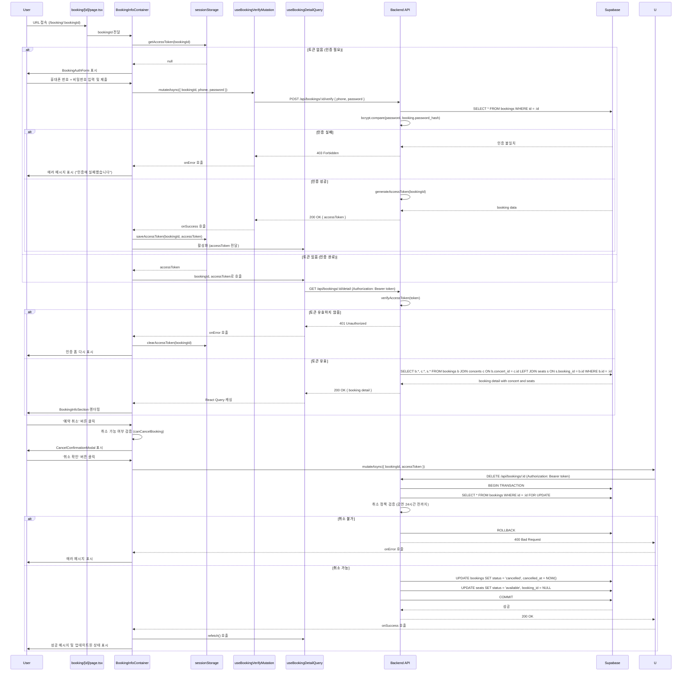
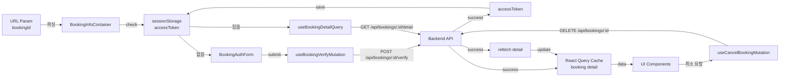

# 예약 정보 상세 (Booking Info) 페이지 구현 계획

## 1. 개요

### 1.1 페이지 정보
- **페이지 경로**: `/booking/:bookingId` (동적 라우트)
- **페이지 목적**: 예약 완료 후 또는 조회 후 예약의 상세 정보를 확인하고 관련 액션(취소, 공유, 출력)을 수행하는 페이지
- **관련 유스케이스**: [Usecase 006: 예약 조회](../../usecases/006/spec.md), [Usecase 007: 예약 취소](../../usecases/007/spec.md)

### 1.2 주요 기능
1. 예약 상세 정보 표시
   - 예약 번호 (UUID)
   - 콘서트 정보 (제목, 날짜, 시간, 장소)
   - 좌석 정보 (등급, 구역, 좌석 번호)
   - 예매자 정보 (이름, 연락처)
   - 결제 정보 (총 금액, 예매일)
   - 예약 상태 (confirmed/cancelled)
2. 예약 취소 기능
   - 취소 가능 여부 확인 (공연 24시간 전까지)
   - 취소 확인 모달
   - 취소 처리 및 결과 표시
3. QR 코드 생성 (입장 확인용)
4. 예약 정보 출력 (프린트 친화적 레이아웃)
5. 보안: 접근 권한 검증 (휴대폰 번호 + 비밀번호 인증)

### 1.3 상태 관리 전략
- **서버 상태**: `@tanstack/react-query` 를 사용하여 예약 상세 정보 캐싱 및 관리
- **로컬 UI 상태**: `useState` 를 사용하여 모달 및 인증 상태 관리
- **인증 전략**: sessionStorage를 통한 임시 인증 토큰 관리 (페이지 세션 동안 유효)
- **URL 상태**: bookingId 파라미터를 통한 예약 식별

### 1.4 보안 고려사항
- **접근 제어**: bookingId만으로 접근 시 휴대폰 번호 + 비밀번호 인증 필요
- **세션 관리**: 인증 성공 시 sessionStorage에 임시 토큰 저장
- **조회 페이지에서의 전환**: booking-search에서 인증 후 이동 시 인증 생략

## 2. 모듈 구조 설계

### 2.1 백엔드 모듈

#### 2.1.1 API Route
- **위치**: `src/features/bookings/backend/route.ts` (기존 파일 확장)
- **설명**: 예약 상세 조회 API 엔드포인트 추가
- **새 엔드포인트**:
  - `POST /api/bookings/:bookingId/verify` - 예약 접근 권한 검증 (phone + password)
  - `GET /api/bookings/:bookingId/detail` - 예약 상세 정보 조회 (인증 토큰 필요)
  - `DELETE /api/bookings/:bookingId` - 예약 취소 (기존 엔드포인트, 인증 토큰 추가 검증)

#### 2.1.2 Service
- **위치**: `src/features/bookings/backend/service.ts` (기존 파일 확장)
- **설명**: Supabase를 통한 예약 상세 조회 및 권한 검증 비즈니스 로직
- **새 함수**:
  - `verifyBookingAccess()`: 휴대폰 번호 + 비밀번호로 접근 권한 검증
  - `getBookingDetailById()`: 예약 상세 정보 조회 (콘서트 정보 + 좌석 정보 포함)
  - `generateAccessToken()`: 임시 접근 토큰 생성 (서명된 JWT)
  - `verifyAccessToken()`: 접근 토큰 검증

#### 2.1.3 Schema
- **위치**: `src/features/bookings/backend/schema.ts` (기존 파일 확장)
- **설명**: Zod 스키마를 사용한 요청/응답 타입 정의
- **새 스키마**:
  - `BookingVerifyRequestSchema`: 접근 권한 검증 요청 (bookingId, phoneNumber, password)
  - `BookingVerifyResponseSchema`: 검증 응답 (accessToken)
  - `BookingDetailRequestSchema`: bookingId 파라미터 검증
  - `BookingDetailWithSeatSchema`: 좌석 정보 포함 예약 상세
  - `BookingDetailResponseSchema`: 예약 상세 응답 (콘서트 + 좌석 정보)

#### 2.1.4 Error
- **위치**: `src/features/bookings/backend/error.ts` (기존 파일 확장)
- **설명**: 예약 상세 관련 에러 코드 추가
- **새 에러 코드**:
  - `BOOKING_ACCESS_DENIED`: 접근 권한 없음 (인증 실패)
  - `BOOKING_DETAIL_FETCH_ERROR`: 예약 상세 조회 실패
  - `INVALID_ACCESS_TOKEN`: 유효하지 않은 접근 토큰

### 2.2 프론트엔드 모듈

#### 2.2.1 Page Component
- **위치**: `src/app/booking/[bookingId]/page.tsx`
- **설명**: 예약 정보 페이지 루트 컴포넌트 (Client Component)
- **책임**: bookingId 파라미터 파싱 및 하위 컴포넌트 조합

#### 2.2.2 Main Container
- **위치**: `src/features/bookings/components/booking-info-container.tsx`
- **설명**: 예약 상세 조회 및 인증 상태 관리를 담당하는 컨테이너 컴포넌트
- **책임**:
  - 인증 상태 확인 (sessionStorage)
  - 인증되지 않은 경우 인증 폼 표시
  - 인증된 경우 예약 상세 정보 표시
  - 로딩/에러 상태 처리
  - 하위 presentational 컴포넌트에 데이터 전달

#### 2.2.3 Booking Auth Form
- **위치**: `src/features/bookings/components/booking-auth-form.tsx`
- **설명**: 예약 접근 권한 인증 폼 (휴대폰 번호 + 비밀번호)
- **Props**: `bookingId`, `onSuccess`
- **Features**:
  - 휴대폰 번호 입력 (형식: 010-1234-5678)
  - 4자리 비밀번호 입력
  - 실시간 검증
  - 제출 버튼 활성화/비활성화

#### 2.2.4 Booking Info Section
- **위치**: `src/features/bookings/components/booking-info-section.tsx`
- **설명**: 예약 정보의 전체 섹션 (콘서트 정보 + 좌석 정보 + 예매자 정보)
- **Props**: `booking` (전체 예약 상세 정보)
- **하위 컴포넌트**:
  - `BookingHeader`: 예약 번호 및 상태 표시
  - `ConcertInfoCard`: 콘서트 기본 정보
  - `SeatInfoCard`: 좌석 정보 목록
  - `BookerInfoCard`: 예매자 정보
  - `PaymentInfoCard`: 결제 정보

#### 2.2.5 Booking Header
- **위치**: `src/features/bookings/components/booking-header.tsx`
- **설명**: 예약 번호 및 예약 상태 표시 헤더
- **Props**: `bookingId`, `status`, `cancelledAt`

#### 2.2.6 Concert Info Card
- **위치**: `src/features/bookings/components/concert-info-card.tsx`
- **설명**: 콘서트 기본 정보 카드 (제목, 날짜, 장소)
- **Props**: `concert` (title, startDate, endDate, venue)

#### 2.2.7 Seat Info Card
- **위치**: `src/features/bookings/components/seat-info-card.tsx`
- **설명**: 좌석 정보 카드 (등급, 구역, 좌석 번호, 가격)
- **Props**: `seats[]` (배열)

#### 2.2.8 Booker Info Card
- **위치**: `src/features/bookings/components/booker-info-card.tsx`
- **설명**: 예매자 정보 카드 (이름, 연락처, 예매일)
- **Props**: `bookerName`, `phoneNumber`, `createdAt`

#### 2.2.9 Payment Info Card
- **위치**: `src/features/bookings/components/payment-info-card.tsx`
- **설명**: 결제 정보 카드 (총 금액, 매수)
- **Props**: `totalAmount`, `seatCount`

#### 2.2.10 Booking Actions
- **위치**: `src/features/bookings/components/booking-actions.tsx`
- **설명**: 예약 관련 액션 버튼 모음 (취소, QR 코드, 출력)
- **Props**: `bookingId`, `booking`, `onCancelClick`, `canCancel`

#### 2.2.11 QR Code Display
- **위치**: `src/features/bookings/components/qr-code-display.tsx`
- **설명**: QR 코드 생성 및 표시 컴포넌트
- **Props**: `bookingId`
- **라이브러리**: `qrcode.react` 사용

#### 2.2.12 Cancel Confirmation Modal
- **위치**: 기존 `src/features/bookings/components/cancel-confirmation-modal.tsx` 재사용
- **설명**: 예약 취소 확인 모달

#### 2.2.13 Print Layout
- **위치**: `src/features/bookings/components/print-layout.tsx`
- **설명**: 프린트 전용 레이아웃 (CSS @media print 사용)
- **Props**: `booking`

#### 2.2.14 Error State
- **위치**: 기존 `src/features/concerts/components/concert-error-state.tsx` 재사용
- **설명**: 에러 발생 시 표시되는 컴포넌트

#### 2.2.15 Loading Skeleton
- **위치**: `src/features/bookings/components/booking-info-skeleton.tsx`
- **설명**: 로딩 중 표시되는 스켈레톤 UI

#### 2.2.16 Header Component
- **위치**: 기존 `src/components/layout/header.tsx` 재사용 (PrimaryHeader)
- **설명**: 페이지 상단 헤더

### 2.3 데이터 페칭 Hook

#### 2.3.1 useBookingVerifyMutation
- **위치**: `src/features/bookings/hooks/useBookingVerifyMutation.ts`
- **설명**: 예약 접근 권한 검증 Mutation 훅
- **Parameters**: `{ bookingId: string, phoneNumber: string, password: string }`
- **Returns**: `{ mutate, mutateAsync, data: { accessToken }, isLoading, isError, error }`

#### 2.3.2 useBookingDetailQuery
- **위치**: `src/features/bookings/hooks/useBookingDetailQuery.ts`
- **설명**: 예약 상세 정보를 조회하는 React Query 커스텀 훅
- **Parameters**: `bookingId: string, accessToken: string | null`
- **Returns**: `{ data, isLoading, isError, error, refetch }`
- **특징**: accessToken이 있을 때만 활성화

#### 2.3.3 useCancelBookingMutation
- **위치**: 기존 `src/features/bookings/hooks/useCancelBookingMutation.ts` 확장
- **설명**: 예약 취소 Mutation 훅 (accessToken 검증 추가)
- **Returns**: `{ mutate, mutateAsync, isLoading, isError, error }`

### 2.4 공통 유틸리티 및 타입

#### 2.4.1 DTO (Data Transfer Object)
- **위치**: `src/features/bookings/lib/dto.ts` (기존 파일 확장)
- **설명**: 백엔드 스키마를 클라이언트에서 재사용하기 위한 재노출
- **새 Export**:
  - `BookingVerifyRequest`
  - `BookingVerifyResponse`
  - `BookingDetailResponse`
  - `BookingDetailWithSeat`

#### 2.4.2 Constants
- **위치**: `src/features/bookings/constants/index.ts` (기존 파일 확장)
- **설명**: 예약 관련 상수 추가
- **새 Constants**:
  - `ACCESS_TOKEN_STORAGE_KEY`: 'booking_access_token'
  - `BOOKING_STATUS_LABELS`: { confirmed: '예매 확정', cancelled: '예매 취소' }

#### 2.4.3 Access Token Utils
- **위치**: `src/features/bookings/lib/access-token.ts`
- **설명**: 접근 토큰 관리 유틸리티
- **Functions**:
  - `saveAccessToken()`: sessionStorage에 토큰 저장
  - `getAccessToken()`: sessionStorage에서 토큰 조회
  - `clearAccessToken()`: sessionStorage에서 토큰 삭제

#### 2.4.4 QR Code Utils
- **위치**: `src/features/bookings/lib/qr-code.ts`
- **설명**: QR 코드 생성 유틸리티
- **Functions**:
  - `generateQRCodeData()`: 예약 ID를 기반으로 QR 코드 데이터 생성
  - `downloadQRCode()`: QR 코드 이미지 다운로드

#### 2.4.5 Print Utils
- **위치**: `src/features/bookings/lib/print.ts`
- **설명**: 프린트 관련 유틸리티
- **Functions**:
  - `handlePrint()`: window.print() 호출 및 프린트 스타일 적용

#### 2.4.6 Cancellation Policy Utils (기존 재사용)
- **위치**: `src/features/bookings/lib/policy.ts`
- **Functions**: `canCancelBooking()`, `getCancellationMessage()`

#### 2.4.7 Date Format Utils (공통)
- **위치**: 기존 `src/lib/utils/date.ts` 재사용
- **Functions**: `formatDateTime()`, `formatShortDate()`

#### 2.4.8 ROUTES 상수 (공통)
- **위치**: 기존 `src/constants/app.ts` 확장
- **추가 상수**:
  - `ROUTES.bookingInfo: (id: string) => `/booking/${id}`

## 3. 아키텍처 다이어그램

### 3.1 컴포넌트 계층 구조



### 3.2 데이터 플로우



### 3.3 상태 관리 구조



## 4. 상세 구현 계획

### 4.1 백엔드 구현

#### 4.1.1 JWT 토큰 관리 유틸리티

```typescript
// src/features/bookings/backend/jwt.ts

import jwt from 'jsonwebtoken';

const JWT_SECRET = process.env.JWT_SECRET ?? 'fallback-secret-for-development-only';
const JWT_EXPIRES_IN = '1h'; // 1시간

type AccessTokenPayload = {
  bookingId: string;
  phoneNumber: string;
};

export const generateAccessToken = (bookingId: string, phoneNumber: string): string => {
  const payload: AccessTokenPayload = { bookingId, phoneNumber };
  return jwt.sign(payload, JWT_SECRET, { expiresIn: JWT_EXPIRES_IN });
};

export const verifyAccessToken = (token: string): AccessTokenPayload | null => {
  try {
    const decoded = jwt.verify(token, JWT_SECRET) as AccessTokenPayload;
    return decoded;
  } catch (error) {
    return null;
  }
};
```

#### 4.1.2 Schema 확장

```typescript
// src/features/bookings/backend/schema.ts (기존 파일 확장)

import { z } from 'zod';
import { PHONE_NUMBER_REGEX, PASSWORD_LENGTH } from '@/features/bookings/constants';

// 예약 접근 권한 검증 요청
export const BookingVerifyRequestSchema = z.object({
  phoneNumber: z.string().regex(PHONE_NUMBER_REGEX, {
    message: 'Invalid phone number format. Expected: 010-1234-5678',
  }),
  password: z.string().length(PASSWORD_LENGTH, {
    message: `Password must be exactly ${PASSWORD_LENGTH} digits`,
  }),
});

export type BookingVerifyRequest = z.infer<typeof BookingVerifyRequestSchema>;

// 예약 접근 권한 검증 응답
export const BookingVerifyResponseSchema = z.object({
  accessToken: z.string(),
});

export type BookingVerifyResponse = z.infer<typeof BookingVerifyResponseSchema>;

// 예약 ID 파라미터
export const BookingDetailParamSchema = z.object({
  bookingId: z.string().uuid(),
});

export type BookingDetailParam = z.infer<typeof BookingDetailParamSchema>;

// 예약 상세 정보 (콘서트 + 좌석 포함)
export const BookingDetailWithSeatSchema = z.object({
  id: z.string().uuid(),
  concertId: z.string().uuid(),
  concertTitle: z.string(),
  concertVenue: z.string(),
  concertStartDate: z.string(),
  concertEndDate: z.string(),
  bookerName: z.string(),
  phoneNumber: z.string(),
  totalAmount: z.number().int().nonnegative(),
  status: z.enum(['confirmed', 'cancelled']),
  seats: z.array(BookedSeatSchema), // 기존 BookedSeatSchema 재사용
  createdAt: z.string(),
  cancelledAt: z.string().nullable(),
});

export type BookingDetailWithSeat = z.infer<typeof BookingDetailWithSeatSchema>;

// 예약 상세 응답
export const BookingDetailResponseSchema = z.object({
  booking: BookingDetailWithSeatSchema,
});

export type BookingDetailResponse = z.infer<typeof BookingDetailResponseSchema>;
```

#### 4.1.3 Service 확장

```typescript
// src/features/bookings/backend/service.ts (기존 파일 확장)

import bcrypt from 'bcryptjs';
import { generateAccessToken, verifyAccessToken } from '@/features/bookings/backend/jwt';
import {
  type BookingVerifyRequest,
  type BookingVerifyResponse,
  type BookingDetailResponse,
  type BookingDetailWithSeat,
} from '@/features/bookings/backend/schema';
import {
  bookingErrorCodes,
  type BookingServiceError,
} from '@/features/bookings/backend/error';

/**
 * 예약 접근 권한 검증 (휴대폰 번호 + 비밀번호)
 */
export const verifyBookingAccess = async (
  client: SupabaseClient,
  bookingId: string,
  request: BookingVerifyRequest
): Promise<HandlerResult<BookingVerifyResponse, BookingServiceError, unknown>> => {
  const { phoneNumber, password } = request;

  // 1. 예약 조회
  const { data: bookingData, error: bookingError } = await client
    .from(BOOKINGS_TABLE)
    .select('id, phone_number, password_hash')
    .eq('id', bookingId)
    .single();

  if (bookingError) {
    if (bookingError.code === 'PGRST116') {
      return failure(404, bookingErrorCodes.notFound, 'Booking not found.');
    }
    return failure(500, bookingErrorCodes.fetchError, bookingError.message);
  }

  // 2. 휴대폰 번호 검증
  if (bookingData.phone_number !== phoneNumber) {
    return failure(403, bookingErrorCodes.accessDenied, 'Access denied.');
  }

  // 3. 비밀번호 검증
  const isPasswordValid = await bcrypt.compare(password, bookingData.password_hash);

  if (!isPasswordValid) {
    return failure(403, bookingErrorCodes.accessDenied, 'Access denied.');
  }

  // 4. 접근 토큰 생성
  const accessToken = generateAccessToken(bookingId, phoneNumber);

  return success({ accessToken });
};

/**
 * 예약 상세 정보 조회 (콘서트 + 좌석 포함)
 */
export const getBookingDetailById = async (
  client: SupabaseClient,
  bookingId: string,
  accessToken: string
): Promise<HandlerResult<BookingDetailResponse, BookingServiceError, unknown>> => {
  // 1. 접근 토큰 검증
  const tokenPayload = verifyAccessToken(accessToken);

  if (!tokenPayload || tokenPayload.bookingId !== bookingId) {
    return failure(401, bookingErrorCodes.invalidAccessToken, 'Invalid access token.');
  }

  // 2. 예약 정보 조회
  const { data: bookingData, error: bookingError } = await client
    .from(BOOKINGS_TABLE)
    .select(`
      *,
      concerts (
        id,
        title,
        venue,
        start_date,
        end_date
      )
    `)
    .eq('id', bookingId)
    .single();

  if (bookingError) {
    if (bookingError.code === 'PGRST116') {
      return failure(404, bookingErrorCodes.notFound, 'Booking not found.');
    }
    return failure(500, bookingErrorCodes.detailFetchError, bookingError.message);
  }

  // 3. 좌석 정보 조회
  const { data: seatsData, error: seatsError } = await client
    .from(SEATS_TABLE)
    .select('id, section, row_number, seat_number, grade, price')
    .eq('booking_id', bookingId);

  if (seatsError) {
    return failure(500, bookingErrorCodes.detailFetchError, seatsError.message);
  }

  // 4. 데이터 변환
  const booking: BookingDetailWithSeat = {
    id: bookingData.id,
    concertId: bookingData.concerts.id,
    concertTitle: bookingData.concerts.title,
    concertVenue: bookingData.concerts.venue,
    concertStartDate: bookingData.concerts.start_date,
    concertEndDate: bookingData.concerts.end_date,
    bookerName: bookingData.booker_name,
    phoneNumber: bookingData.phone_number,
    totalAmount: bookingData.total_amount,
    status: bookingData.status,
    seats: seatsData.map((seat) => ({
      id: seat.id,
      section: seat.section,
      rowNumber: seat.row_number,
      seatNumber: seat.seat_number,
      grade: seat.grade,
      price: seat.price,
    })),
    createdAt: bookingData.created_at,
    cancelledAt: bookingData.cancelled_at,
  };

  return success({ booking });
};
```

#### 4.1.4 Route 확장

```typescript
// src/features/bookings/backend/route.ts (기존 파일 확장)

export const registerBookingRoutes = (app: Hono<AppEnv>) => {
  // 기존 엔드포인트 유지 (POST /bookings/lookup, DELETE /bookings/:id)

  // 신규: POST /bookings/:bookingId/verify (예약 접근 권한 검증)
  app.post('/bookings/:bookingId/verify', async (c) => {
    const bookingId = c.req.param('bookingId');
    const body = await c.req.json();

    const parsedParam = BookingDetailParamSchema.safeParse({ bookingId });
    const parsedBody = BookingVerifyRequestSchema.safeParse(body);

    if (!parsedParam.success || !parsedBody.success) {
      return respond(
        c,
        failure(
          400,
          'INVALID_REQUEST',
          'The provided request is invalid.',
          { param: parsedParam.error?.format(), body: parsedBody.error?.format() }
        )
      );
    }

    const supabase = getSupabase(c);
    const logger = getLogger(c);

    const result = await verifyBookingAccess(
      supabase,
      parsedParam.data.bookingId,
      parsedBody.data
    );

    if (!result.ok) {
      logger.error('Failed to verify booking access', result.error.message);
    }

    return respond(c, result);
  });

  // 신규: GET /bookings/:bookingId/detail (예약 상세 정보 조회)
  app.get('/bookings/:bookingId/detail', async (c) => {
    const bookingId = c.req.param('bookingId');
    const authHeader = c.req.header('Authorization');

    if (!authHeader || !authHeader.startsWith('Bearer ')) {
      return respond(
        c,
        failure(401, 'UNAUTHORIZED', 'Missing or invalid Authorization header.')
      );
    }

    const accessToken = authHeader.substring(7); // 'Bearer ' 제거

    const parsedParam = BookingDetailParamSchema.safeParse({ bookingId });

    if (!parsedParam.success) {
      return respond(
        c,
        failure(
          400,
          'INVALID_BOOKING_ID',
          'The provided booking ID is invalid.',
          parsedParam.error.format()
        )
      );
    }

    const supabase = getSupabase(c);
    const logger = getLogger(c);

    const result = await getBookingDetailById(
      supabase,
      parsedParam.data.bookingId,
      accessToken
    );

    if (!result.ok) {
      logger.error('Failed to fetch booking detail', result.error.message);
    }

    return respond(c, result);
  });
};
```

#### 4.1.5 Error 확장

```typescript
// src/features/bookings/backend/error.ts (기존 파일 확장)

export const bookingErrorCodes = {
  fetchError: 'BOOKING_FETCH_ERROR',
  notFound: 'BOOKING_NOT_FOUND',
  alreadyCancelled: 'BOOKING_ALREADY_CANCELLED',
  cancelNotAllowed: 'BOOKING_CANCEL_NOT_ALLOWED',
  cancelError: 'BOOKING_CANCEL_ERROR',
  accessDenied: 'BOOKING_ACCESS_DENIED', // 신규
  detailFetchError: 'BOOKING_DETAIL_FETCH_ERROR', // 신규
  invalidAccessToken: 'INVALID_ACCESS_TOKEN', // 신규
} as const;

export type BookingServiceError =
  (typeof bookingErrorCodes)[keyof typeof bookingErrorCodes];
```

### 4.2 프론트엔드 구현

#### 4.2.1 Constants 확장

```typescript
// src/features/bookings/constants/index.ts (기존 파일 확장)

export const ACCESS_TOKEN_STORAGE_KEY = 'booking_access_token';

export const BOOKING_STATUS_LABELS: Record<string, string> = {
  confirmed: '예매 확정',
  cancelled: '예매 취소',
};

export const BOOKING_STATUS_COLORS: Record<string, string> = {
  confirmed: 'text-emerald-400',
  cancelled: 'text-red-400',
};
```

#### 4.2.2 Access Token Utils

```typescript
// src/features/bookings/lib/access-token.ts

import { ACCESS_TOKEN_STORAGE_KEY } from '@/features/bookings/constants';

const getStorageKey = (bookingId: string) => `${ACCESS_TOKEN_STORAGE_KEY}_${bookingId}`;

export const saveAccessToken = (bookingId: string, token: string): void => {
  if (typeof window !== 'undefined') {
    sessionStorage.setItem(getStorageKey(bookingId), token);
  }
};

export const getAccessToken = (bookingId: string): string | null => {
  if (typeof window !== 'undefined') {
    return sessionStorage.getItem(getStorageKey(bookingId));
  }
  return null;
};

export const clearAccessToken = (bookingId: string): void => {
  if (typeof window !== 'undefined') {
    sessionStorage.removeItem(getStorageKey(bookingId));
  }
};
```

#### 4.2.3 QR Code Utils

```typescript
// src/features/bookings/lib/qr-code.ts

export const generateQRCodeData = (bookingId: string): string => {
  // QR 코드 데이터 형식: booking://verify/{bookingId}
  return `booking://verify/${bookingId}`;
};

export const downloadQRCode = (bookingId: string): void => {
  const canvas = document.getElementById('qr-code-canvas') as HTMLCanvasElement;
  if (!canvas) return;

  const url = canvas.toDataURL('image/png');
  const link = document.createElement('a');
  link.download = `booking-${bookingId}-qrcode.png`;
  link.href = url;
  link.click();
};
```

#### 4.2.4 Print Utils

```typescript
// src/features/bookings/lib/print.ts

export const handlePrint = (): void => {
  window.print();
};
```

#### 4.2.5 React Query Hooks

##### useBookingVerifyMutation

```typescript
// src/features/bookings/hooks/useBookingVerifyMutation.ts

"use client";

import { useMutation } from '@tanstack/react-query';
import { apiClient, extractApiErrorMessage } from '@/lib/remote/api-client';
import {
  BookingVerifyRequestSchema,
  BookingVerifyResponseSchema,
  type BookingVerifyRequest,
} from '@/features/bookings/backend/schema';

export const useBookingVerifyMutation = (bookingId: string) => {
  return useMutation({
    mutationFn: async (request: BookingVerifyRequest) => {
      try {
        const validatedRequest = BookingVerifyRequestSchema.parse(request);
        const { data } = await apiClient.post(
          `/api/bookings/${bookingId}/verify`,
          validatedRequest
        );
        return BookingVerifyResponseSchema.parse(data);
      } catch (error) {
        const message = extractApiErrorMessage(error, 'Failed to verify booking access.');
        throw new Error(message);
      }
    },
  });
};
```

##### useBookingDetailQuery

```typescript
// src/features/bookings/hooks/useBookingDetailQuery.ts

"use client";

import { useQuery } from '@tanstack/react-query';
import { apiClient, extractApiErrorMessage } from '@/lib/remote/api-client';
import { BookingDetailResponseSchema } from '@/features/bookings/backend/schema';

export const useBookingDetailQuery = (bookingId: string, accessToken: string | null) => {
  return useQuery({
    queryKey: ['booking-detail', bookingId],
    queryFn: async () => {
      if (!accessToken) {
        throw new Error('Access token is required.');
      }

      try {
        const { data } = await apiClient.get(`/api/bookings/${bookingId}/detail`, {
          headers: {
            Authorization: `Bearer ${accessToken}`,
          },
        });
        return BookingDetailResponseSchema.parse(data);
      } catch (error) {
        const message = extractApiErrorMessage(error, 'Failed to fetch booking detail.');
        throw new Error(message);
      }
    },
    enabled: !!bookingId && !!accessToken,
    staleTime: 60000, // 1분
    retry: 1,
  });
};
```

#### 4.2.6 Container Component

```typescript
// src/features/bookings/components/booking-info-container.tsx

"use client";

import { useState, useEffect } from 'react';
import { PrimaryHeader } from '@/components/layout/header';
import { useBookingVerifyMutation } from '@/features/bookings/hooks/useBookingVerifyMutation';
import { useBookingDetailQuery } from '@/features/bookings/hooks/useBookingDetailQuery';
import { useCancelBookingMutation } from '@/features/bookings/hooks/useCancelBookingMutation';
import { BookingAuthForm } from '@/features/bookings/components/booking-auth-form';
import { BookingInfoSection } from '@/features/bookings/components/booking-info-section';
import { BookingInfoSkeleton } from '@/features/bookings/components/booking-info-skeleton';
import { ConcertErrorState } from '@/features/concerts/components/concert-error-state';
import { CancelConfirmationModal } from '@/features/bookings/components/cancel-confirmation-modal';
import { getAccessToken, saveAccessToken, clearAccessToken } from '@/features/bookings/lib/access-token';
import { canCancelBooking } from '@/features/bookings/lib/policy';
import type { BookingDetailWithSeat, BookingLookupFormData } from '@/features/bookings/lib/dto';

type BookingInfoContainerProps = {
  bookingId: string;
};

export function BookingInfoContainer({ bookingId }: BookingInfoContainerProps) {
  const [accessToken, setAccessToken] = useState<string | null>(null);
  const [isAuthenticated, setIsAuthenticated] = useState(false);
  const [selectedBooking, setSelectedBooking] = useState<BookingDetailWithSeat | null>(null);
  const [isCancelModalOpen, setIsCancelModalOpen] = useState(false);

  const verifyMutation = useBookingVerifyMutation(bookingId);
  const detailQuery = useBookingDetailQuery(bookingId, accessToken);
  const cancelMutation = useCancelBookingMutation();

  // 초기 로드 시 sessionStorage에서 토큰 확인
  useEffect(() => {
    const storedToken = getAccessToken(bookingId);
    if (storedToken) {
      setAccessToken(storedToken);
      setIsAuthenticated(true);
    }
  }, [bookingId]);

  const handleAuthSubmit = async (formData: BookingLookupFormData) => {
    try {
      const result = await verifyMutation.mutateAsync({
        phoneNumber: formData.phoneNumber,
        password: formData.password,
      });

      saveAccessToken(bookingId, result.accessToken);
      setAccessToken(result.accessToken);
      setIsAuthenticated(true);
    } catch (error) {
      // Error is handled by mutation
    }
  };

  const handleCancelClick = (booking: BookingDetailWithSeat) => {
    setSelectedBooking(booking);
    setIsCancelModalOpen(true);
  };

  const handleCancelConfirm = async () => {
    if (!selectedBooking || !accessToken) return;

    try {
      await cancelMutation.mutateAsync({
        bookingId: selectedBooking.id,
        accessToken,
      });

      await detailQuery.refetch();
      setIsCancelModalOpen(false);
      setSelectedBooking(null);
    } catch (error) {
      // Error is handled by mutation
    }
  };

  // 인증되지 않은 경우
  if (!isAuthenticated) {
    return (
      <div className="min-h-screen bg-slate-950">
        <PrimaryHeader />

        <main className="container mx-auto max-w-md px-4 py-16">
          <div className="space-y-6">
            <div className="text-center space-y-2">
              <h1 className="text-2xl font-bold text-white">예약 정보 확인</h1>
              <p className="text-slate-400">
                예약 정보를 확인하려면 인증이 필요합니다.
              </p>
            </div>

            <BookingAuthForm
              onSubmit={handleAuthSubmit}
              isLoading={verifyMutation.isLoading}
              error={verifyMutation.error?.message}
            />
          </div>
        </main>
      </div>
    );
  }

  // 인증된 경우
  if (detailQuery.isLoading) {
    return <BookingInfoSkeleton />;
  }

  if (detailQuery.isError) {
    // 401 에러인 경우 토큰 삭제 및 재인증 요청
    if (detailQuery.error.message.includes('Unauthorized') ||
        detailQuery.error.message.includes('Invalid access token')) {
      clearAccessToken(bookingId);
      setAccessToken(null);
      setIsAuthenticated(false);
      return null; // 리렌더링으로 인증 폼으로 전환
    }

    return (
      <>
        <PrimaryHeader />
        <ConcertErrorState
          error={detailQuery.error.message}
          onRetry={() => detailQuery.refetch()}
        />
      </>
    );
  }

  if (!detailQuery.data) {
    return (
      <>
        <PrimaryHeader />
        <div className="container mx-auto max-w-4xl px-4 py-16 text-center">
          <p className="text-slate-400">예약 정보를 불러올 수 없습니다.</p>
        </div>
      </>
    );
  }

  const { booking } = detailQuery.data;
  const canCancel = booking.status === 'confirmed' && canCancelBooking(booking.concertStartDate);

  return (
    <div className="min-h-screen bg-slate-950">
      <PrimaryHeader />

      <main className="container mx-auto max-w-4xl px-4 py-8">
        <BookingInfoSection
          booking={booking}
          canCancel={canCancel}
          onCancelClick={() => handleCancelClick(booking)}
        />
      </main>

      {selectedBooking && (
        <CancelConfirmationModal
          isOpen={isCancelModalOpen}
          booking={selectedBooking}
          onConfirm={handleCancelConfirm}
          onClose={() => {
            setIsCancelModalOpen(false);
            setSelectedBooking(null);
          }}
          isLoading={cancelMutation.isLoading}
          error={cancelMutation.error?.message}
        />
      )}
    </div>
  );
}
```

#### 4.2.7 Presentational Components

##### BookingAuthForm

```typescript
// src/features/bookings/components/booking-auth-form.tsx

"use client";

import { useForm } from 'react-hook-form';
import { zodResolver } from '@hookform/resolvers/zod';
import { Button } from '@/components/ui/button';
import { Input } from '@/components/ui/input';
import { Label } from '@/components/ui/label';
import {
  bookingLookupSchema,
  type BookingLookupFormData,
} from '@/features/bookings/lib/validation';

type BookingAuthFormProps = {
  onSubmit: (data: BookingLookupFormData) => void;
  isLoading: boolean;
  error?: string;
};

export function BookingAuthForm({ onSubmit, isLoading, error }: BookingAuthFormProps) {
  const {
    register,
    handleSubmit,
    formState: { errors, isValid },
  } = useForm<BookingLookupFormData>({
    resolver: zodResolver(bookingLookupSchema),
    mode: 'onChange',
  });

  return (
    <form
      onSubmit={handleSubmit(onSubmit)}
      className="space-y-6 rounded-lg border border-slate-800 bg-slate-900/40 p-6"
    >
      <div className="space-y-2">
        <Label htmlFor="phoneNumber" className="text-slate-200">
          휴대폰 번호
        </Label>
        <Input
          id="phoneNumber"
          type="tel"
          placeholder="010-1234-5678"
          {...register('phoneNumber')}
          disabled={isLoading}
          className="bg-slate-950 border-slate-700 text-white"
        />
        {errors.phoneNumber && (
          <p className="text-sm text-red-400">{errors.phoneNumber.message}</p>
        )}
      </div>

      <div className="space-y-2">
        <Label htmlFor="password" className="text-slate-200">
          비밀번호 (4자리)
        </Label>
        <Input
          id="password"
          type="password"
          placeholder="0000"
          maxLength={4}
          {...register('password')}
          disabled={isLoading}
          className="bg-slate-950 border-slate-700 text-white"
        />
        {errors.password && (
          <p className="text-sm text-red-400">{errors.password.message}</p>
        )}
      </div>

      {error && (
        <p className="text-sm text-red-400" role="alert">
          {error}
        </p>
      )}

      <Button
        type="submit"
        disabled={!isValid || isLoading}
        className="w-full bg-emerald-600 hover:bg-emerald-500"
      >
        {isLoading ? '인증 중...' : '확인'}
      </Button>
    </form>
  );
}
```

##### BookingInfoSection

```typescript
// src/features/bookings/components/booking-info-section.tsx

"use client";

import { BookingHeader } from '@/features/bookings/components/booking-header';
import { ConcertInfoCard } from '@/features/bookings/components/concert-info-card';
import { SeatInfoCard } from '@/features/bookings/components/seat-info-card';
import { BookerInfoCard } from '@/features/bookings/components/booker-info-card';
import { PaymentInfoCard } from '@/features/bookings/components/payment-info-card';
import { BookingActions } from '@/features/bookings/components/booking-actions';
import type { BookingDetailWithSeat } from '@/features/bookings/lib/dto';

type BookingInfoSectionProps = {
  booking: BookingDetailWithSeat;
  canCancel: boolean;
  onCancelClick: () => void;
};

export function BookingInfoSection({
  booking,
  canCancel,
  onCancelClick,
}: BookingInfoSectionProps) {
  return (
    <div className="space-y-8">
      <BookingHeader
        bookingId={booking.id}
        status={booking.status}
        cancelledAt={booking.cancelledAt}
      />

      <div className="grid gap-6 md:grid-cols-2">
        <ConcertInfoCard
          title={booking.concertTitle}
          venue={booking.concertVenue}
          startDate={booking.concertStartDate}
          endDate={booking.concertEndDate}
        />

        <SeatInfoCard seats={booking.seats} />
      </div>

      <div className="grid gap-6 md:grid-cols-2">
        <BookerInfoCard
          bookerName={booking.bookerName}
          phoneNumber={booking.phoneNumber}
          createdAt={booking.createdAt}
        />

        <PaymentInfoCard
          totalAmount={booking.totalAmount}
          seatCount={booking.seats.length}
        />
      </div>

      <BookingActions
        bookingId={booking.id}
        booking={booking}
        canCancel={canCancel}
        onCancelClick={onCancelClick}
      />
    </div>
  );
}
```

##### BookingActions

```typescript
// src/features/bookings/components/booking-actions.tsx

"use client";

import { useState } from 'react';
import { Printer, QrCode, Trash2 } from 'lucide-react';
import { Button } from '@/components/ui/button';
import { QRCodeDisplay } from '@/features/bookings/components/qr-code-display';
import { handlePrint } from '@/features/bookings/lib/print';
import type { BookingDetailWithSeat } from '@/features/bookings/lib/dto';

type BookingActionsProps = {
  bookingId: string;
  booking: BookingDetailWithSeat;
  canCancel: boolean;
  onCancelClick: () => void;
};

export function BookingActions({
  bookingId,
  booking,
  canCancel,
  onCancelClick,
}: BookingActionsProps) {
  const [showQRCode, setShowQRCode] = useState(false);

  return (
    <div className="space-y-4">
      <div className="flex flex-wrap gap-4">
        <Button
          variant="outline"
          onClick={() => setShowQRCode(!showQRCode)}
          className="flex-1 gap-2 border-slate-700"
        >
          <QrCode className="h-4 w-4" />
          QR 코드 {showQRCode ? '숨기기' : '보기'}
        </Button>

        <Button
          variant="outline"
          onClick={handlePrint}
          className="flex-1 gap-2 border-slate-700"
        >
          <Printer className="h-4 w-4" />
          인쇄하기
        </Button>

        {canCancel && (
          <Button
            variant="destructive"
            onClick={onCancelClick}
            className="flex-1 gap-2"
          >
            <Trash2 className="h-4 w-4" />
            예약 취소
          </Button>
        )}
      </div>

      {showQRCode && <QRCodeDisplay bookingId={bookingId} />}
    </div>
  );
}
```

##### QRCodeDisplay

```typescript
// src/features/bookings/components/qr-code-display.tsx

"use client";

import { QRCodeSVG } from 'qrcode.react';
import { Download } from 'lucide-react';
import { Button } from '@/components/ui/button';
import { generateQRCodeData, downloadQRCode } from '@/features/bookings/lib/qr-code';

type QRCodeDisplayProps = {
  bookingId: string;
};

export function QRCodeDisplay({ bookingId }: QRCodeDisplayProps) {
  const qrData = generateQRCodeData(bookingId);

  return (
    <div className="rounded-lg border border-slate-800 bg-slate-900/40 p-6 space-y-4">
      <div className="text-center space-y-2">
        <h3 className="text-lg font-semibold text-white">입장 확인용 QR 코드</h3>
        <p className="text-sm text-slate-400">
          공연 당일 입장 시 이 QR 코드를 스캔해주세요.
        </p>
      </div>

      <div className="flex justify-center">
        <div className="bg-white p-4 rounded-lg">
          <QRCodeSVG
            id="qr-code-canvas"
            value={qrData}
            size={200}
            level="H"
            includeMargin={false}
          />
        </div>
      </div>

      <Button
        variant="outline"
        onClick={() => downloadQRCode(bookingId)}
        className="w-full gap-2 border-slate-700"
      >
        <Download className="h-4 w-4" />
        QR 코드 다운로드
      </Button>
    </div>
  );
}
```

#### 4.2.8 Page Component

```typescript
// src/app/booking/[bookingId]/page.tsx

import { BookingInfoContainer } from '@/features/bookings/components/booking-info-container';

type PageProps = {
  params: Promise<{
    bookingId: string;
  }>;
};

export default async function BookingInfoPage(props: PageProps) {
  const params = await props.params;

  return <BookingInfoContainer bookingId={params.bookingId} />;
}
```

## 5. API 명세

### 5.1 POST /api/bookings/:bookingId/verify

**설명**: 예약 접근 권한을 검증하고 접근 토큰을 발급합니다.

**Path Parameters**:
| Parameter | Type | Required | Description |
|-----------|------|----------|-------------|
| bookingId | uuid | Yes | 예약 고유 ID |

**Request Body**:
```json
{
  "phoneNumber": "010-1234-5678",
  "password": "1234"
}
```

**Response 200 OK**:
```json
{
  "accessToken": "eyJhbGciOiJIUzI1NiIsInR5cCI6IkpXVCJ9..."
}
```

**Response 403 Forbidden**:
```json
{
  "error": {
    "code": "BOOKING_ACCESS_DENIED",
    "message": "Access denied."
  }
}
```

### 5.2 GET /api/bookings/:bookingId/detail

**설명**: 예약 상세 정보를 조회합니다 (인증 토큰 필요).

**Path Parameters**:
| Parameter | Type | Required | Description |
|-----------|------|----------|-------------|
| bookingId | uuid | Yes | 예약 고유 ID |

**Headers**:
| Header | Value | Required | Description |
|--------|-------|----------|-------------|
| Authorization | Bearer {accessToken} | Yes | 접근 토큰 |

**Response 200 OK**:
```json
{
  "booking": {
    "id": "uuid",
    "concertId": "uuid",
    "concertTitle": "2025 뉴이어 콘서트",
    "concertVenue": "서울 예술의전당 콘서트홀",
    "concertStartDate": "2025-01-15T19:00:00+09:00",
    "concertEndDate": "2025-01-15T21:30:00+09:00",
    "bookerName": "홍길동",
    "phoneNumber": "010-1234-5678",
    "totalAmount": 300000,
    "status": "confirmed",
    "seats": [
      {
        "id": "uuid",
        "section": "A",
        "rowNumber": "1",
        "seatNumber": "5",
        "grade": "vip",
        "price": 150000
      }
    ],
    "createdAt": "2025-01-10T10:30:00Z",
    "cancelledAt": null
  }
}
```

**Response 401 Unauthorized**:
```json
{
  "error": {
    "code": "INVALID_ACCESS_TOKEN",
    "message": "Invalid access token."
  }
}
```

## 6. 추가 패키지 설치

### 6.1 QR Code 라이브러리

```bash
npm install qrcode.react
npm install --save-dev @types/qrcode.react
```

### 6.2 JWT 라이브러리

```bash
npm install jsonwebtoken
npm install --save-dev @types/jsonwebtoken
```

## 7. 환경 변수 추가

```env
# .env.local

# JWT Secret Key (프로덕션에서는 강력한 시크릿 키 사용)
JWT_SECRET=your-secure-jwt-secret-key-here
```

## 8. ROUTES 상수 확장

```typescript
// src/constants/app.ts (기존 파일 확장)

export const ROUTES = {
  home: '/',
  bookingLookup: '/lookup',
  concertDetail: (id: string) => `/concerts/${id}`,
  seatSelection: (concertId: string, count: number) =>
    `/booking/seats?concertId=${concertId}&numberOfTickets=${count}`,
  checkout: (concertId: string, sessionId: string) =>
    `/booking/checkout?concertId=${concertId}&sessionId=${sessionId}`,
  bookingInfo: (id: string) => `/booking/${id}`, // 신규 추가
} as const;
```

## 9. 에러 핸들링 전략

### 9.1 에러 타입별 처리

| 에러 타입 | HTTP 상태 | 처리 방법 |
|-----------|-----------|-----------|
| 예약을 찾을 수 없음 | 404 | Error State 표시 ("예약을 찾을 수 없습니다.") |
| 접근 권한 없음 | 403 | 인증 폼에 에러 메시지 표시 ("인증에 실패했습니다.") |
| 유효하지 않은 토큰 | 401 | 토큰 삭제 후 인증 폼으로 전환 |
| 예약 상세 조회 실패 | 500 | Error State 표시, 재시도 버튼 제공 |
| 네트워크 오류 | - | Error State 표시, 재시도 버튼 제공 |

## 10. 보안 고려사항

### 10.1 JWT 토큰 보안
- 토큰 만료 시간: 1시간
- sessionStorage 사용 (탭 닫으면 자동 삭제)
- HTTPS 사용 필수 (프로덕션)

### 10.2 접근 제어
- bookingId만으로 직접 접근 시 인증 필요
- booking-search에서 전환 시 토큰 전달로 인증 생략
- 토큰 검증 실패 시 재인증 요청

### 10.3 개인정보 보호
- 휴대폰 번호는 마스킹 처리하지 않음 (본인 확인용)
- 비밀번호는 절대 로그에 기록하지 않음

## 11. 성능 최적화

### 11.1 React Query 캐싱 전략
```typescript
// 예약 상세: 1분 캐시, refetch 없음 (정적 데이터)
staleTime: 60000
```

### 11.2 QR 코드 최적화
- SVG 형식 사용 (빠른 렌더링)
- 토글 방식으로 필요할 때만 렌더링

### 11.3 프린트 최적화
- CSS @media print 사용
- 불필요한 요소 숨김 (헤더, 버튼 등)

## 12. 접근성 (A11y)

### 12.1 ARIA 속성
```typescript
<main aria-label="예약 정보 상세">
  <section aria-label="콘서트 정보">...</section>
  <section aria-label="좌석 정보">...</section>
  <section aria-label="예매자 정보">...</section>
</main>
```

### 12.2 키보드 네비게이션
- 모든 버튼은 Tab 키로 접근 가능
- Enter 키로 액션 실행

## 13. QA 체크리스트

### 13.1 기능 테스트
- [ ] 예약 ID로 직접 접근 시 인증 폼이 표시되는가?
- [ ] 올바른 휴대폰 번호 + 비밀번호로 인증에 성공하는가?
- [ ] 잘못된 인증 정보로 인증이 실패하는가?
- [ ] 인증 성공 후 예약 상세 정보가 올바르게 표시되는가?
- [ ] QR 코드가 정상적으로 생성되는가?
- [ ] QR 코드 다운로드가 정상 작동하는가?
- [ ] 인쇄 기능이 정상 작동하는가?
- [ ] 취소 가능 여부가 올바르게 판단되는가?
- [ ] 예약 취소가 정상적으로 처리되는가?
- [ ] 취소 후 상태가 업데이트되는가?

### 13.2 보안 테스트
- [ ] 토큰 없이 detail API 호출 시 401 에러가 반환되는가?
- [ ] 잘못된 토큰으로 호출 시 401 에러가 반환되는가?
- [ ] 다른 사용자의 예약에 접근 시도 시 차단되는가?
- [ ] 토큰 만료 후 재인증이 요구되는가?

### 13.3 성능 테스트
- [ ] 초기 로딩 시간이 3초 이내인가?
- [ ] QR 코드 생성이 빠르게 완료되는가?
- [ ] 프린트 레이아웃이 즉시 렌더링되는가?

## 14. 구현 순서 및 마일스톤

### Phase 1: 백엔드 기반 구축 (2-3일)
1. 🔲 JWT 토큰 관리 유틸리티 구현 (`jwt.ts`)
2. 🔲 Schema 확장 (`schema.ts`)
3. 🔲 Service 레이어 확장 (`service.ts`)
   - `verifyBookingAccess()`
   - `getBookingDetailById()`
4. 🔲 Route Handler 확장 (`route.ts`)
   - `POST /bookings/:id/verify`
   - `GET /bookings/:id/detail`
5. 🔲 Error 코드 확장 (`error.ts`)
6. 🔲 환경 변수 추가 (JWT_SECRET)
7. 🔲 API 테스트 (Postman/Thunder Client)

### Phase 2: 프론트엔드 기본 구조 (2-3일)
1. 🔲 Constants 확장 (`constants/index.ts`)
2. 🔲 DTO 확장 (`lib/dto.ts`)
3. 🔲 Access Token Utils 구현 (`lib/access-token.ts`)
4. 🔲 QR Code Utils 구현 (`lib/qr-code.ts`)
5. 🔲 Print Utils 구현 (`lib/print.ts`)
6. 🔲 React Query Hooks 구현
   - `useBookingVerifyMutation.ts`
   - `useBookingDetailQuery.ts`
7. 🔲 Container 컴포넌트 구현 (`booking-info-container.tsx`)

### Phase 3: UI 컴포넌트 구현 (3-4일)
1. 🔲 BookingAuthForm 구현
2. 🔲 BookingInfoSection 구현
3. 🔲 BookingHeader, Cards (Concert, Seat, Booker, Payment) 구현
4. 🔲 BookingActions 구현
5. 🔲 QRCodeDisplay 구현
6. 🔲 PrintLayout 구현
7. 🔲 Loading Skeleton 구현
8. 🔲 Page 컴포넌트 구현 (`app/booking/[bookingId]/page.tsx`)

### Phase 4: 스타일링 및 프린트 레이아웃 (1-2일)
1. 🔲 Tailwind CSS 스타일 적용
2. 🔲 반응형 레이아웃 구현
3. 🔲 프린트 전용 스타일 (@media print)
4. 🔲 애니메이션 및 전환 효과

### Phase 5: QR 코드 및 보안 (1-2일)
1. 🔲 qrcode.react 패키지 설치 및 설정
2. 🔲 jsonwebtoken 패키지 설치 및 설정
3. 🔲 JWT 시크릿 키 생성 및 환경 변수 설정
4. 🔲 QR 코드 다운로드 기능 구현
5. 🔲 토큰 검증 로직 테스트

### Phase 6: 테스트 및 QA (2-3일)
1. 🔲 백엔드 단위 테스트 작성
2. 🔲 React Query Hook 테스트 작성
3. 🔲 컴포넌트 통합 테스트 작성
4. 🔲 보안 테스트 (토큰 검증, 접근 제어)
5. 🔲 QA 체크리스트 검증
6. 🔲 버그 수정 및 리팩토링

**총 예상 기간**: 11-17일

## 15. 참고 자료 및 문서

- [PRD: 콘서트 예매 시스템](../../prd.md)
- [유저플로우 문서](../../userflow.md)
- [데이터베이스 설계 문서](../../database.md)
- [Usecase 006: 예약 조회](../../usecases/006/spec.md)
- [Usecase 007: 예약 취소](../../usecases/007/spec.md)
- [예약 조회 페이지 구현 계획](../booking-search/plan.md)
- [qrcode.react 공식 문서](https://github.com/zpao/qrcode.react)
- [jsonwebtoken 공식 문서](https://github.com/auth0/node-jsonwebtoken)
- [Next.js App Router 공식 문서](https://nextjs.org/docs/app)
- [TanStack Query 공식 문서](https://tanstack.com/query/latest/docs/react/overview)

---

**작성일**: 2025-10-14
**작성자**: Claude Code (AI Agent)
**문서 버전**: 1.0.0
**기반 문서**: booking-search/plan.md, concert-detail/plan.md, seat-selection/plan.md
