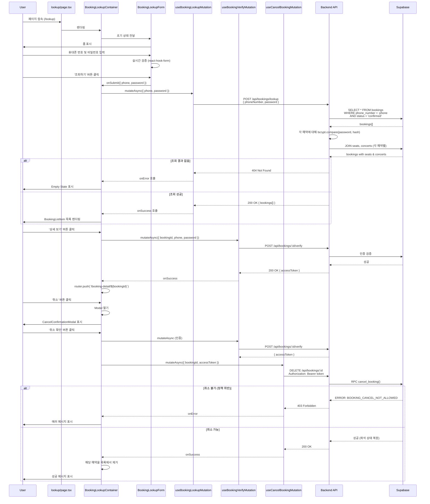

# 예약 조회 (Booking Lookup) 페이지 구현 계획

## 1. 개요

### 1.1 페이지 정보
- **페이지 경로**: `/lookup` (비회원 예약 조회)
- **페이지 목적**: 사용자가 휴대폰 번호와 조회용 비밀번호를 통해 본인의 예약 내역을 조회하고, 예약 상세 확인 및 취소 작업을 수행할 수 있는 페이지
- **관련 유스케이스**:
  - [UC-006: 예약 조회](../../usecases/006/spec.md)
  - [UC-007: 예약 취소](../../usecases/007/spec.md)

### 1.2 주요 기능
1. **예약 조회 폼** (휴대폰 번호 + 4자리 비밀번호)
2. **입력 검증** (실시간 형식 검증)
3. **예약 목록 조회** (일치하는 모든 confirmed 예약)
4. **예약 상세 정보 표시** (콘서트 정보, 좌석 정보, 예매자 정보)
5. **예약 취소 기능** (취소 가능 여부 검증 + 트랜잭션 처리)
6. **에러 핸들링** (일치하는 예약 없음, 취소 불가 등)

### 1.3 구현 현황 분석

#### 이미 구현된 기능 (재사용)
- ✅ `POST /api/bookings/:bookingId/verify` - 예약 인증 (Access Token 발급)
- ✅ `GET /api/bookings/:bookingId/detail` - 예약 상세 조회 (Access Token 필요)
- ✅ `DELETE /api/bookings/:bookingId` - 예약 취소 (Access Token 필요)
- ✅ `useBookingVerifyMutation` - 예약 인증 훅
- ✅ `useBookingDetailQuery` - 예약 상세 조회 훅
- ✅ `useCancelBookingMutation` - 예약 취소 훅
- ✅ `CancelConfirmationModal` - 취소 확인 모달 컴포넌트
- ✅ `BookingInfoCard` - 예약 정보 카드 컴포넌트

#### 신규 구현 필요
- 🆕 `POST /api/bookings/lookup` - 휴대폰 번호 + 비밀번호로 **여러 예약** 조회
- 🆕 `lookupBookingsByPhone()` - Service 함수
- 🆕 `BookingLookupRequestSchema`, `BookingLookupResponseSchema` - Zod 스키마
- 🆕 `useBookingLookupMutation` - 예약 조회 Mutation 훅
- 🆕 `/lookup/page.tsx` - 예약 조회 페이지
- 🆕 `BookingLookupContainer` - 컨테이너 컴포넌트
- 🆕 `BookingLookupForm` - 조회 폼 컴포넌트
- 🆕 `BookingListItem` - 예약 목록 아이템 컴포넌트

### 1.4 상태 관리 전략
- **서버 상태**: `@tanstack/react-query` 를 사용하여 예약 조회 및 취소 API 호출
- **로컬 UI 상태**: `useState` 를 사용하여 폼 입력값 및 선택된 예약 관리
- **폼 검증**: `react-hook-form` + `zod` 를 사용한 타입 안전 폼 관리

## 2. 모듈 구조 설계

### 2.1 백엔드 모듈

#### 2.1.1 API Route (수정)
- **위치**: `src/features/bookings/backend/route.ts`
- **설명**: 신규 예약 조회 엔드포인트 추가
- **기존 엔드포인트** (재사용):
  - `POST /api/bookings/:bookingId/verify` - Access Token 발급
  - `GET /api/bookings/:bookingId/detail` - 예약 상세 조회
  - `DELETE /api/bookings/:bookingId` - 예약 취소
- **신규 엔드포인트**:
  - `POST /api/bookings/lookup` - 휴대폰 번호 + 비밀번호로 여러 예약 조회

#### 2.1.2 Service (수정)
- **위치**: `src/features/bookings/backend/service.ts`
- **설명**: 휴대폰 번호 기반 예약 조회 함수 추가
- **기존 함수** (재사용):
  - `verifyBookingAccess()` - 예약 인증 및 토큰 발급
  - `getBookingDetailById()` - 예약 상세 조회
  - `cancelBooking()` - 예약 취소
- **신규 함수**:
  - `lookupBookingsByPhone()`: 휴대폰 번호 + 비밀번호로 모든 confirmed 예약 조회

#### 2.1.3 Schema (수정)
- **위치**: `src/features/bookings/backend/schema.ts`
- **설명**: 예약 조회 요청/응답 스키마 추가
- **기존 스키마** (재사용):
  - `BookingVerifyRequestSchema`
  - `BookingDetailWithSeatSchema`
  - `CancelBookingResponseSchema`
- **신규 스키마**:
  - `BookingLookupRequestSchema`: `{ phoneNumber, password }`
  - `BookingLookupResponseSchema`: `{ bookings: BookingDetailWithSeat[] }`

#### 2.1.4 Error (재사용)
- **위치**: `src/features/bookings/backend/error.ts`
- **설명**: 기존 에러 코드 활용
- **활용 에러 코드**:
  - `notFound`: 일치하는 예약 없음
  - `accessDenied`: 인증 실패
  - `fetchError`: 조회 오류
  - `alreadyCancelled`: 이미 취소된 예약
  - `cancelNotAllowed`: 취소 불가 (정책 위반)

### 2.2 프론트엔드 모듈

#### 2.2.1 Page Component (신규)
- **위치**: `src/app/lookup/page.tsx`
- **설명**: 예약 조회 페이지 루트 컴포넌트 (Client Component)
- **책임**: 최상위 레이아웃 및 하위 컴포넌트 조합

#### 2.2.2 Main Container (신규)
- **위치**: `src/features/bookings/components/booking-lookup-container.tsx`
- **설명**: 예약 조회 및 결과 표시를 담당하는 컨테이너 컴포넌트
- **책임**:
  - React Query를 통한 데이터 페칭
  - 상태 관리 (조회 전 / 조회 후 / 취소 플로우)
  - 하위 presentational 컴포넌트에 데이터 전달

#### 2.2.3 Lookup Form (신규)
- **위치**: `src/features/bookings/components/booking-lookup-form.tsx`
- **설명**: 예약 조회 폼 컴포넌트
- **Props**: `{ onSubmit, isLoading }`
- **Features**:
  - 휴대폰 번호 입력 (형식: 010-1234-5678)
  - 4자리 비밀번호 입력
  - 실시간 검증 (react-hook-form)
  - 제출 버튼 활성화/비활성화

#### 2.2.4 Booking List Item (신규)
- **위치**: `src/features/bookings/components/booking-list-item.tsx`
- **설명**: 개별 예약 요약 정보를 카드 형태로 표시하는 컴포넌트
- **Props**: `{ booking, onViewDetail, onCancel }`
- **Features**:
  - 콘서트 제목, 일시, 장소 표시
  - 좌석 수 및 총 금액 표시
  - "상세 보기", "취소" 버튼

#### 2.2.5 Cancel Confirmation Modal (기존 재사용)
- **위치**: `src/features/bookings/components/cancel-confirmation-modal.tsx`
- **설명**: 예약 취소 확인 모달 (이미 구현됨)
- **활용**: 그대로 재사용

#### 2.2.6 Empty State (신규)
- **위치**: `src/features/bookings/components/booking-empty-state.tsx`
- **설명**: 조회 결과가 없을 때 표시되는 컴포넌트
- **Props**: `{ message }`

#### 2.2.7 Header Component (기존 재사용)
- **위치**: `src/components/layout/header.tsx` (PrimaryHeader)
- **설명**: 페이지 상단 헤더 (기존 활용)

### 2.3 데이터 페칭 Hook

#### 2.3.1 useBookingLookupMutation (신규)
- **위치**: `src/features/bookings/hooks/useBookingLookupMutation.ts`
- **설명**: 예약 조회 Mutation 훅
- **Parameters**: `{ phoneNumber: string, password: string }`
- **Returns**: `{ mutate, mutateAsync, data, isPending, isError, error }`

#### 2.3.2 useBookingVerifyMutation (기존 재사용)
- **위치**: `src/features/bookings/hooks/useBookingVerifyMutation.ts`
- **설명**: 예약 인증 및 Access Token 발급 훅
- **활용**: 상세 보기 시 토큰 발급용

#### 2.3.3 useBookingDetailQuery (기존 재사용)
- **위치**: `src/features/bookings/hooks/useBookingDetailQuery.ts`
- **설명**: 예약 상세 조회 훅
- **활용**: 상세 보기 페이지로 이동 후 사용

#### 2.3.4 useCancelBookingMutation (기존 재사용)
- **위치**: `src/features/bookings/hooks/useCancelBookingMutation.ts`
- **설명**: 예약 취소 훅
- **활용**: 취소 버튼 클릭 시 사용

### 2.4 공통 유틸리티 및 타입

#### 2.4.1 DTO (수정)
- **위치**: `src/features/bookings/lib/dto.ts`
- **설명**: 백엔드 스키마를 클라이언트에서 재사용하기 위한 재노출
- **기존 Export** (재사용):
  - `BookingVerifyRequest`
  - `BookingDetailWithSeat`
  - `CancelBookingResponse`
- **신규 Export**:
  - `BookingLookupRequest`
  - `BookingLookupResponse`

#### 2.4.2 Constants (재사용)
- **위치**: `src/features/bookings/constants/index.ts`
- **설명**: 기존 상수 활용
- **활용 상수**:
  - `BOOKING_PHONE_NUMBER_REGEX`: `/^010-\d{4}-\d{4}$/`
  - `BOOKING_PASSWORD_REGEX`: `/^\d{4}$/`
  - `BOOKING_PASSWORD_LENGTH`: 4
  - `BOOKING_CANCELLATION_WINDOW_HOURS`: 24

#### 2.4.3 Validation Schema (수정)
- **위치**: `src/features/bookings/lib/validation.ts`
- **설명**: 폼 검증 스키마 추가
- **신규 Export**:
  - `bookingLookupFormSchema`: react-hook-form용 zod 스키마

#### 2.4.4 Cancellation Policy Utils (기존 재사용)
- **위치**: `src/features/bookings/lib/policy.ts`
- **설명**: 취소 정책 검증 유틸리티 (이미 구현됨)
- **활용 함수**:
  - `canCancelBooking()`: 취소 가능 여부 확인
  - `getCancellationMessage()`: 취소 불가 사유 메시지 반환

## 3. 아키텍처 다이어그램

### 3.1 컴포넌트 계층 구조

```mermaid
graph TD
    A[lookup/page.tsx<br/>Root Page] --> B[BookingLookupContainer]
    B --> C[PrimaryHeader<br/>기존 재사용]
    B --> D{State}

    D -->|Initial| E[BookingLookupForm<br/>신규]
    D -->|Loading| F[Loading Spinner]
    D -->|Error| G[ErrorMessage]
    D -->|Empty| H[BookingEmptyState<br/>신규]
    D -->|Success| I[BookingList<br/>여러 BookingListItem]

    I --> J[BookingListItem<br/>신규]
    J --> K1[상세 보기 버튼]
    J --> K2[취소 버튼]

    K1 -->|verify + navigate| L[/booking-detail/:id]
    K2 -->|onClick| M[CancelConfirmationModal<br/>기존 재사용]

    B -.uses.-> N[useBookingLookupMutation<br/>신규]
    B -.uses.-> O[useBookingVerifyMutation<br/>기존]
    B -.uses.-> P[useCancelBookingMutation<br/>기존]

    N -.posts.-> Q[POST /api/bookings/lookup<br/>신규 API]
    O -.posts.-> R[POST /api/bookings/:id/verify<br/>기존 API]
    P -.deletes.-> S[DELETE /api/bookings/:id<br/>기존 API]
```

### 3.2 데이터 플로우 (조회 → 상세 보기 → 취소)



### 3.3 상태 관리 구조

```mermaid
graph LR
    A[User Input<br/>Form] -->|submit| B[useBookingLookupMutation]
    B -->|POST /api/bookings/lookup| C[Backend API]
    C -->|response| D[React Query Cache<br/>Mutation State]

    D -->|onSuccess| E[Container State<br/>bookings[]]
    D -->|onError| F[Error State]

    E -->|map| G[BookingListItem들]

    G -->|상세 보기| H1[useBookingVerifyMutation]
    G -->|취소 버튼| H2[useCancelBookingMutation]

    H1 -->|verify| I[POST /api/bookings/:id/verify]
    I -->|success| J[router.push to detail page]

    H2 -->|verify first| I
    I -->|accessToken| K[DELETE /api/bookings/:id]

    K -->|success| L[onSuccess: Remove from list]
    K -->|error| M[onError: Toast]
```

## 4. 상세 구현 계획

### 4.1 백엔드 구현

#### 4.1.1 Schema Definition (수정)

```typescript
// src/features/bookings/backend/schema.ts 에 추가

// 예약 조회 요청
export const BookingLookupRequestSchema = z.object({
  phoneNumber: z.string().regex(BOOKING_PHONE_NUMBER_REGEX, PHONE_NUMBER_ERROR),
  password: z.string().regex(BOOKING_PASSWORD_REGEX, PASSWORD_LENGTH_ERROR),
});

// 예약 조회 응답
export const BookingLookupResponseSchema = z.object({
  bookings: z.array(BookingDetailWithSeatSchema),
});

export type BookingLookupRequest = z.infer<typeof BookingLookupRequestSchema>;
export type BookingLookupResponse = z.infer<typeof BookingLookupResponseSchema>;
```

#### 4.1.2 Service Implementation (수정)

```typescript
// src/features/bookings/backend/service.ts 에 추가

/**
 * 휴대폰 번호와 비밀번호로 예약 목록 조회
 * - confirmed 상태의 예약만 조회
 * - 비밀번호 검증 (bcrypt compare)
 * - 각 예약에 대한 좌석 및 콘서트 정보 포함
 */
export const lookupBookingsByPhone = async (
  supabase: SupabaseClient,
  payload: BookingLookupRequest,
): Promise<HandlerResult<BookingLookupResponse, BookingServiceError>> => {
  const parsed = BookingLookupRequestSchema.safeParse(payload);

  if (!parsed.success) {
    return failure(
      400,
      bookingErrorCodes.validationError,
      '입력값을 확인해주세요.',
      parsed.error.format(),
    );
  }

  const { phoneNumber, password } = parsed.data;

  // 1. 해당 휴대폰 번호로 등록된 모든 confirmed 예약 조회
  const { data: bookingsData, error: bookingsError } = await supabase
    .from(BOOKINGS_TABLE)
    .select('id, concert_id, booker_name, phone_number, password_hash, total_amount, status, created_at, cancelled_at')
    .eq('phone_number', phoneNumber)
    .eq('status', BOOKING_STATUS.confirmed)
    .order('created_at', { ascending: false });

  if (bookingsError) {
    return failure(
      500,
      bookingErrorCodes.fetchError,
      BOOKING_FETCH_FAILURE_MESSAGE,
      bookingsError.message ?? bookingsError,
    );
  }

  if (!bookingsData || bookingsData.length === 0) {
    return failure(
      404,
      bookingErrorCodes.notFound,
      '입력하신 정보와 일치하는 예매 내역이 없습니다.',
    );
  }

  // 2. 비밀번호 검증 (bcrypt compare) - 일치하는 예약만 필터링
  const validBookings = [];
  for (const booking of bookingsData) {
    const isValid = await bcrypt.compare(password, booking.password_hash);
    if (isValid) {
      validBookings.push(booking);
    }
  }

  if (validBookings.length === 0) {
    return failure(
      404,
      bookingErrorCodes.notFound,
      '입력하신 정보와 일치하는 예매 내역이 없습니다.',
    );
  }

  // 3. 각 예약에 대해 상세 정보 조회 (콘서트 정보 + 좌석 정보)
  const bookingDetails: BookingDetailWithSeat[] = [];

  for (const booking of validBookings) {
    // 3.1 콘서트 정보 조회
    const { data: concertData, error: concertError } = await supabase
      .from('concerts')
      .select('id, title, venue, start_date, end_date')
      .eq('id', booking.concert_id)
      .single();

    if (concertError || !concertData) {
      continue; // Skip if concert not found
    }

    // 3.2 좌석 정보 조회
    const { data: seatsData, error: seatsError } = await supabase
      .from(SEATS_TABLE)
      .select('id, section, row_number, seat_number, grade, price')
      .eq('booking_id', booking.id);

    if (seatsError) {
      continue; // Skip if seats not found
    }

    const seatRows = (seatsData as unknown as BookingSeatRow[] | null) ?? [];

    // 3.3 데이터 변환
    bookingDetails.push({
      id: booking.id,
      concertId: concertData.id,
      concertTitle: concertData.title,
      concertVenue: concertData.venue,
      concertStartDate: concertData.start_date,
      concertEndDate: concertData.end_date,
      bookerName: booking.booker_name,
      phoneNumber: booking.phone_number,
      totalAmount: booking.total_amount,
      status: booking.status,
      seats: seatRows.map((seat) => ({
        id: seat.id,
        section: seat.section,
        rowNumber: seat.row_number,
        seatNumber: seat.seat_number,
        grade: seat.grade,
        price: seat.price,
      })),
      createdAt: booking.created_at,
      cancelledAt: booking.cancelled_at,
    });
  }

  const validated = z.array(BookingDetailWithSeatSchema).safeParse(bookingDetails);

  if (!validated.success) {
    return failure(
      500,
      bookingErrorCodes.validationError,
      RESPONSE_PARSE_FAILURE_MESSAGE,
      validated.error.format(),
    );
  }

  return success({ bookings: validated.data });
};
```

#### 4.1.3 Route Handler (수정)

```typescript
// src/features/bookings/backend/route.ts 에 추가

import { lookupBookingsByPhone } from '@/features/bookings/backend/service';
import { BookingLookupRequestSchema } from '@/features/bookings/backend/schema';

export const registerBookingRoutes = (app: Hono<AppEnv>) => {
  // ... 기존 라우트들 ...

  // POST /api/bookings/lookup (신규)
  app.post('/bookings/lookup', async (c) => {
    const logger = getLogger(c);
    let body: unknown;

    try {
      body = await c.req.json();
    } catch (jsonError) {
      logger.warn('예약 조회 요청 본문 파싱에 실패했습니다.', jsonError);
      return respond(
        c,
        failure(400, bookingErrorCodes.validationError, INVALID_JSON_MESSAGE),
      );
    }

    const parsed = BookingLookupRequestSchema.safeParse(body);

    if (!parsed.success) {
      logger.warn('예약 조회 요청 검증 실패', parsed.error.flatten());
      return respond(
        c,
        failure(
          400,
          bookingErrorCodes.validationError,
          '입력값을 확인해주세요.',
          parsed.error.format(),
        ),
      );
    }

    const supabase = getSupabase(c);
    const result = await lookupBookingsByPhone(supabase, parsed.data);

    if (!result.ok) {
      const errorResult = result as ErrorResult<BookingServiceError, unknown>;
      logger.warn('예약 조회 실패', errorResult.error);
      return respond(c, errorResult);
    }

    logger.info('예약 조회 성공', { bookingCount: result.data.bookings.length });
    return respond(c, result);
  });
};
```

### 4.2 프론트엔드 구현

#### 4.2.1 DTO (수정)

```typescript
// src/features/bookings/lib/dto.ts 에 추가

export type {
  // ... 기존 exports ...
  BookingLookupRequest,
  BookingLookupResponse,
} from '@/features/bookings/backend/schema';
```

#### 4.2.2 Validation Schema (수정)

```typescript
// src/features/bookings/lib/validation.ts 에 추가

import {
  BOOKING_PHONE_NUMBER_REGEX,
  BOOKING_PASSWORD_REGEX,
  BOOKING_PASSWORD_LENGTH,
} from '@/features/bookings/constants';

export const bookingLookupFormSchema = z.object({
  phoneNumber: z
    .string()
    .regex(BOOKING_PHONE_NUMBER_REGEX, '휴대폰 번호 형식이 올바르지 않습니다. (예: 010-1234-5678)'),
  password: z
    .string()
    .regex(BOOKING_PASSWORD_REGEX, `비밀번호는 ${BOOKING_PASSWORD_LENGTH}자리 숫자여야 합니다.`),
});

export type BookingLookupFormData = z.infer<typeof bookingLookupFormSchema>;
```

#### 4.2.3 React Query Hooks

##### useBookingLookupMutation (신규)

```typescript
// src/features/bookings/hooks/useBookingLookupMutation.ts

"use client";

import { useMutation } from '@tanstack/react-query';
import {
  apiClient,
  extractApiErrorMessage,
} from '@/lib/remote/api-client';
import { BOOKING_API_PATH } from '@/features/bookings/constants';
import {
  BookingLookupRequestSchema,
  BookingLookupResponseSchema,
  type BookingLookupRequest,
  type BookingLookupResponse,
} from '@/features/bookings/lib/dto';

const LOOKUP_ENDPOINT = `/api${BOOKING_API_PATH}/lookup`;
const LOOKUP_ERROR_MESSAGE = '예약 조회에 실패했습니다. 입력하신 정보를 다시 확인해주세요.';

export const useBookingLookupMutation = () =>
  useMutation<BookingLookupResponse, Error, BookingLookupRequest>({
    mutationFn: async (payload) => {
      const validated = BookingLookupRequestSchema.parse(payload);

      try {
        const { data } = await apiClient.post(LOOKUP_ENDPOINT, validated);
        return BookingLookupResponseSchema.parse(data);
      } catch (error) {
        throw new Error(extractApiErrorMessage(error, LOOKUP_ERROR_MESSAGE));
      }
    },
  });
```

#### 4.2.4 Container Component (신규)

```typescript
// src/features/bookings/components/booking-lookup-container.tsx

"use client";

import { useState } from 'react';
import { useRouter } from 'next/navigation';
import { PrimaryHeader } from '@/components/layout/header';
import { useBookingLookupMutation } from '@/features/bookings/hooks/useBookingLookupMutation';
import { useBookingVerifyMutation } from '@/features/bookings/hooks/useBookingVerifyMutation';
import { useCancelBookingMutation } from '@/features/bookings/hooks/useCancelBookingMutation';
import { BookingLookupForm } from '@/features/bookings/components/booking-lookup-form';
import { BookingListItem } from '@/features/bookings/components/booking-list-item';
import { BookingEmptyState } from '@/features/bookings/components/booking-empty-state';
import { CancelConfirmationModal } from '@/features/bookings/components/cancel-confirmation-modal';
import type { BookingDetail } from '@/features/bookings/types';
import type { BookingLookupFormData } from '@/features/bookings/lib/validation';
import { ROUTES } from '@/constants/app';

const CONTAINER_CLASS = 'min-h-screen bg-slate-950';
const MAIN_CLASS = 'container mx-auto max-w-4xl px-4 py-8 space-y-8';
const HEADER_SECTION_CLASS = 'space-y-4';
const TITLE_CLASS = 'text-3xl font-bold text-white';
const DESCRIPTION_CLASS = 'text-slate-400';
const LIST_SECTION_CLASS = 'space-y-4';
const LIST_TITLE_CLASS = 'text-xl font-semibold text-white';
const ERROR_CLASS = 'rounded-lg border border-red-800 bg-red-950/40 p-4 text-sm text-red-400';

export function BookingLookupContainer() {
  const router = useRouter();
  const [bookings, setBookings] = useState<BookingDetail[]>([]);
  const [selectedBooking, setSelectedBooking] = useState<BookingDetail | null>(null);
  const [isCancelModalOpen, setIsCancelModalOpen] = useState(false);
  const [verifyCredentials, setVerifyCredentials] = useState<{ phoneNumber: string; password: string } | null>(null);

  const lookupMutation = useBookingLookupMutation();
  const cancelMutation = useCancelBookingMutation();

  const handleLookup = async (formData: BookingLookupFormData) => {
    try {
      const result = await lookupMutation.mutateAsync(formData);
      setBookings(result.bookings);
      setVerifyCredentials(formData); // 인증 정보 저장 (상세 보기/취소 시 사용)
    } catch (error) {
      setBookings([]);
    }
  };

  const handleViewDetail = async (bookingId: string) => {
    if (!verifyCredentials) return;

    try {
      const verifyMutation = useBookingVerifyMutation(bookingId);
      const { accessToken } = await verifyMutation.mutateAsync(verifyCredentials);

      // Access Token을 sessionStorage에 저장하고 상세 페이지로 이동
      sessionStorage.setItem(`booking_access_token_${bookingId}`, accessToken);
      router.push(`${ROUTES.bookingDetail}/${bookingId}`);
    } catch (error) {
      // 에러 처리는 mutation에서 자동으로 처리됨
    }
  };

  const handleCancelClick = (booking: BookingDetail) => {
    setSelectedBooking(booking);
    setIsCancelModalOpen(true);
  };

  const handleCancelConfirm = async () => {
    if (!selectedBooking || !verifyCredentials) return;

    try {
      // 1. Access Token 발급
      const verifyMutation = useBookingVerifyMutation(selectedBooking.id);
      const { accessToken } = await verifyMutation.mutateAsync(verifyCredentials);

      // 2. 예약 취소
      await cancelMutation.mutateAsync({
        bookingId: selectedBooking.id,
        accessToken,
      });

      // 3. 성공 시 목록에서 제거
      setBookings((prev) => prev.filter((b) => b.id !== selectedBooking.id));
      setIsCancelModalOpen(false);
      setSelectedBooking(null);
    } catch (error) {
      // 에러는 mutation에서 자동으로 처리됨
    }
  };

  const showEmptyState = !lookupMutation.isPending && bookings.length === 0 && lookupMutation.isSuccess;

  return (
    <div className={CONTAINER_CLASS}>
      <PrimaryHeader />

      <main className={MAIN_CLASS}>
        <section className={HEADER_SECTION_CLASS}>
          <h1 className={TITLE_CLASS}>예약 조회</h1>
          <p className={DESCRIPTION_CLASS}>
            예매 시 입력하신 휴대폰 번호와 비밀번호를 입력해주세요.
          </p>
        </section>

        <BookingLookupForm
          onSubmit={handleLookup}
          isLoading={lookupMutation.isPending}
        />

        {lookupMutation.isError && (
          <div className={ERROR_CLASS}>
            {lookupMutation.error?.message || '예약 조회에 실패했습니다.'}
          </div>
        )}

        {showEmptyState && (
          <BookingEmptyState message="입력하신 정보와 일치하는 예약 내역이 없습니다." />
        )}

        {lookupMutation.isSuccess && bookings.length > 0 && (
          <section className={LIST_SECTION_CLASS}>
            <h2 className={LIST_TITLE_CLASS}>
              예약 내역 ({bookings.length}건)
            </h2>

            <div className="space-y-4">
              {bookings.map((booking) => (
                <BookingListItem
                  key={booking.id}
                  booking={booking}
                  onViewDetail={() => handleViewDetail(booking.id)}
                  onCancel={() => handleCancelClick(booking)}
                />
              ))}
            </div>
          </section>
        )}
      </main>

      {selectedBooking && (
        <CancelConfirmationModal
          isOpen={isCancelModalOpen}
          booking={selectedBooking}
          onConfirm={handleCancelConfirm}
          onClose={() => {
            setIsCancelModalOpen(false);
            setSelectedBooking(null);
          }}
          isLoading={cancelMutation.isPending}
          errorMessage={cancelMutation.error?.message}
        />
      )}
    </div>
  );
}
```

#### 4.2.5 Presentational Components

##### BookingLookupForm (신규)

```typescript
// src/features/bookings/components/booking-lookup-form.tsx

"use client";

import { useForm } from 'react-hook-form';
import { zodResolver } from '@hookform/resolvers/zod';
import { Button } from '@/components/ui/button';
import { Input } from '@/components/ui/input';
import { Label } from '@/components/ui/label';
import {
  bookingLookupFormSchema,
  type BookingLookupFormData,
} from '@/features/bookings/lib/validation';

const FORM_CLASS = 'space-y-6 rounded-lg border border-slate-800 bg-slate-900/40 p-6';
const FIELD_CLASS = 'space-y-2';
const LABEL_CLASS = 'text-slate-200';
const INPUT_CLASS = 'bg-slate-950 border-slate-700 text-white';
const ERROR_CLASS = 'text-sm text-red-400';
const BUTTON_CLASS = 'w-full bg-emerald-600 hover:bg-emerald-500';

type BookingLookupFormProps = {
  onSubmit: (data: BookingLookupFormData) => void;
  isLoading: boolean;
};

export function BookingLookupForm({ onSubmit, isLoading }: BookingLookupFormProps) {
  const {
    register,
    handleSubmit,
    formState: { errors, isValid },
  } = useForm<BookingLookupFormData>({
    resolver: zodResolver(bookingLookupFormSchema),
    mode: 'onChange',
  });

  return (
    <form
      onSubmit={handleSubmit(onSubmit)}
      className={FORM_CLASS}
    >
      <div className={FIELD_CLASS}>
        <Label htmlFor="phoneNumber" className={LABEL_CLASS}>
          휴대폰 번호
        </Label>
        <Input
          id="phoneNumber"
          type="tel"
          placeholder="010-1234-5678"
          {...register('phoneNumber')}
          disabled={isLoading}
          className={INPUT_CLASS}
          aria-invalid={!!errors.phoneNumber}
        />
        {errors.phoneNumber && (
          <p className={ERROR_CLASS} role="alert">
            {errors.phoneNumber.message}
          </p>
        )}
      </div>

      <div className={FIELD_CLASS}>
        <Label htmlFor="password" className={LABEL_CLASS}>
          비밀번호 (4자리)
        </Label>
        <Input
          id="password"
          type="password"
          placeholder="0000"
          maxLength={4}
          {...register('password')}
          disabled={isLoading}
          className={INPUT_CLASS}
          aria-invalid={!!errors.password}
        />
        {errors.password && (
          <p className={ERROR_CLASS} role="alert">
            {errors.password.message}
          </p>
        )}
      </div>

      <Button
        type="submit"
        disabled={!isValid || isLoading}
        className={BUTTON_CLASS}
      >
        {isLoading ? '조회 중...' : '조회하기'}
      </Button>
    </form>
  );
}
```

##### BookingListItem (신규)

```typescript
// src/features/bookings/components/booking-list-item.tsx

"use client";

import { Calendar, MapPin, Ticket, CreditCard } from 'lucide-react';
import { Button } from '@/components/ui/button';
import { formatDateTime } from '@/lib/utils/date';
import { BOOKING_CURRENCY_SUFFIX } from '@/features/bookings/constants';
import type { BookingDetail } from '@/features/bookings/types';

const CARD_CLASS = 'rounded-lg border border-slate-800 bg-slate-900/60 overflow-hidden hover:border-slate-700 transition-colors';
const HEADER_CLASS = 'bg-slate-900/80 p-4 border-b border-slate-800';
const TITLE_CLASS = 'text-lg font-semibold text-white';
const BODY_CLASS = 'p-6 space-y-4';
const INFO_ROW_CLASS = 'flex items-center gap-2 text-sm text-slate-300';
const ICON_CLASS = 'w-4 h-4 text-emerald-400';
const FOOTER_CLASS = 'bg-slate-900/40 p-4 border-t border-slate-800 flex gap-3';

type BookingListItemProps = {
  booking: BookingDetail;
  onViewDetail: () => void;
  onCancel: () => void;
};

export function BookingListItem({ booking, onViewDetail, onCancel }: BookingListItemProps) {
  const concertDate = formatDateTime(booking.concertStartDate);
  const seatCount = booking.seats.length;
  const totalAmount = booking.totalAmount.toLocaleString();

  return (
    <div className={CARD_CLASS}>
      {/* Header */}
      <div className={HEADER_CLASS}>
        <h3 className={TITLE_CLASS}>{booking.concertTitle}</h3>
      </div>

      {/* Body */}
      <div className={BODY_CLASS}>
        <div className={INFO_ROW_CLASS}>
          <Calendar className={ICON_CLASS} />
          <span>{concertDate}</span>
        </div>

        <div className={INFO_ROW_CLASS}>
          <MapPin className={ICON_CLASS} />
          <span>{booking.concertVenue}</span>
        </div>

        <div className={INFO_ROW_CLASS}>
          <Ticket className={ICON_CLASS} />
          <span>{seatCount}석 예매</span>
        </div>

        <div className={INFO_ROW_CLASS}>
          <CreditCard className={ICON_CLASS} />
          <span className="font-semibold text-white">{totalAmount}{BOOKING_CURRENCY_SUFFIX}</span>
        </div>
      </div>

      {/* Footer */}
      <div className={FOOTER_CLASS}>
        <Button
          variant="outline"
          onClick={onViewDetail}
          className="flex-1"
        >
          상세 보기
        </Button>
        <Button
          variant="destructive"
          onClick={onCancel}
          className="flex-1"
        >
          예약 취소
        </Button>
      </div>
    </div>
  );
}
```

##### BookingEmptyState (신규)

```typescript
// src/features/bookings/components/booking-empty-state.tsx

"use client";

import { SearchX } from 'lucide-react';

const CONTAINER_CLASS = 'flex flex-col items-center justify-center py-16 text-center';
const ICON_CLASS = 'w-16 h-16 text-slate-600 mb-4';
const MESSAGE_CLASS = 'text-lg text-slate-400';
const HINT_CLASS = 'text-sm text-slate-500 mt-2';

type BookingEmptyStateProps = {
  message: string;
};

export function BookingEmptyState({ message }: BookingEmptyStateProps) {
  return (
    <div className={CONTAINER_CLASS}>
      <SearchX className={ICON_CLASS} />
      <p className={MESSAGE_CLASS}>{message}</p>
      <p className={HINT_CLASS}>
        입력하신 정보를 다시 확인해주세요.
      </p>
    </div>
  );
}
```

#### 4.2.6 Page Component (신규)

```typescript
// src/app/lookup/page.tsx

import { BookingLookupContainer } from '@/features/bookings/components/booking-lookup-container';

export default function BookingLookupPage() {
  return <BookingLookupContainer />;
}
```

## 5. API 명세

### 5.1 POST /api/bookings/lookup (신규)

**설명**: 휴대폰 번호와 비밀번호로 예약 내역을 조회합니다.

**Request Body**:
```json
{
  "phoneNumber": "010-1234-5678",
  "password": "1234"
}
```

**Response 200 OK**:
```json
{
  "bookings": [
    {
      "id": "uuid",
      "concertId": "uuid",
      "concertTitle": "2025 뉴이어 콘서트",
      "concertVenue": "서울 예술의전당 콘서트홀",
      "concertStartDate": "2025-01-15T19:00:00+09:00",
      "concertEndDate": "2025-01-15T21:30:00+09:00",
      "bookerName": "홍길동",
      "phoneNumber": "010-1234-5678",
      "totalAmount": 300000,
      "status": "confirmed",
      "seats": [
        {
          "id": "uuid",
          "section": "A",
          "rowNumber": "1",
          "seatNumber": "5",
          "grade": "vip",
          "price": 150000
        }
      ],
      "createdAt": "2025-01-10T10:30:00Z",
      "cancelledAt": null
    }
  ]
}
```

**Response 404 Not Found**:
```json
{
  "error": {
    "code": "BOOKING_NOT_FOUND",
    "message": "입력하신 정보와 일치하는 예매 내역이 없습니다."
  }
}
```

### 5.2 기존 API 활용

#### POST /api/bookings/:bookingId/verify
- **목적**: Access Token 발급 (상세 보기/취소 시 필요)
- **Request Body**: `{ phoneNumber, password }`
- **Response**: `{ accessToken }`

#### GET /api/bookings/:bookingId/detail
- **목적**: 예약 상세 조회
- **Header**: `Authorization: Bearer {accessToken}`
- **Response**: `{ booking: { ... } }`

#### DELETE /api/bookings/:bookingId
- **목적**: 예약 취소
- **Header**: `Authorization: Bearer {accessToken}`
- **Response**: `{ bookingId, status, cancelledAt, message }`

## 6. 에러 핸들링 전략

| 에러 타입 | HTTP 상태 | 처리 방법 |
|-----------|-----------|-----------|
| 일치하는 예약 없음 | 404 | Empty State 표시 |
| 인증 실패 (잘못된 비밀번호) | 403 | 에러 메시지 표시 |
| 이미 취소된 예약 | 409 | 모달 내 에러 메시지 표시 |
| 취소 불가 (정책 위반) | 403 | 모달 내 에러 메시지 표시 (공연 24시간 전) |
| 취소 처리 실패 | 500 | 모달 내 에러 메시지 표시 + 재시도 안내 |
| 네트워크 오류 | - | 에러 메시지 표시, 재시도 가능 |

## 7. 보안 고려사항

### 7.1 비밀번호 처리
- 프론트엔드에서는 평문으로 전송 (HTTPS로 보호)
- 백엔드에서 bcrypt로 해시화된 값과 비교
- 데이터베이스에는 해시만 저장

### 7.2 Access Token
- 예약 인증 후 단기 Access Token 발급
- 상세 보기/취소 작업 시 Authorization 헤더로 전송
- SessionStorage에 임시 저장 (새로고침 시 유지)

### 7.3 Rate Limiting
- 예약 조회 API에 Rate Limit 적용 (brute-force 방지)
- 향후 구현 예정: 동일 IP에서 1분에 10회까지만 허용

### 7.4 개인정보 보호
- 로그에 휴대폰 번호 마스킹 처리 (010-****-5678)
- 비밀번호는 절대 로그에 기록하지 않음

## 8. 접근성 (A11y)

### 8.1 ARIA 속성
```typescript
<main aria-label="예약 조회">
  <form aria-label="예약 조회 폼">
    ...
  </form>

  <div role="status" aria-live="polite">
    {bookings.length > 0 && `${bookings.length}건의 예약이 조회되었습니다.`}
  </div>
</main>
```

### 8.2 키보드 네비게이션
- 모든 인터랙티브 요소는 Tab 키로 접근 가능
- Enter 키로 폼 제출 및 버튼 클릭

### 8.3 스크린 리더 지원
```typescript
<Input
  aria-describedby="phone-error"
  aria-invalid={!!errors.phoneNumber}
/>
{errors.phoneNumber && (
  <p id="phone-error" role="alert">
    {errors.phoneNumber.message}
  </p>
)}
```

## 9. 반응형 디자인

### 9.1 Breakpoints
- Mobile: 1 column 레이아웃
- Tablet: 1 column 레이아웃 (max-w-4xl 컨테이너)
- Desktop: 1 column 레이아웃 (max-w-4xl 컨테이너)

### 9.2 BookingListItem 레이아웃
- Mobile: 버튼 세로 배치 (w-full)
- Desktop: 버튼 가로 배치 (flex-row)

## 10. 테스트 전략

### 10.1 QA 체크리스트

#### 기능 테스트
- [ ] 올바른 휴대폰 번호와 비밀번호로 예약 조회가 되는가?
- [ ] 잘못된 형식의 입력은 검증 오류가 표시되는가?
- [ ] 일치하는 예약이 없을 때 Empty State가 표시되는가?
- [ ] 여러 건의 예약이 모두 조회되는가?
- [ ] '상세 보기' 버튼 클릭 시 인증 후 상세 페이지로 이동하는가?
- [ ] 예약 취소 모달이 정상적으로 열리는가?
- [ ] 예약 취소가 정상적으로 처리되는가?
- [ ] 취소 불가 시간대에 취소를 시도하면 에러가 표시되는가?
- [ ] 취소된 예약은 목록에서 제거되는가?

#### 에러 케이스
- [ ] 네트워크 오류 시 적절한 메시지가 표시되는가?
- [ ] 이미 취소된 예약을 다시 취소하려고 하면 에러가 표시되는가?
- [ ] 서버 오류 시 500 에러 메시지가 표시되는가?

#### 보안
- [ ] 비밀번호는 평문으로 전송되지만 HTTPS로 보호되는가?
- [ ] 로그에 개인정보가 마스킹 처리되는가?

#### 반응형 디자인
- [ ] Mobile에서 정상 작동하는가?
- [ ] Tablet에서 정상 작동하는가?
- [ ] Desktop에서 정상 작동하는가?

#### 접근성
- [ ] 키보드만으로 모든 기능에 접근 가능한가?
- [ ] 스크린 리더가 콘텐츠를 올바르게 읽는가?
- [ ] Focus indicator가 명확하게 표시되는가?

## 11. 구현 순서 및 마일스톤

### Phase 1: 백엔드 구축 (1일)
1. ✅ Schema 정의 (`BookingLookupRequestSchema`, `BookingLookupResponseSchema`)
2. ✅ Service 레이어 구현 (`lookupBookingsByPhone()`)
3. ✅ Route Handler 구현 (`POST /api/bookings/lookup`)
4. ✅ API 테스트 (Postman/Thunder Client)

### Phase 2: 프론트엔드 Hooks 및 유틸리티 (1일)
1. ✅ DTO 재노출 (`lib/dto.ts`)
2. ✅ Validation Schema 구현 (`bookingLookupFormSchema`)
3. ✅ React Query Hook 구현 (`useBookingLookupMutation`)

### Phase 3: UI 컴포넌트 (1일)
1. ✅ BookingLookupForm 구현
2. ✅ BookingListItem 구현
3. ✅ BookingEmptyState 구현
4. ✅ Container 컴포넌트 구현 (`BookingLookupContainer`)
5. ✅ Page Component 구현 (`app/lookup/page.tsx`)

### Phase 4: 스타일링 및 반응형 (0.5일)
1. ✅ Tailwind CSS 스타일 적용
2. ✅ 반응형 레이아웃 구현
3. ✅ 애니메이션 및 전환 효과

### Phase 5: 테스트 및 QA (0.5일)
1. ✅ QA 체크리스트 검증
2. ✅ 버그 수정 및 리팩토링

**총 예상 기간**: 4일

## 12. 참고 자료 및 문서

- [PRD: 콘서트 예매 시스템](../../prd.md)
- [유저플로우 문서](../../userflow.md)
- [데이터베이스 설계 문서](../../database.md)
- [UC-006: 예약 조회](../../usecases/006/spec.md)
- [UC-007: 예약 취소](../../usecases/007/spec.md)
- [React Hook Form 공식 문서](https://react-hook-form.com/)
- [Zod 공식 문서](https://zod.dev/)
- [TanStack Query Mutations 가이드](https://tanstack.com/query/latest/docs/react/guides/mutations)

---

**작성일**: 2025-10-14
**작성자**: Claude Code (AI Agent)
**문서 버전**: 2.0.0
**변경 이력**:
- v1.0.0: 초기 작성 (기존 plan.md)
- v2.0.0: 기존 구현 분석 반영, API 엔드포인트 및 플로우 수정
  - 기존 인증 플로우 (`verify` + `detail` + `cancel`) 재사용
  - 신규 `/lookup` API 추가 (여러 예약 조회)
  - Container 로직 수정 (인증 정보 저장 및 활용)
  - 컴포넌트 구조 최적화 (재사용 극대화)
