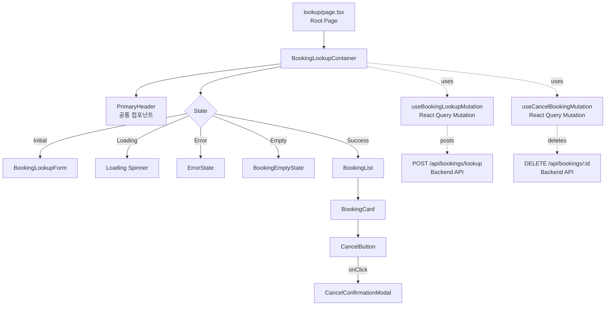
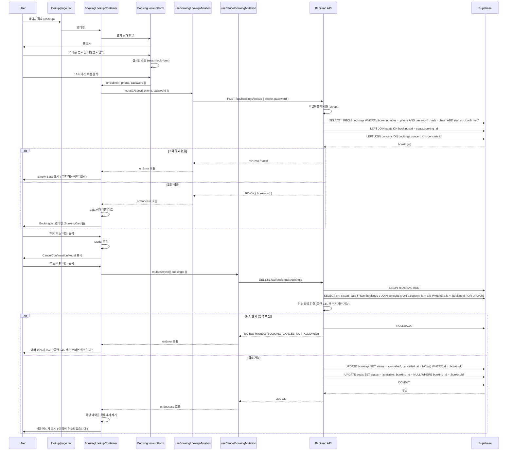

# 예약 조회 (Booking Search) 페이지 구현 계획

## 1. 개요

### 1.1 페이지 정보
- **페이지 경로**: `/lookup` (비회원 예약 조회)
- **페이지 목적**: 사용자가 휴대폰 번호와 조회용 비밀번호를 통해 예약 내역을 조회하고 취소할 수 있는 페이지
- **관련 유스케이스**: [Usecase 006: 예약 조회](../../usecases/006/spec.md), [Usecase 007: 예약 취소](../../usecases/007/spec.md)

### 1.2 주요 기능
1. 예약 조회 폼 (휴대폰 번호 + 4자리 비밀번호)
2. 입력 검증 (형식 검증)
3. 예약 내역 조회 (일치하는 모든 예약)
4. 예약 상세 정보 표시 (콘서트 정보, 좌석 정보, 예매자 정보)
5. 예약 취소 기능 (취소 가능 여부 검증)
6. 에러 핸들링 (일치하는 예약 없음, 취소 불가 등)

### 1.3 상태 관리 전략
- **서버 상태**: `@tanstack/react-query` 를 사용하여 예약 조회 및 취소 API 호출
- **로컬 UI 상태**: `useState` 를 사용하여 폼 입력값 관리
- **폼 검증**: `react-hook-form` + `zod` 를 사용한 타입 안전 폼 관리

## 2. 모듈 구조 설계

### 2.1 백엔드 모듈

#### 2.1.1 API Route
- **위치**: `src/features/bookings/backend/route.ts` (신규 feature)
- **설명**: 예약 조회 및 취소 API 엔드포인트 정의
- **새 엔드포인트**:
  - `POST /api/bookings/lookup` - 예약 조회 (phone + password)
  - `DELETE /api/bookings/:bookingId` - 예약 취소

#### 2.1.2 Service
- **위치**: `src/features/bookings/backend/service.ts`
- **설명**: Supabase를 통한 예약 조회 및 취소 비즈니스 로직
- **주요 함수**:
  - `lookupBookings()`: 휴대폰 번호 + 비밀번호 해시로 예약 조회
  - `cancelBooking()`: 예약 취소 (트랜잭션)
  - `canCancelBooking()`: 취소 가능 여부 검증 (정책 기반)

#### 2.1.3 Schema
- **위치**: `src/features/bookings/backend/schema.ts`
- **설명**: Zod 스키마를 사용한 요청/응답 타입 정의
- **스키마**:
  - `BookingLookupRequestSchema`: 조회 요청 (phone, password)
  - `BookingDetailSchema`: 개별 예약 상세 정보
  - `BookingLookupResponseSchema`: 조회 응답 (배열)
  - `CancelBookingRequestSchema`: 취소 요청
  - `CancelBookingResponseSchema`: 취소 응답

#### 2.1.4 Error
- **위치**: `src/features/bookings/backend/error.ts`
- **설명**: 예약 관련 에러 코드 정의
- **에러 코드**:
  - `BOOKING_NOT_FOUND`: 일치하는 예약 없음
  - `BOOKING_ALREADY_CANCELLED`: 이미 취소된 예약
  - `BOOKING_CANCEL_NOT_ALLOWED`: 취소 불가 (정책 위반)
  - `BOOKING_CANCEL_ERROR`: 취소 처리 실패

### 2.2 프론트엔드 모듈

#### 2.2.1 Page Component
- **위치**: `src/app/lookup/page.tsx`
- **설명**: 예약 조회 페이지 루트 컴포넌트 (Client Component)
- **책임**: 최상위 레이아웃 및 하위 컴포넌트 조합

#### 2.2.2 Main Container
- **위치**: `src/features/bookings/components/booking-lookup-container.tsx`
- **설명**: 예약 조회 및 결과 표시를 담당하는 컨테이너 컴포넌트
- **책임**:
  - React Query를 통한 데이터 페칭
  - 상태 관리 (조회 전 / 조회 후)
  - 하위 presentational 컴포넌트에 데이터 전달

#### 2.2.3 Lookup Form
- **위치**: `src/features/bookings/components/booking-lookup-form.tsx`
- **설명**: 예약 조회 폼 컴포넌트
- **Props**: `onSubmit`, `isLoading`
- **Features**:
  - 휴대폰 번호 입력 (형식: 010-1234-5678)
  - 4자리 비밀번호 입력
  - 실시간 검증
  - 제출 버튼 활성화/비활성화

#### 2.2.4 Booking List
- **위치**: `src/features/bookings/components/booking-list.tsx`
- **설명**: 조회된 예약 목록을 표시하는 컴포넌트
- **Props**: `bookings[]`

#### 2.2.5 Booking Card
- **위치**: `src/features/bookings/components/booking-card.tsx`
- **설명**: 개별 예약 정보를 카드 형태로 표시하는 컴포넌트
- **Props**: `booking`, `onCancel`
- **재사용 가능**: 다른 곳에서도 예약 정보 표시 시 사용 가능

#### 2.2.6 Cancel Confirmation Modal
- **위치**: `src/features/bookings/components/cancel-confirmation-modal.tsx`
- **설명**: 예약 취소 확인 모달
- **Props**: `isOpen`, `booking`, `onConfirm`, `onClose`, `isLoading`

#### 2.2.7 Empty State
- **위치**: `src/features/bookings/components/booking-empty-state.tsx`
- **설명**: 조회 결과가 없을 때 표시되는 컴포넌트
- **Props**: `message`

#### 2.2.8 Error State
- **위치**: 기존 `src/features/concerts/components/concert-error-state.tsx` 재사용
- **설명**: 에러 발생 시 표시되는 컴포넌트

#### 2.2.9 Header Component
- **위치**: 기존 `src/components/layout/header.tsx` 재사용 (PrimaryHeader)
- **설명**: 페이지 상단 헤더

### 2.3 데이터 페칭 Hook

#### 2.3.1 useBookingLookupMutation
- **위치**: `src/features/bookings/hooks/useBookingLookupMutation.ts`
- **설명**: 예약 조회 Mutation 훅
- **Parameters**: `{ phoneNumber: string, password: string }`
- **Returns**: `{ mutate, mutateAsync, data, isLoading, isError, error }`

#### 2.3.2 useCancelBookingMutation
- **위치**: `src/features/bookings/hooks/useCancelBookingMutation.ts`
- **설명**: 예약 취소 Mutation 훅
- **Parameters**: `{ bookingId: string }`
- **Returns**: `{ mutate, mutateAsync, isLoading, isError, error }`

### 2.4 공통 유틸리티 및 타입

#### 2.4.1 DTO (Data Transfer Object)
- **위치**: `src/features/bookings/lib/dto.ts`
- **설명**: 백엔드 스키마를 클라이언트에서 재사용하기 위한 재노출
- **Export**:
  - `BookingLookupRequest`
  - `BookingDetail`
  - `BookingLookupResponse`
  - `CancelBookingRequest`

#### 2.4.2 Constants
- **위치**: `src/features/bookings/constants/index.ts`
- **설명**: 예약 관련 상수 정의
- **Constants**:
  - `PHONE_NUMBER_REGEX`: 휴대폰 번호 정규식 (`/^010-\d{4}-\d{4}$/`)
  - `PASSWORD_LENGTH`: 4
  - `CANCEL_POLICY_HOURS`: 24 (공연 24시간 전까지만 취소 가능)

#### 2.4.3 Validation Schema
- **위치**: `src/features/bookings/lib/validation.ts`
- **설명**: 폼 검증 스키마 (react-hook-form용)
- **Export**:
  - `bookingLookupSchema`: zod 스키마

#### 2.4.4 Password Hashing Utils
- **위치**: `src/features/bookings/lib/password.ts`
- **설명**: 비밀번호 해시 유틸리티
- **Functions**:
  - `hashPassword()`: 4자리 숫자를 bcrypt로 해시화
  - (백엔드 전용, 프론트엔드는 평문 전송)

#### 2.4.5 Cancellation Policy Utils
- **위치**: `src/features/bookings/lib/policy.ts`
- **설명**: 취소 정책 검증 유틸리티
- **Functions**:
  - `canCancelBooking()`: 취소 가능 여부 확인
  - `getCancellationMessage()`: 취소 불가 사유 메시지 반환

#### 2.4.6 Date Format Utils (공통)
- **위치**: 기존 `src/lib/utils/date.ts` 재사용
- **Functions**: `formatDateTime()`, `formatShortDate()`

#### 2.4.7 ROUTES 상수 (공통)
- **위치**: 기존 `src/constants/app.ts` (이미 정의됨)
- **상수**: `ROUTES.bookingLookup: '/lookup'`

## 3. 아키텍처 다이어그램

### 3.1 컴포넌트 계층 구조



### 3.2 데이터 플로우



### 3.3 상태 관리 구조

```mermaid
graph LR
    A[User Input<br/>Form] -->|submit| B[useBookingLookupMutation]
    B -->|POST /api/bookings/lookup| C[Backend API]
    C -->|response| D[React Query Cache<br/>Mutation State]

    D -->|onSuccess| E[Container State<br/>bookings[]]
    D -->|onError| F[Error State]

    E -->|map| G[BookingList<br/>BookingCard들]
    G -->|취소 버튼 클릭| H[useCancelBookingMutation]

    H -->|DELETE /api/bookings/:id| C
    C -->|success| I[onSuccess: Refetch or Remove]
    C -->|error| J[onError: Toast]

    I -->|update| E
    J -->|display| K[Error Message]
```

## 4. 상세 구현 계획

### 4.1 백엔드 구현

#### 4.1.1 Schema Definition

```typescript
// src/features/bookings/backend/schema.ts

import { z } from 'zod';
import { PHONE_NUMBER_REGEX, PASSWORD_LENGTH } from '@/features/bookings/constants';

// 조회 요청
export const BookingLookupRequestSchema = z.object({
  phoneNumber: z.string().regex(PHONE_NUMBER_REGEX, {
    message: 'Invalid phone number format. Expected: 010-1234-5678',
  }),
  password: z.string().length(PASSWORD_LENGTH, {
    message: `Password must be exactly ${PASSWORD_LENGTH} digits`,
  }),
});

export type BookingLookupRequest = z.infer<typeof BookingLookupRequestSchema>;

// 좌석 정보
export const BookedSeatSchema = z.object({
  id: z.string().uuid(),
  section: z.string(),
  rowNumber: z.string(),
  seatNumber: z.string(),
  grade: z.string(),
  price: z.number().int().nonnegative(),
});

export type BookedSeat = z.infer<typeof BookedSeatSchema>;

// 예약 상세 정보
export const BookingDetailSchema = z.object({
  id: z.string().uuid(),
  concertId: z.string().uuid(),
  concertTitle: z.string(),
  concertVenue: z.string(),
  concertStartDate: z.string(),
  concertEndDate: z.string(),
  bookerName: z.string(),
  phoneNumber: z.string(),
  totalAmount: z.number().int().nonnegative(),
  status: z.enum(['confirmed', 'cancelled']),
  seats: z.array(BookedSeatSchema),
  createdAt: z.string(),
  cancelledAt: z.string().nullable(),
});

export type BookingDetail = z.infer<typeof BookingDetailSchema>;

// 조회 응답
export const BookingLookupResponseSchema = z.object({
  bookings: z.array(BookingDetailSchema),
});

export type BookingLookupResponse = z.infer<typeof BookingLookupResponseSchema>;

// 취소 요청 (Path Parameter)
export const CancelBookingParamSchema = z.object({
  bookingId: z.string().uuid(),
});

export type CancelBookingParam = z.infer<typeof CancelBookingParamSchema>;

// 취소 응답
export const CancelBookingResponseSchema = z.object({
  success: z.boolean(),
  message: z.string(),
});

export type CancelBookingResponse = z.infer<typeof CancelBookingResponseSchema>;
```

#### 4.1.2 Service Implementation

```typescript
// src/features/bookings/backend/service.ts

import type { SupabaseClient } from '@supabase/supabase-js';
import bcrypt from 'bcryptjs';
import {
  failure,
  success,
  type HandlerResult,
} from '@/backend/http/response';
import {
  type BookingLookupRequest,
  type BookingLookupResponse,
  type BookingDetail,
  type CancelBookingResponse,
} from '@/features/bookings/backend/schema';
import {
  bookingErrorCodes,
  type BookingServiceError,
} from '@/features/bookings/backend/error';
import { CANCEL_POLICY_HOURS } from '@/features/bookings/constants';

const BOOKINGS_TABLE = 'bookings';
const SEATS_TABLE = 'seats';
const CONCERTS_TABLE = 'concerts';
const CONFIRMED_STATUS = 'confirmed';
const CANCELLED_STATUS = 'cancelled';
const AVAILABLE_STATUS = 'available';

/**
 * 예약 조회 (휴대폰 번호 + 비밀번호)
 */
export const lookupBookings = async (
  client: SupabaseClient,
  request: BookingLookupRequest
): Promise<HandlerResult<BookingLookupResponse, BookingServiceError, unknown>> => {
  const { phoneNumber, password } = request;

  // 1. 해당 휴대폰 번호로 등록된 모든 확정 예약 조회
  const { data: bookingsData, error: bookingsError } = await client
    .from(BOOKINGS_TABLE)
    .select('*')
    .eq('phone_number', phoneNumber)
    .eq('status', CONFIRMED_STATUS);

  if (bookingsError) {
    return failure(500, bookingErrorCodes.fetchError, bookingsError.message);
  }

  if (!bookingsData || bookingsData.length === 0) {
    return failure(404, bookingErrorCodes.notFound, 'No bookings found with the provided credentials.');
  }

  // 2. 비밀번호 검증 (bcrypt compare)
  const validBookings = [];
  for (const booking of bookingsData) {
    const isValid = await bcrypt.compare(password, booking.password_hash);
    if (isValid) {
      validBookings.push(booking);
    }
  }

  if (validBookings.length === 0) {
    return failure(404, bookingErrorCodes.notFound, 'No bookings found with the provided credentials.');
  }

  // 3. 각 예약에 대해 상세 정보 조회 (콘서트 정보 + 좌석 정보)
  const bookingDetails: BookingDetail[] = [];

  for (const booking of validBookings) {
    // 3.1 콘서트 정보 조회
    const { data: concertData, error: concertError } = await client
      .from(CONCERTS_TABLE)
      .select('id, title, venue, start_date, end_date')
      .eq('id', booking.concert_id)
      .single();

    if (concertError || !concertData) {
      continue; // Skip if concert not found
    }

    // 3.2 좌석 정보 조회
    const { data: seatsData, error: seatsError } = await client
      .from(SEATS_TABLE)
      .select('id, section, row_number, seat_number, grade, price')
      .eq('booking_id', booking.id);

    if (seatsError) {
      continue; // Skip if seats not found
    }

    // 3.3 데이터 변환
    bookingDetails.push({
      id: booking.id,
      concertId: concertData.id,
      concertTitle: concertData.title,
      concertVenue: concertData.venue,
      concertStartDate: concertData.start_date,
      concertEndDate: concertData.end_date,
      bookerName: booking.booker_name,
      phoneNumber: booking.phone_number,
      totalAmount: booking.total_amount,
      status: booking.status,
      seats: seatsData.map((seat) => ({
        id: seat.id,
        section: seat.section,
        rowNumber: seat.row_number,
        seatNumber: seat.seat_number,
        grade: seat.grade,
        price: seat.price,
      })),
      createdAt: booking.created_at,
      cancelledAt: booking.cancelled_at,
    });
  }

  return success({ bookings: bookingDetails });
};

/**
 * 예약 취소
 */
export const cancelBooking = async (
  client: SupabaseClient,
  bookingId: string
): Promise<HandlerResult<CancelBookingResponse, BookingServiceError, unknown>> => {
  // 1. 트랜잭션 시작 및 예약 정보 조회
  const { data: bookingData, error: bookingError } = await client
    .from(BOOKINGS_TABLE)
    .select(`
      *,
      concerts (
        start_date
      )
    `)
    .eq('id', bookingId)
    .single();

  if (bookingError) {
    if (bookingError.code === 'PGRST116') {
      return failure(404, bookingErrorCodes.notFound, 'Booking not found.');
    }
    return failure(500, bookingErrorCodes.fetchError, bookingError.message);
  }

  // 2. 이미 취소된 예약인지 확인
  if (bookingData.status === CANCELLED_STATUS) {
    return failure(
      400,
      bookingErrorCodes.alreadyCancelled,
      'This booking has already been cancelled.'
    );
  }

  // 3. 취소 정책 검증 (공연 24시간 전까지만 가능)
  const concertStartDate = new Date(bookingData.concerts.start_date);
  const now = new Date();
  const hoursUntilConcert = (concertStartDate.getTime() - now.getTime()) / (1000 * 60 * 60);

  if (hoursUntilConcert < CANCEL_POLICY_HOURS) {
    return failure(
      400,
      bookingErrorCodes.cancelNotAllowed,
      `Cancellation is not allowed within ${CANCEL_POLICY_HOURS} hours of the concert start time.`
    );
  }

  // 4. 예약 상태 변경
  const { error: updateBookingError } = await client
    .from(BOOKINGS_TABLE)
    .update({
      status: CANCELLED_STATUS,
      cancelled_at: new Date().toISOString(),
    })
    .eq('id', bookingId);

  if (updateBookingError) {
    return failure(500, bookingErrorCodes.cancelError, updateBookingError.message);
  }

  // 5. 좌석 상태 복원 (available)
  const { error: updateSeatsError } = await client
    .from(SEATS_TABLE)
    .update({
      status: AVAILABLE_STATUS,
      booking_id: null,
    })
    .eq('booking_id', bookingId);

  if (updateSeatsError) {
    // Rollback 필요 (Supabase는 자동 rollback 지원 안 함)
    // 에러 로깅 후 관리자 알림 필요
    return failure(500, bookingErrorCodes.cancelError, updateSeatsError.message);
  }

  return success({
    success: true,
    message: 'Booking has been cancelled successfully.',
  });
};
```

#### 4.1.3 Route Handler

```typescript
// src/features/bookings/backend/route.ts

import { Hono } from 'hono';
import type { AppEnv } from '@/backend/hono/context';
import { getSupabase } from '@/backend/middleware/supabase';
import { getLogger } from '@/backend/middleware/context';
import { respond, failure } from '@/backend/http/response';
import {
  lookupBookings,
  cancelBooking,
} from '@/features/bookings/backend/service';
import {
  BookingLookupRequestSchema,
  CancelBookingParamSchema,
} from '@/features/bookings/backend/schema';

export const registerBookingRoutes = (app: Hono<AppEnv>) => {
  // POST /api/bookings/lookup
  app.post('/bookings/lookup', async (c) => {
    const body = await c.req.json();
    const parsedBody = BookingLookupRequestSchema.safeParse(body);

    if (!parsedBody.success) {
      return respond(
        c,
        failure(
          400,
          'INVALID_REQUEST_BODY',
          'The provided request body is invalid.',
          parsedBody.error.format()
        )
      );
    }

    const supabase = getSupabase(c);
    const logger = getLogger(c);

    const result = await lookupBookings(supabase, parsedBody.data);

    if (!result.ok) {
      logger.error('Failed to lookup bookings', result.error.message);
    }

    return respond(c, result);
  });

  // DELETE /api/bookings/:bookingId
  app.delete('/bookings/:bookingId', async (c) => {
    const bookingId = c.req.param('bookingId');
    const parsedParam = CancelBookingParamSchema.safeParse({ bookingId });

    if (!parsedParam.success) {
      return respond(
        c,
        failure(
          400,
          'INVALID_BOOKING_ID',
          'The provided booking ID is invalid.',
          parsedParam.error.format()
        )
      );
    }

    const supabase = getSupabase(c);
    const logger = getLogger(c);

    const result = await cancelBooking(supabase, parsedParam.data.bookingId);

    if (!result.ok) {
      logger.error('Failed to cancel booking', result.error.message);
    }

    return respond(c, result);
  });
};
```

#### 4.1.4 Error Codes

```typescript
// src/features/bookings/backend/error.ts

export const bookingErrorCodes = {
  fetchError: 'BOOKING_FETCH_ERROR',
  notFound: 'BOOKING_NOT_FOUND',
  alreadyCancelled: 'BOOKING_ALREADY_CANCELLED',
  cancelNotAllowed: 'BOOKING_CANCEL_NOT_ALLOWED',
  cancelError: 'BOOKING_CANCEL_ERROR',
} as const;

export type BookingServiceError =
  (typeof bookingErrorCodes)[keyof typeof bookingErrorCodes];
```

#### 4.1.5 Hono App 등록

```typescript
// src/backend/hono/app.ts (수정)

import { registerBookingRoutes } from '@/features/bookings/backend/route';

export const createHonoApp = () => {
  // ... 기존 코드 ...

  registerExampleRoutes(app);
  registerConcertRoutes(app);
  registerSeatRoutes(app);
  registerBookingRoutes(app); // 신규 추가

  singletonApp = app;

  return app;
};
```

### 4.2 프론트엔드 구현

#### 4.2.1 Constants

```typescript
// src/features/bookings/constants/index.ts

export const PHONE_NUMBER_REGEX = /^010-\d{4}-\d{4}$/;
export const PASSWORD_LENGTH = 4;
export const CANCEL_POLICY_HOURS = 24;
```

#### 4.2.2 DTO

```typescript
// src/features/bookings/lib/dto.ts

export type {
  BookingLookupRequest,
  BookingDetail,
  BookingLookupResponse,
  BookedSeat,
  CancelBookingResponse,
} from '@/features/bookings/backend/schema';
```

#### 4.2.3 Validation Schema

```typescript
// src/features/bookings/lib/validation.ts

import { z } from 'zod';
import { PHONE_NUMBER_REGEX, PASSWORD_LENGTH } from '@/features/bookings/constants';

export const bookingLookupSchema = z.object({
  phoneNumber: z
    .string()
    .regex(PHONE_NUMBER_REGEX, '휴대폰 번호 형식이 올바르지 않습니다. (예: 010-1234-5678)'),
  password: z
    .string()
    .length(PASSWORD_LENGTH, `비밀번호는 ${PASSWORD_LENGTH}자리 숫자여야 합니다.`),
});

export type BookingLookupFormData = z.infer<typeof bookingLookupSchema>;
```

#### 4.2.4 React Query Hooks

##### useBookingLookupMutation

```typescript
// src/features/bookings/hooks/useBookingLookupMutation.ts

"use client";

import { useMutation } from '@tanstack/react-query';
import { apiClient, extractApiErrorMessage } from '@/lib/remote/api-client';
import {
  BookingLookupRequestSchema,
  BookingLookupResponseSchema,
  type BookingLookupRequest,
} from '@/features/bookings/backend/schema';

export const useBookingLookupMutation = () => {
  return useMutation({
    mutationFn: async (request: BookingLookupRequest) => {
      try {
        const validatedRequest = BookingLookupRequestSchema.parse(request);
        const { data } = await apiClient.post('/api/bookings/lookup', validatedRequest);
        return BookingLookupResponseSchema.parse(data);
      } catch (error) {
        const message = extractApiErrorMessage(error, 'Failed to lookup bookings.');
        throw new Error(message);
      }
    },
  });
};
```

##### useCancelBookingMutation

```typescript
// src/features/bookings/hooks/useCancelBookingMutation.ts

"use client";

import { useMutation } from '@tanstack/react-query';
import { apiClient, extractApiErrorMessage } from '@/lib/remote/api-client';
import { CancelBookingResponseSchema } from '@/features/bookings/backend/schema';

export const useCancelBookingMutation = () => {
  return useMutation({
    mutationFn: async (bookingId: string) => {
      try {
        const { data } = await apiClient.delete(`/api/bookings/${bookingId}`);
        return CancelBookingResponseSchema.parse(data);
      } catch (error) {
        const message = extractApiErrorMessage(error, 'Failed to cancel booking.');
        throw new Error(message);
      }
    },
  });
};
```

#### 4.2.5 Container Component

```typescript
// src/features/bookings/components/booking-lookup-container.tsx

"use client";

import { useState } from 'react';
import { PrimaryHeader } from '@/components/layout/header';
import { useBookingLookupMutation } from '@/features/bookings/hooks/useBookingLookupMutation';
import { useCancelBookingMutation } from '@/features/bookings/hooks/useCancelBookingMutation';
import { BookingLookupForm } from '@/features/bookings/components/booking-lookup-form';
import { BookingList } from '@/features/bookings/components/booking-list';
import { BookingEmptyState } from '@/features/bookings/components/booking-empty-state';
import { ConcertErrorState } from '@/features/concerts/components/concert-error-state';
import { CancelConfirmationModal } from '@/features/bookings/components/cancel-confirmation-modal';
import type { BookingDetail, BookingLookupFormData } from '@/features/bookings/lib/dto';

export function BookingLookupContainer() {
  const [bookings, setBookings] = useState<BookingDetail[]>([]);
  const [selectedBooking, setSelectedBooking] = useState<BookingDetail | null>(null);
  const [isCancelModalOpen, setIsCancelModalOpen] = useState(false);

  const lookupMutation = useBookingLookupMutation();
  const cancelMutation = useCancelBookingMutation();

  const handleLookup = async (formData: BookingLookupFormData) => {
    try {
      const result = await lookupMutation.mutateAsync(formData);
      setBookings(result.bookings);
    } catch (error) {
      // Error is handled by mutation
      setBookings([]);
    }
  };

  const handleCancelClick = (booking: BookingDetail) => {
    setSelectedBooking(booking);
    setIsCancelModalOpen(true);
  };

  const handleCancelConfirm = async () => {
    if (!selectedBooking) return;

    try {
      await cancelMutation.mutateAsync(selectedBooking.id);
      // 성공 시 해당 예약을 목록에서 제거
      setBookings((prev) => prev.filter((b) => b.id !== selectedBooking.id));
      setIsCancelModalOpen(false);
      setSelectedBooking(null);
    } catch (error) {
      // Error is handled by mutation
    }
  };

  const showEmptyState = !lookupMutation.isLoading && bookings.length === 0 && lookupMutation.isSuccess;

  return (
    <div className="min-h-screen bg-slate-950">
      <PrimaryHeader />

      <main className="container mx-auto max-w-4xl px-4 py-8 space-y-8">
        <section className="space-y-4">
          <h1 className="text-3xl font-bold text-white">예약 조회</h1>
          <p className="text-slate-400">
            예매 시 입력하신 휴대폰 번호와 비밀번호를 입력해주세요.
          </p>
        </section>

        <BookingLookupForm
          onSubmit={handleLookup}
          isLoading={lookupMutation.isLoading}
        />

        {lookupMutation.isError && (
          <ConcertErrorState
            error={lookupMutation.error?.message || '예약 조회에 실패했습니다.'}
            onRetry={() => lookupMutation.reset()}
          />
        )}

        {showEmptyState && (
          <BookingEmptyState message="입력하신 정보와 일치하는 예약 내역이 없습니다." />
        )}

        {lookupMutation.isSuccess && bookings.length > 0 && (
          <BookingList
            bookings={bookings}
            onCancelClick={handleCancelClick}
          />
        )}
      </main>

      {selectedBooking && (
        <CancelConfirmationModal
          isOpen={isCancelModalOpen}
          booking={selectedBooking}
          onConfirm={handleCancelConfirm}
          onClose={() => {
            setIsCancelModalOpen(false);
            setSelectedBooking(null);
          }}
          isLoading={cancelMutation.isLoading}
          error={cancelMutation.error?.message}
        />
      )}
    </div>
  );
}
```

#### 4.2.6 Presentational Components

##### BookingLookupForm

```typescript
// src/features/bookings/components/booking-lookup-form.tsx

"use client";

import { useForm } from 'react-hook-form';
import { zodResolver } from '@hookform/resolvers/zod';
import { Button } from '@/components/ui/button';
import { Input } from '@/components/ui/input';
import { Label } from '@/components/ui/label';
import {
  bookingLookupSchema,
  type BookingLookupFormData,
} from '@/features/bookings/lib/validation';

type BookingLookupFormProps = {
  onSubmit: (data: BookingLookupFormData) => void;
  isLoading: boolean;
};

export function BookingLookupForm({ onSubmit, isLoading }: BookingLookupFormProps) {
  const {
    register,
    handleSubmit,
    formState: { errors, isValid },
  } = useForm<BookingLookupFormData>({
    resolver: zodResolver(bookingLookupSchema),
    mode: 'onChange',
  });

  return (
    <form
      onSubmit={handleSubmit(onSubmit)}
      className="space-y-6 rounded-lg border border-slate-800 bg-slate-900/40 p-6"
    >
      <div className="space-y-2">
        <Label htmlFor="phoneNumber" className="text-slate-200">
          휴대폰 번호
        </Label>
        <Input
          id="phoneNumber"
          type="tel"
          placeholder="010-1234-5678"
          {...register('phoneNumber')}
          disabled={isLoading}
          className="bg-slate-950 border-slate-700 text-white"
        />
        {errors.phoneNumber && (
          <p className="text-sm text-red-400">{errors.phoneNumber.message}</p>
        )}
      </div>

      <div className="space-y-2">
        <Label htmlFor="password" className="text-slate-200">
          비밀번호 (4자리)
        </Label>
        <Input
          id="password"
          type="password"
          placeholder="0000"
          maxLength={4}
          {...register('password')}
          disabled={isLoading}
          className="bg-slate-950 border-slate-700 text-white"
        />
        {errors.password && (
          <p className="text-sm text-red-400">{errors.password.message}</p>
        )}
      </div>

      <Button
        type="submit"
        disabled={!isValid || isLoading}
        className="w-full bg-emerald-600 hover:bg-emerald-500"
      >
        {isLoading ? '조회 중...' : '조회하기'}
      </Button>
    </form>
  );
}
```

##### BookingList

```typescript
// src/features/bookings/components/booking-list.tsx

"use client";

import { BookingCard } from '@/features/bookings/components/booking-card';
import type { BookingDetail } from '@/features/bookings/lib/dto';

type BookingListProps = {
  bookings: BookingDetail[];
  onCancelClick: (booking: BookingDetail) => void;
};

export function BookingList({ bookings, onCancelClick }: BookingListProps) {
  return (
    <section className="space-y-6">
      <h2 className="text-xl font-semibold text-white">
        예약 내역 ({bookings.length}건)
      </h2>

      <div className="space-y-4">
        {bookings.map((booking) => (
          <BookingCard
            key={booking.id}
            booking={booking}
            onCancel={() => onCancelClick(booking)}
          />
        ))}
      </div>
    </section>
  );
}
```

##### BookingCard

```typescript
// src/features/bookings/components/booking-card.tsx

"use client";

import { Calendar, MapPin, User, CreditCard, Ticket } from 'lucide-react';
import { Button } from '@/components/ui/button';
import { formatDateTime } from '@/lib/utils/date';
import type { BookingDetail } from '@/features/bookings/lib/dto';
import { SEAT_GRADE_LABELS } from '@/features/concerts/constants';

type BookingCardProps = {
  booking: BookingDetail;
  onCancel: () => void;
};

export function BookingCard({ booking, onCancel }: BookingCardProps) {
  const concertDate = formatDateTime(booking.concertStartDate, booking.concertEndDate);
  const bookingDate = formatDateTime(booking.createdAt);

  return (
    <div className="rounded-lg border border-slate-800 bg-slate-900/60 overflow-hidden">
      {/* Header */}
      <div className="bg-slate-900/80 p-4 border-b border-slate-800">
        <h3 className="text-lg font-semibold text-white">{booking.concertTitle}</h3>
      </div>

      {/* Body */}
      <div className="p-6 space-y-4">
        {/* 콘서트 정보 */}
        <div className="space-y-2">
          <div className="flex items-center gap-2 text-sm text-slate-300">
            <Calendar className="w-4 h-4 text-emerald-400" />
            <span>{concertDate}</span>
          </div>
          <div className="flex items-center gap-2 text-sm text-slate-300">
            <MapPin className="w-4 h-4 text-emerald-400" />
            <span>{booking.concertVenue}</span>
          </div>
        </div>

        {/* 예매자 정보 */}
        <div className="border-t border-slate-800 pt-4 space-y-2">
          <div className="flex items-center gap-2 text-sm text-slate-300">
            <User className="w-4 h-4 text-emerald-400" />
            <span>{booking.bookerName}</span>
          </div>
          <div className="flex items-center gap-2 text-sm text-slate-400">
            <span>예매일: {bookingDate}</span>
          </div>
        </div>

        {/* 좌석 정보 */}
        <div className="border-t border-slate-800 pt-4 space-y-2">
          <div className="flex items-center gap-2 text-sm font-semibold text-slate-200">
            <Ticket className="w-4 h-4 text-emerald-400" />
            <span>좌석 정보 ({booking.seats.length}석)</span>
          </div>
          <div className="grid grid-cols-2 gap-2">
            {booking.seats.map((seat) => (
              <div
                key={seat.id}
                className="rounded bg-slate-950/60 p-2 text-xs text-slate-300"
              >
                <span className="font-semibold text-emerald-400">
                  {SEAT_GRADE_LABELS[seat.grade] || seat.grade}
                </span>
                {' '}
                {seat.section}구역 {seat.rowNumber}열 {seat.seatNumber}번
              </div>
            ))}
          </div>
        </div>

        {/* 결제 금액 */}
        <div className="border-t border-slate-800 pt-4">
          <div className="flex items-center justify-between">
            <div className="flex items-center gap-2 text-sm font-semibold text-slate-200">
              <CreditCard className="w-4 h-4 text-emerald-400" />
              <span>총 결제 금액</span>
            </div>
            <span className="text-lg font-bold text-white">
              {booking.totalAmount.toLocaleString()}원
            </span>
          </div>
        </div>
      </div>

      {/* Footer (취소 버튼) */}
      <div className="bg-slate-900/40 p-4 border-t border-slate-800">
        <Button
          variant="destructive"
          onClick={onCancel}
          className="w-full"
        >
          예약 취소
        </Button>
      </div>
    </div>
  );
}
```

##### CancelConfirmationModal

```typescript
// src/features/bookings/components/cancel-confirmation-modal.tsx

"use client";

import { AlertTriangle } from 'lucide-react';
import {
  Dialog,
  DialogContent,
  DialogDescription,
  DialogFooter,
  DialogHeader,
  DialogTitle,
} from '@/components/ui/dialog';
import { Button } from '@/components/ui/button';
import type { BookingDetail } from '@/features/bookings/lib/dto';

type CancelConfirmationModalProps = {
  isOpen: boolean;
  booking: BookingDetail;
  onConfirm: () => void;
  onClose: () => void;
  isLoading: boolean;
  error?: string;
};

export function CancelConfirmationModal({
  isOpen,
  booking,
  onConfirm,
  onClose,
  isLoading,
  error,
}: CancelConfirmationModalProps) {
  return (
    <Dialog open={isOpen} onOpenChange={onClose}>
      <DialogContent className="bg-slate-900 border-slate-800">
        <DialogHeader>
          <DialogTitle className="flex items-center gap-2 text-white">
            <AlertTriangle className="w-5 h-5 text-amber-400" />
            예약 취소 확인
          </DialogTitle>
          <DialogDescription className="text-slate-400">
            정말로 다음 예약을 취소하시겠습니까?
          </DialogDescription>
        </DialogHeader>

        <div className="space-y-4 py-4">
          <div className="rounded bg-slate-950/60 p-4 space-y-2 text-sm">
            <p className="text-slate-200">
              <span className="font-semibold">콘서트:</span> {booking.concertTitle}
            </p>
            <p className="text-slate-200">
              <span className="font-semibold">좌석 수:</span> {booking.seats.length}석
            </p>
            <p className="text-slate-200">
              <span className="font-semibold">결제 금액:</span>{' '}
              {booking.totalAmount.toLocaleString()}원
            </p>
          </div>

          <p className="text-sm text-amber-400">
            ※ 취소된 예약은 복구할 수 없습니다.
          </p>

          {error && (
            <p className="text-sm text-red-400" role="alert">
              {error}
            </p>
          )}
        </div>

        <DialogFooter>
          <Button
            variant="outline"
            onClick={onClose}
            disabled={isLoading}
            className="border-slate-700"
          >
            돌아가기
          </Button>
          <Button
            variant="destructive"
            onClick={onConfirm}
            disabled={isLoading}
          >
            {isLoading ? '취소 처리 중...' : '예약 취소'}
          </Button>
        </DialogFooter>
      </DialogContent>
    </Dialog>
  );
}
```

##### BookingEmptyState

```typescript
// src/features/bookings/components/booking-empty-state.tsx

"use client";

import { SearchX } from 'lucide-react';

type BookingEmptyStateProps = {
  message: string;
};

export function BookingEmptyState({ message }: BookingEmptyStateProps) {
  return (
    <div className="flex flex-col items-center justify-center py-16 text-center">
      <SearchX className="w-16 h-16 text-slate-600 mb-4" />
      <p className="text-lg text-slate-400">{message}</p>
      <p className="text-sm text-slate-500 mt-2">
        입력하신 정보를 다시 확인해주세요.
      </p>
    </div>
  );
}
```

#### 4.2.7 Page Component

```typescript
// src/app/lookup/page.tsx

import { BookingLookupContainer } from '@/features/bookings/components/booking-lookup-container';

export default function BookingLookupPage() {
  return <BookingLookupContainer />;
}
```

## 5. API 명세

### 5.1 POST /api/bookings/lookup

**설명**: 휴대폰 번호와 비밀번호로 예약 내역을 조회합니다.

**Request Body**:
```json
{
  "phoneNumber": "010-1234-5678",
  "password": "1234"
}
```

**Response 200 OK**:
```json
{
  "bookings": [
    {
      "id": "uuid",
      "concertId": "uuid",
      "concertTitle": "2025 뉴이어 콘서트",
      "concertVenue": "서울 예술의전당 콘서트홀",
      "concertStartDate": "2025-01-15T19:00:00+09:00",
      "concertEndDate": "2025-01-15T21:30:00+09:00",
      "bookerName": "홍길동",
      "phoneNumber": "010-1234-5678",
      "totalAmount": 300000,
      "status": "confirmed",
      "seats": [
        {
          "id": "uuid",
          "section": "A",
          "rowNumber": "1",
          "seatNumber": "5",
          "grade": "vip",
          "price": 150000
        }
      ],
      "createdAt": "2025-01-10T10:30:00Z",
      "cancelledAt": null
    }
  ]
}
```

**Response 404 Not Found**:
```json
{
  "error": {
    "code": "BOOKING_NOT_FOUND",
    "message": "No bookings found with the provided credentials."
  }
}
```

### 5.2 DELETE /api/bookings/:bookingId

**설명**: 예약을 취소합니다.

**Path Parameters**:
| Parameter | Type | Required | Description |
|-----------|------|----------|-------------|
| bookingId | uuid | Yes | 예약 고유 ID |

**Response 200 OK**:
```json
{
  "success": true,
  "message": "Booking has been cancelled successfully."
}
```

**Response 400 Bad Request** (이미 취소됨):
```json
{
  "error": {
    "code": "BOOKING_ALREADY_CANCELLED",
    "message": "This booking has already been cancelled."
  }
}
```

**Response 400 Bad Request** (취소 불가):
```json
{
  "error": {
    "code": "BOOKING_CANCEL_NOT_ALLOWED",
    "message": "Cancellation is not allowed within 24 hours of the concert start time."
  }
}
```

**Response 404 Not Found**:
```json
{
  "error": {
    "code": "BOOKING_NOT_FOUND",
    "message": "Booking not found."
  }
}
```

## 6. 에러 핸들링 전략

### 6.1 에러 타입별 처리

| 에러 타입 | HTTP 상태 | 처리 방법 |
|-----------|-----------|-----------|
| 일치하는 예약 없음 | 404 | Empty State 표시 ("입력하신 정보와 일치하는 예약 내역이 없습니다.") |
| 이미 취소된 예약 | 400 | 토스트 메시지 표시 ("이미 취소된 예약입니다.") |
| 취소 불가 (정책 위반) | 400 | 토스트 메시지 표시 ("공연 24시간 전부터는 취소할 수 없습니다.") |
| 취소 처리 실패 | 500 | 모달 내 에러 메시지 표시 + 재시도 안내 |
| 네트워크 오류 | - | Error State 표시, 재시도 버튼 제공 |

## 7. 보안 고려사항

### 7.1 비밀번호 처리
- 프론트엔드에서는 평문으로 전송
- 백엔드에서 bcrypt로 해시화된 값과 비교
- 데이터베이스에는 해시만 저장

### 7.2 Rate Limiting
- 예약 조회 API에 Rate Limit 적용 (brute-force 방지)
- 예: 동일 IP에서 1분에 10회까지만 허용

### 7.3 개인정보 보호
- 로그에 휴대폰 번호 마스킹 처리 (010-****-5678)
- 비밀번호는 절대 로그에 기록하지 않음

## 8. 성능 최적화

### 8.1 React Query 캐싱 전략
```typescript
// 조회 결과는 캐싱하지 않음 (민감 정보)
gcTime: 0
staleTime: 0
```

### 8.2 컴포넌트 메모이제이션
- BookingCard는 memo 처리하여 불필요한 리렌더링 방지

## 9. 접근성 (A11y)

### 9.1 ARIA 속성
```typescript
<main aria-label="예약 조회">
  <form aria-label="예약 조회 폼">
    ...
  </form>

  <div role="status" aria-live="polite">
    {bookings.length > 0 && `${bookings.length}건의 예약이 조회되었습니다.`}
  </div>
</main>
```

### 9.2 키보드 네비게이션
- 모든 인터랙티브 요소는 Tab 키로 접근 가능
- Enter 키로 폼 제출 및 버튼 클릭

### 9.3 스크린 리더 지원
```typescript
<Label htmlFor="phoneNumber">
  휴대폰 번호
</Label>
<Input
  id="phoneNumber"
  aria-describedby="phone-error"
  aria-invalid={!!errors.phoneNumber}
/>
{errors.phoneNumber && (
  <p id="phone-error" role="alert">
    {errors.phoneNumber.message}
  </p>
)}
```

## 10. 반응형 디자인

### 10.1 Breakpoints
- Mobile: 1 column 레이아웃
- Tablet: 1 column 레이아웃 (max-w-4xl 컨테이너)
- Desktop: 1 column 레이아웃 (max-w-4xl 컨테이너)

### 10.2 좌석 정보 표시
- Mobile: 1 column grid
- Desktop: 2 columns grid

## 11. 테스트 전략

### 11.1 단위 테스트 (Unit Tests)

#### Service Layer Test
```typescript
describe('lookupBookings', () => {
  it('should return bookings when credentials match', async () => {
    const mockClient = createMockSupabaseClient();
    const result = await lookupBookings(mockClient, {
      phoneNumber: '010-1234-5678',
      password: '1234',
    });

    expect(result.ok).toBe(true);
    expect(result.data.bookings).toHaveLength(2);
  });

  it('should return 404 when no bookings found', async () => {
    const mockClient = createMockSupabaseClient({ bookings: [] });
    const result = await lookupBookings(mockClient, {
      phoneNumber: '010-9999-9999',
      password: '1234',
    });

    expect(result.ok).toBe(false);
    expect(result.error.code).toBe(bookingErrorCodes.notFound);
  });

  it('should verify password with bcrypt', async () => {
    // Test password hashing and comparison
  });
});

describe('cancelBooking', () => {
  it('should cancel booking successfully', async () => {
    const mockClient = createMockSupabaseClient();
    const result = await cancelBooking(mockClient, 'valid-booking-id');

    expect(result.ok).toBe(true);
    expect(result.data.success).toBe(true);
  });

  it('should reject cancellation within 24 hours of concert', async () => {
    const mockClient = createMockSupabaseClient({
      concertStartDate: new Date(Date.now() + 12 * 60 * 60 * 1000), // 12시간 후
    });
    const result = await cancelBooking(mockClient, 'booking-id');

    expect(result.ok).toBe(false);
    expect(result.error.code).toBe(bookingErrorCodes.cancelNotAllowed);
  });
});
```

### 11.2 통합 테스트 (Integration Tests)

#### Component Integration Test
```typescript
describe('BookingLookupContainer', () => {
  it('should lookup bookings and display results', async () => {
    const { user } = render(<BookingLookupContainer />, { wrapper: createAppWrapper() });

    const phoneInput = screen.getByLabelText('휴대폰 번호');
    const passwordInput = screen.getByLabelText('비밀번호 (4자리)');
    const submitButton = screen.getByRole('button', { name: /조회하기/ });

    await user.type(phoneInput, '010-1234-5678');
    await user.type(passwordInput, '1234');
    await user.click(submitButton);

    await waitFor(() => {
      expect(screen.getByText('예약 내역 (2건)')).toBeInTheDocument();
    });
  });

  it('should show empty state when no bookings found', async () => {
    mockApiClient.post.mockResolvedValueOnce({ data: { bookings: [] } });

    const { user } = render(<BookingLookupContainer />, { wrapper: createAppWrapper() });

    await user.type(screen.getByLabelText('휴대폰 번호'), '010-9999-9999');
    await user.type(screen.getByLabelText('비밀번호 (4자리)'), '1234');
    await user.click(screen.getByRole('button', { name: /조회하기/ }));

    await waitFor(() => {
      expect(screen.getByText(/일치하는 예약 내역이 없습니다/)).toBeInTheDocument();
    });
  });

  it('should cancel booking with confirmation', async () => {
    const { user } = render(<BookingLookupContainer />, { wrapper: createAppWrapper() });

    // 조회 후 취소 버튼 클릭
    await user.click(screen.getAllByRole('button', { name: /예약 취소/ })[0]);

    // 모달 확인
    expect(screen.getByText('예약 취소 확인')).toBeInTheDocument();

    // 최종 취소 확인
    await user.click(screen.getByRole('button', { name: /예약 취소/ }));

    await waitFor(() => {
      expect(screen.queryByText('예약 내역 (1건)')).toBeInTheDocument();
    });
  });
});
```

## 12. QA 체크리스트

### 12.1 기능 테스트
- [ ] 올바른 휴대폰 번호와 비밀번호로 예약 조회가 되는가?
- [ ] 잘못된 형식의 입력은 검증 오류가 표시되는가?
- [ ] 일치하는 예약이 없을 때 Empty State가 표시되는가?
- [ ] 여러 건의 예약이 모두 조회되는가?
- [ ] 예약 취소 모달이 정상적으로 열리는가?
- [ ] 예약 취소가 정상적으로 처리되는가?
- [ ] 취소 불가 시간대에 취소를 시도하면 에러가 표시되는가?
- [ ] 취소된 예약은 목록에서 제거되는가?

### 12.2 에러 케이스
- [ ] 네트워크 오류 시 적절한 메시지가 표시되는가?
- [ ] 이미 취소된 예약을 다시 취소하려고 하면 에러가 표시되는가?
- [ ] 서버 오류 시 500 에러 페이지가 표시되는가?

### 12.3 보안
- [ ] 비밀번호는 평문으로 전송되지만 HTTPS로 보호되는가?
- [ ] 로그에 개인정보가 마스킹 처리되는가?
- [ ] Rate Limiting이 작동하는가?

### 12.4 반응형 디자인
- [ ] Mobile에서 정상 작동하는가?
- [ ] Tablet에서 정상 작동하는가?
- [ ] Desktop에서 정상 작동하는가?

### 12.5 접근성
- [ ] 키보드만으로 모든 기능에 접근 가능한가?
- [ ] 스크린 리더가 콘텐츠를 올바르게 읽는가?
- [ ] Focus indicator가 명확하게 표시되는가?

## 13. 구현 순서 및 마일스톤

### Phase 1: 백엔드 구축 (2일)
1. 🔲 Schema 정의 (`schema.ts`)
2. 🔲 Error Codes 정의 (`error.ts`)
3. 🔲 Service 레이어 구현 (`service.ts`)
   - `lookupBookings()`
   - `cancelBooking()`
4. 🔲 Route Handler 구현 (`route.ts`)
5. 🔲 Hono App에 라우터 등록
6. 🔲 API 테스트 (Postman/Thunder Client)

### Phase 2: 프론트엔드 기본 구조 (2일)
1. 🔲 Constants 정의 (`constants/index.ts`)
2. 🔲 DTO 재노출 (`lib/dto.ts`)
3. 🔲 Validation Schema 구현 (`lib/validation.ts`)
4. 🔲 React Query Hooks 구현
   - `useBookingLookupMutation.ts`
   - `useCancelBookingMutation.ts`
5. 🔲 Container 컴포넌트 구현

### Phase 3: UI 컴포넌트 (2일)
1. 🔲 BookingLookupForm 구현
2. 🔲 BookingList 구현
3. 🔲 BookingCard 구현
4. 🔲 CancelConfirmationModal 구현
5. 🔲 BookingEmptyState 구현
6. 🔲 Page Component 구현 (`app/lookup/page.tsx`)

### Phase 4: 스타일링 및 반응형 (1일)
1. 🔲 Tailwind CSS 스타일 적용
2. 🔲 반응형 레이아웃 구현
3. 🔲 애니메이션 및 전환 효과

### Phase 5: 테스트 및 QA (2일)
1. 🔲 백엔드 단위 테스트 작성
2. 🔲 React Query Hook 테스트 작성
3. 🔲 컴포넌트 통합 테스트 작성
4. 🔲 QA 체크리스트 검증
5. 🔲 버그 수정 및 리팩토링

**총 예상 기간**: 9일

## 14. 참고 자료 및 문서

- [PRD: 콘서트 예매 시스템](../../prd.md)
- [유저플로우 문서](../../userflow.md)
- [데이터베이스 설계 문서](../../database.md)
- [Usecase 006: 예약 조회](../../usecases/006/spec.md)
- [Usecase 007: 예약 취소](../../usecases/007/spec.md)
- [React Hook Form 공식 문서](https://react-hook-form.com/)
- [Zod 공식 문서](https://zod.dev/)
- [TanStack Query Mutations 가이드](https://tanstack.com/query/latest/docs/react/guides/mutations)

---

**작성일**: 2025-10-14
**작성자**: Claude Code (AI Agent)
**문서 버전**: 1.0.0
**기반 문서**: concert-list(home)/plan.md, concert-detail/plan.md, seat-selection/plan.md
