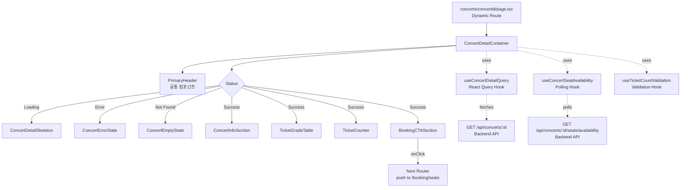
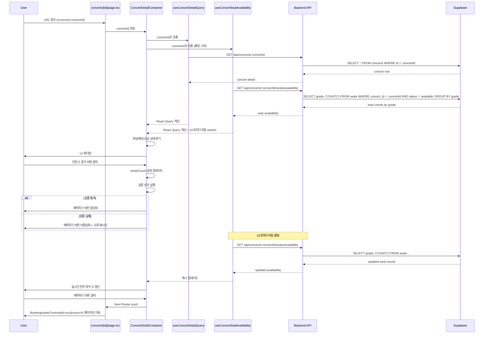

# 콘서트 상세 (Concert Detail) 페이지 구현 계획

## 1. 개요

### 1.1 페이지 정보
- **페이지 경로**: `/concerts/:concertId` (동적 라우트)
- **페이지 목적**: 콘서트 상세 정보를 확인하고 예매 인원을 선택하여 좌석 선택 페이지로 이동
- **관련 유스케이스**: [Usecase 002: 콘서트 상세 정보 확인 및 인원 선택](../../usecases/002/spec.md)

### 1.2 주요 기능
1. 콘서트 상세 정보 표시 (제목, 설명, 이미지, 장소, 일시)
2. 등급별 티켓 가격 및 실시간 잔여 좌석 수 표시
3. 인원 수 선택 기능 (증감 버튼)
4. 실시간 잔여 좌석 수 갱신 (폴링)
5. 인원 수 검증 로직
   - 1 이상
   - `max_tickets_per_booking` 이하
   - 전체 잔여 좌석 이하
6. 예약하기 버튼 활성화/비활성화
7. 좌석 선택 페이지로 네비게이션 (concertId와 numberOfTickets 전달)

### 1.3 상태 관리 전략
- **서버 상태**: `@tanstack/react-query` 를 사용하여 콘서트 상세 정보 및 실시간 좌석 수 캐싱 및 관리
- **로컬 UI 상태**: `useState` 를 사용하여 선택된 인원 수 관리
- **폴링 전략**: React Query의 `refetchInterval` 옵션을 사용하여 10초마다 잔여 좌석 수 자동 갱신
- **전역 상태**: 좌석 선택 페이지로 전달할 데이터는 URL Query Parameters 사용

## 2. 모듈 구조 설계

### 2.1 백엔드 모듈

#### 2.1.1 API Route
- **위치**: `src/features/concerts/backend/route.ts` (기존 파일 확장)
- **설명**: 콘서트 상세 조회 API 엔드포인트 추가
- **새 엔드포인트**:
  - `GET /api/concerts/:concertId` - 콘서트 상세 정보 조회
  - `GET /api/concerts/:concertId/seats/availability` - 등급별 잔여 좌석 수 조회

#### 2.1.2 Service
- **위치**: `src/features/concerts/backend/service.ts` (기존 파일 확장)
- **설명**: Supabase를 통한 콘서트 상세 및 좌석 수 조회 비즈니스 로직
- **새 함수**:
  - `getConcertById()`: 콘서트 상세 정보 조회
  - `getConcertSeatAvailability()`: 등급별 잔여 좌석 수 조회

#### 2.1.3 Schema
- **위치**: `src/features/concerts/backend/schema.ts` (기존 파일 확장)
- **설명**: Zod 스키마를 사용한 요청/응답 타입 정의
- **새 스키마**:
  - `ConcertIdParamSchema`: concertId 파라미터 검증
  - `SeatGradeSchema`: 좌석 등급 enum
  - `ConcertDetailResponseSchema`: 콘서트 상세 정보 응답
  - `SeatAvailabilitySchema`: 등급별 잔여 좌석 수
  - `SeatAvailabilityResponseSchema`: 전체 잔여 좌석 응답

#### 2.1.4 Error
- **위치**: `src/features/concerts/backend/error.ts` (기존 파일 확장)
- **설명**: 콘서트 상세 관련 에러 코드 추가
- **새 에러 코드**:
  - `CONCERT_NOT_FOUND`: 콘서트가 존재하지 않음
  - `CONCERT_NOT_AVAILABLE`: 예매 불가능한 상태 (published가 아님)
  - `SEAT_AVAILABILITY_FETCH_ERROR`: 좌석 수 조회 실패

### 2.2 프론트엔드 모듈

#### 2.2.1 Page Component
- **위치**: `src/app/concerts/[concertId]/page.tsx`
- **설명**: 콘서트 상세 페이지 루트 컴포넌트 (Client Component)
- **책임**: concertId 파라미터 파싱 및 하위 컴포넌트 조합

#### 2.2.2 Main Container
- **위치**: `src/features/concerts/components/concert-detail-container.tsx`
- **설명**: 콘서트 상세 조회 및 상태 관리를 담당하는 컨테이너 컴포넌트
- **책임**:
  - React Query를 통한 데이터 페칭 (콘서트 상세 + 좌석 수)
  - 실시간 좌석 수 폴링
  - 로딩/에러 상태 처리
  - 하위 presentational 컴포넌트에 데이터 전달

#### 2.2.3 Concert Info Section
- **위치**: `src/features/concerts/components/concert-info-section.tsx`
- **설명**: 콘서트 기본 정보를 표시하는 섹션 컴포넌트
- **Props**: `concert` (id, title, description, imageUrl, venue, startDate, endDate)

#### 2.2.4 Ticket Grade Table
- **위치**: `src/features/concerts/components/ticket-grade-table.tsx`
- **설명**: 등급별 티켓 가격 및 잔여 좌석 수를 표로 표시하는 컴포넌트
- **Props**: `grades[]` (grade, price, availableCount)

#### 2.2.5 Ticket Counter
- **위치**: `src/features/concerts/components/ticket-counter.tsx`
- **설명**: 인원 수 선택 UI (증감 버튼)
- **Props**: `value`, `min`, `max`, `onChange`, `disabled`
- **재사용 가능**: 다른 카운터 UI가 필요한 곳에서 재사용 가능

#### 2.2.6 Booking CTA Section
- **위치**: `src/features/concerts/components/booking-cta-section.tsx`
- **설명**: 선택된 인원 수 표시 및 예약하기 버튼을 포함하는 CTA 섹션
- **Props**: `ticketCount`, `isDisabled`, `onBooking`, `validationMessage`

#### 2.2.7 Empty State
- **위치**: 기존 `src/features/concerts/components/concert-empty-state.tsx` 재사용
- **설명**: 콘서트를 찾을 수 없거나 매진된 경우 표시

#### 2.2.8 Error State
- **위치**: 기존 `src/features/concerts/components/concert-error-state.tsx` 재사용
- **설명**: 에러 발생 시 표시되는 컴포넌트

#### 2.2.9 Loading Skeleton
- **위치**: `src/features/concerts/components/concert-detail-skeleton.tsx`
- **설명**: 로딩 중 표시되는 스켈레톤 UI

#### 2.2.10 Header Component
- **위치**: 기존 `src/components/layout/header.tsx` 재사용 (PrimaryHeader)
- **설명**: 페이지 상단 헤더

### 2.3 데이터 페칭 Hook

#### 2.3.1 useConcertDetailQuery
- **위치**: `src/features/concerts/hooks/useConcertDetailQuery.ts`
- **설명**: 콘서트 상세 정보를 조회하는 React Query 커스텀 훅
- **Parameters**: `concertId: string`
- **Returns**: `{ data, isLoading, isError, error, refetch }`

#### 2.3.2 useConcertSeatAvailability
- **위치**: `src/features/concerts/hooks/useConcertSeatAvailability.ts`
- **설명**: 실시간 좌석 수를 폴링하는 React Query 커스텀 훅
- **Parameters**: `concertId: string, enabled: boolean`
- **Returns**: `{ data, isLoading, isError, error }`
- **특징**: `refetchInterval: 10000` (10초마다 자동 갱신)

### 2.4 공통 유틸리티 및 타입

#### 2.4.1 DTO (Data Transfer Object)
- **위치**: `src/features/concerts/lib/dto.ts` (기존 파일 확장)
- **설명**: 백엔드 스키마를 클라이언트에서 재사용하기 위한 재노출
- **새 Export**:
  - `ConcertDetailResponse`
  - `SeatAvailabilityResponse`
  - `SeatGrade`

#### 2.4.2 Constants
- **위치**: `src/features/concerts/constants/index.ts` (기존 파일 확장)
- **설명**: 콘서트 상세 페이지 관련 상수 추가
- **새 Constants**:
  - `SEAT_GRADES`: { VIP: 'vip', R: 'r', S: 's', A: 'a' }
  - `SEAT_GRADE_LABELS`: { vip: 'VIP', r: 'R석', s: 'S석', a: 'A석' }
  - `POLLING_INTERVAL`: 10000 (10초)
  - `MIN_TICKET_COUNT`: 1
  - `DEFAULT_MAX_TICKETS_PER_BOOKING`: 6

#### 2.4.3 Validation Hook
- **위치**: `src/features/concerts/hooks/useTicketCountValidation.ts`
- **설명**: 인원 수 검증 로직을 담당하는 커스텀 훅
- **Parameters**: `ticketCount`, `maxTicketsPerBooking`, `totalAvailableSeats`
- **Returns**: `{ isValid, validationMessage }`

#### 2.4.4 날짜 포맷 유틸리티 (공통)
- **위치**: 기존 `src/lib/utils/date.ts` 재사용
- **Functions**: `formatConcertPeriod(startDate, endDate)`, `formatShortDate(date)`

#### 2.4.5 ROUTES 상수 (공통)
- **위치**: 기존 `src/constants/app.ts` 확장
- **추가 상수**:
  - `ROUTES.seatSelection: (concertId: string, count: number) => `/booking/seats?concertId=${concertId}&count=${count}`

## 3. 아키텍처 다이어그램

### 3.1 컴포넌트 계층 구조



### 3.2 데이터 플로우



### 3.3 상태 관리 구조

```mermaid
graph LR
    A[URL Param<br/>concertId] -->|파싱| B[useConcertDetailQuery]
    A -->|파싱| C[useConcertSeatAvailability]

    B -->|data| D[React Query Cache<br/>콘서트 상세]
    C -->|data + refetchInterval| E[React Query Cache<br/>좌석 수]

    D -->|concert| F[Container State]
    E -->|seatAvailability| F

    F -->|ticketCount| G[useState<br/>로컬 상태]

    F -.validate.-> H[useTicketCountValidation]
    G -.ticketCount.-> H
    E -.totalAvailableSeats.-> H
    D -.maxTicketsPerBooking.-> H

    H -->|isValid, message| I[UI Components]
    F -->|concert, seats| I
    G -->|ticketCount| I

    I -->|user action| J[Next Router]
    J -->|navigate| K[/booking/seats?concertId=xxx&count=N]
```

## 4. 상세 구현 계획

### 4.1 백엔드 구현

#### 4.1.1 Schema 확장
```typescript
// src/features/concerts/backend/schema.ts (기존 파일 확장)

import { z } from 'zod';

// concertId 파라미터 검증
export const ConcertIdParamSchema = z.object({
  concertId: z.string().uuid(),
});

export type ConcertIdParam = z.infer<typeof ConcertIdParamSchema>;

// 좌석 등급 enum
export const SeatGradeSchema = z.enum(['vip', 'r', 's', 'a']);
export type SeatGrade = z.infer<typeof SeatGradeSchema>;

// 콘서트 상세 응답 (기존 ConcertResponse 확장)
export const ConcertDetailResponseSchema = z.object({
  id: z.string().uuid(),
  title: z.string(),
  description: z.string().nullable(),
  imageUrl: z.string().url(),
  venue: z.string(),
  startDate: z.string(),
  endDate: z.string(),
  status: z.string(),
  maxTicketsPerBooking: z.number().int().positive(),
});

export type ConcertDetailResponse = z.infer<typeof ConcertDetailResponseSchema>;

// 등급별 잔여 좌석
export const SeatAvailabilitySchema = z.object({
  grade: SeatGradeSchema,
  price: z.number().int().nonnegative(),
  availableCount: z.number().int().nonnegative(),
});

export type SeatAvailability = z.infer<typeof SeatAvailabilitySchema>;

// 전체 좌석 수 응답
export const SeatAvailabilityResponseSchema = z.object({
  grades: z.array(SeatAvailabilitySchema),
  totalAvailable: z.number().int().nonnegative(),
});

export type SeatAvailabilityResponse = z.infer<typeof SeatAvailabilityResponseSchema>;
```

#### 4.1.2 Service 확장
```typescript
// src/features/concerts/backend/service.ts (기존 파일 확장)

import type { SupabaseClient } from '@supabase/supabase-js';
import {
  failure,
  success,
  type HandlerResult,
} from '@/backend/http/response';
import {
  ConcertDetailResponseSchema,
  SeatAvailabilityResponseSchema,
  type ConcertDetailResponse,
  type SeatAvailabilityResponse,
} from '@/features/concerts/backend/schema';
import {
  concertErrorCodes,
  type ConcertServiceError,
} from '@/features/concerts/backend/error';
import {
  CONCERT_PLACEHOLDER_IMAGE_DIMENSIONS,
} from '@/features/concerts/constants';

const CONCERTS_TABLE = 'concerts';
const SEATS_TABLE = 'seats';
const PUBLISHED_STATUS = 'published';
const AVAILABLE_STATUS = 'available';

const toPlaceholderImage = (seed: string) =>
  `https://picsum.photos/seed/${encodeURIComponent(seed)}/${CONCERT_PLACEHOLDER_IMAGE_DIMENSIONS.width}/${CONCERT_PLACEHOLDER_IMAGE_DIMENSIONS.height}`;

/**
 * 콘서트 상세 정보 조회
 */
export const getConcertById = async (
  client: SupabaseClient,
  concertId: string,
): Promise<HandlerResult<ConcertDetailResponse, ConcertServiceError, unknown>> => {
  const { data, error } = await client
    .from(CONCERTS_TABLE)
    .select('id, title, description, image_url, venue, start_date, end_date, status, max_tickets_per_booking')
    .eq('id', concertId)
    .single();

  if (error) {
    if (error.code === 'PGRST116') {
      // PGRST116: No rows returned
      return failure(404, concertErrorCodes.notFound, 'Concert not found.');
    }

    return failure(500, concertErrorCodes.fetchError, error.message);
  }

  // 예매 불가능한 상태 검증
  if (data.status !== PUBLISHED_STATUS) {
    return failure(
      400,
      concertErrorCodes.notAvailable,
      'This concert is not available for booking.',
    );
  }

  const parsed = ConcertDetailResponseSchema.safeParse({
    id: data.id,
    title: data.title,
    description: data.description,
    imageUrl: data.image_url ?? toPlaceholderImage(data.id),
    venue: data.venue,
    startDate: data.start_date,
    endDate: data.end_date,
    status: data.status,
    maxTicketsPerBooking: data.max_tickets_per_booking,
  });

  if (!parsed.success) {
    return failure(
      500,
      concertErrorCodes.validationError,
      'Concert detail failed validation.',
      parsed.error.format(),
    );
  }

  return success(parsed.data);
};

/**
 * 등급별 잔여 좌석 수 조회
 */
export const getConcertSeatAvailability = async (
  client: SupabaseClient,
  concertId: string,
): Promise<HandlerResult<SeatAvailabilityResponse, ConcertServiceError, unknown>> => {
  // 1. 콘서트 존재 여부 확인
  const { data: concertData, error: concertError } = await client
    .from(CONCERTS_TABLE)
    .select('id')
    .eq('id', concertId)
    .single();

  if (concertError) {
    if (concertError.code === 'PGRST116') {
      return failure(404, concertErrorCodes.notFound, 'Concert not found.');
    }

    return failure(500, concertErrorCodes.fetchError, concertError.message);
  }

  // 2. 등급별 잔여 좌석 수 조회
  const { data, error } = await client
    .from(SEATS_TABLE)
    .select('grade, price')
    .eq('concert_id', concertId)
    .eq('status', AVAILABLE_STATUS);

  if (error) {
    return failure(500, concertErrorCodes.seatAvailabilityFetchError, error.message);
  }

  // 3. 등급별로 집계
  const gradeMap = new Map<string, { price: number; count: number }>();

  (data ?? []).forEach((row) => {
    const existing = gradeMap.get(row.grade);

    if (existing) {
      existing.count += 1;
    } else {
      gradeMap.set(row.grade, { price: row.price, count: 1 });
    }
  });

  // 4. 배열로 변환 및 정렬 (vip -> r -> s -> a)
  const gradeOrder = ['vip', 'r', 's', 'a'];
  const grades = Array.from(gradeMap.entries())
    .map(([grade, info]) => ({
      grade,
      price: info.price,
      availableCount: info.count,
    }))
    .sort((a, b) => gradeOrder.indexOf(a.grade) - gradeOrder.indexOf(b.grade));

  const totalAvailable = grades.reduce((sum, g) => sum + g.availableCount, 0);

  const parsed = SeatAvailabilityResponseSchema.safeParse({
    grades,
    totalAvailable,
  });

  if (!parsed.success) {
    return failure(
      500,
      concertErrorCodes.validationError,
      'Seat availability failed validation.',
      parsed.error.format(),
    );
  }

  return success(parsed.data);
};
```

#### 4.1.3 Route 확장
```typescript
// src/features/concerts/backend/route.ts (기존 파일 확장)

import { Hono } from 'hono';
import type { AppEnv } from '@/backend/hono/context';
import { getSupabase } from '@/backend/middleware/supabase';
import { getLogger } from '@/backend/middleware/context';
import { respond, failure } from '@/backend/http/response';
import {
  parseConcertQueryParams,
  getConcerts,
  getConcertById,
  getConcertSeatAvailability,
} from '@/features/concerts/backend/service';
import {
  ConcertIdParamSchema,
} from '@/features/concerts/backend/schema';

export const registerConcertRoutes = (app: Hono<AppEnv>) => {
  // 기존: GET /concerts (콘서트 목록)
  app.get('/concerts', async (c) => {
    // ... 기존 구현 유지 ...
  });

  // 신규: GET /concerts/:concertId (콘서트 상세)
  app.get('/concerts/:concertId', async (c) => {
    const concertId = c.req.param('concertId');
    const parsedParam = ConcertIdParamSchema.safeParse({ concertId });

    if (!parsedParam.success) {
      return respond(
        c,
        failure(
          400,
          'INVALID_CONCERT_ID',
          'The provided concert ID is invalid.',
          parsedParam.error.format(),
        ),
      );
    }

    const supabase = getSupabase(c);
    const logger = getLogger(c);

    const result = await getConcertById(supabase, parsedParam.data.concertId);

    if (!result.ok) {
      logger.error('Failed to fetch concert detail', result.error.message);
    }

    return respond(c, result);
  });

  // 신규: GET /concerts/:concertId/seats/availability (등급별 잔여 좌석 수)
  app.get('/concerts/:concertId/seats/availability', async (c) => {
    const concertId = c.req.param('concertId');
    const parsedParam = ConcertIdParamSchema.safeParse({ concertId });

    if (!parsedParam.success) {
      return respond(
        c,
        failure(
          400,
          'INVALID_CONCERT_ID',
          'The provided concert ID is invalid.',
          parsedParam.error.format(),
        ),
      );
    }

    const supabase = getSupabase(c);
    const logger = getLogger(c);

    const result = await getConcertSeatAvailability(supabase, parsedParam.data.concertId);

    if (!result.ok) {
      logger.error('Failed to fetch seat availability', result.error.message);
    }

    return respond(c, result);
  });
};
```

#### 4.1.4 Error 확장
```typescript
// src/features/concerts/backend/error.ts (기존 파일 확장)

export const concertErrorCodes = {
  fetchError: 'CONCERT_FETCH_ERROR',
  validationError: 'CONCERT_VALIDATION_ERROR',
  notFound: 'CONCERT_NOT_FOUND', // 신규
  notAvailable: 'CONCERT_NOT_AVAILABLE', // 신규
  seatAvailabilityFetchError: 'SEAT_AVAILABILITY_FETCH_ERROR', // 신규
} as const;

export type ConcertServiceError =
  (typeof concertErrorCodes)[keyof typeof concertErrorCodes];
```

### 4.2 프론트엔드 구현

#### 4.2.1 Constants 확장
```typescript
// src/features/concerts/constants/index.ts (기존 파일 확장)

// 좌석 등급
export const SEAT_GRADES = {
  VIP: 'vip',
  R: 'r',
  S: 's',
  A: 'a',
} as const;

// 좌석 등급 라벨
export const SEAT_GRADE_LABELS: Record<string, string> = {
  vip: 'VIP',
  r: 'R석',
  s: 'S석',
  a: 'A석',
};

// 폴링 간격 (10초)
export const SEAT_AVAILABILITY_POLLING_INTERVAL = 10000;

// 인원 수 제한
export const MIN_TICKET_COUNT = 1;
export const DEFAULT_MAX_TICKETS_PER_BOOKING = 6;
```

#### 4.2.2 DTO 확장
```typescript
// src/features/concerts/lib/dto.ts (기존 파일 확장)

export type {
  ConcertDetailResponse,
  SeatAvailabilityResponse,
  SeatAvailability,
  SeatGrade,
} from '@/features/concerts/backend/schema';
```

#### 4.2.3 ROUTES 상수 확장
```typescript
// src/constants/app.ts (기존 파일 확장)

export const ROUTES = {
  home: '/',
  bookingLookup: '/lookup',
  concertDetail: (id: string) => `/concerts/${id}`,
  seatSelection: (concertId: string, count: number) => `/booking/seats?concertId=${concertId}&count=${count}`, // 신규
} as const;
```

#### 4.2.4 React Query Hooks

##### useConcertDetailQuery
```typescript
// src/features/concerts/hooks/useConcertDetailQuery.ts

"use client";

import { useQuery } from '@tanstack/react-query';
import { apiClient, extractApiErrorMessage } from '@/lib/remote/api-client';
import { ConcertDetailResponseSchema } from '@/features/concerts/backend/schema';

export const useConcertDetailQuery = (concertId: string) => {
  return useQuery({
    queryKey: ['concert-detail', concertId],
    queryFn: async () => {
      try {
        const { data } = await apiClient.get(`/api/concerts/${concertId}`);
        return ConcertDetailResponseSchema.parse(data);
      } catch (error) {
        const message = extractApiErrorMessage(error, 'Failed to fetch concert detail.');
        throw new Error(message);
      }
    },
    enabled: !!concertId,
    staleTime: 60000, // 1분
    retry: 1,
  });
};
```

##### useConcertSeatAvailability
```typescript
// src/features/concerts/hooks/useConcertSeatAvailability.ts

"use client";

import { useQuery } from '@tanstack/react-query';
import { apiClient, extractApiErrorMessage } from '@/lib/remote/api-client';
import { SeatAvailabilityResponseSchema } from '@/features/concerts/backend/schema';
import { SEAT_AVAILABILITY_POLLING_INTERVAL } from '@/features/concerts/constants';

export const useConcertSeatAvailability = (concertId: string, enabled = true) => {
  return useQuery({
    queryKey: ['concert-seat-availability', concertId],
    queryFn: async () => {
      try {
        const { data } = await apiClient.get(`/api/concerts/${concertId}/seats/availability`);
        return SeatAvailabilityResponseSchema.parse(data);
      } catch (error) {
        const message = extractApiErrorMessage(error, 'Failed to fetch seat availability.');
        throw new Error(message);
      }
    },
    enabled: enabled && !!concertId,
    refetchInterval: SEAT_AVAILABILITY_POLLING_INTERVAL, // 10초마다 자동 갱신
    refetchIntervalInBackground: false, // 탭이 백그라운드일 때는 폴링 중지
    staleTime: 5000, // 5초
    retry: 1,
  });
};
```

##### useTicketCountValidation
```typescript
// src/features/concerts/hooks/useTicketCountValidation.ts

"use client";

import { useMemo } from 'react';
import { MIN_TICKET_COUNT } from '@/features/concerts/constants';

type ValidationResult = {
  isValid: boolean;
  validationMessage: string | null;
};

export const useTicketCountValidation = (
  ticketCount: number,
  maxTicketsPerBooking: number,
  totalAvailableSeats: number,
): ValidationResult => {
  return useMemo(() => {
    if (ticketCount < MIN_TICKET_COUNT) {
      return {
        isValid: false,
        validationMessage: '최소 1매 이상 선택해주세요.',
      };
    }

    if (ticketCount > maxTicketsPerBooking) {
      return {
        isValid: false,
        validationMessage: `1회 최대 ${maxTicketsPerBooking}매까지만 예매 가능합니다.`,
      };
    }

    if (ticketCount > totalAvailableSeats) {
      return {
        isValid: false,
        validationMessage: '잔여 좌석이 부족합니다. 인원 수를 조정해주세요.',
      };
    }

    return {
      isValid: true,
      validationMessage: null,
    };
  }, [ticketCount, maxTicketsPerBooking, totalAvailableSeats]);
};
```

#### 4.2.5 Container Component
```typescript
// src/features/concerts/components/concert-detail-container.tsx

"use client";

import { useState } from 'react';
import { useRouter } from 'next/navigation';
import { PrimaryHeader } from '@/components/layout/header';
import { useConcertDetailQuery } from '@/features/concerts/hooks/useConcertDetailQuery';
import { useConcertSeatAvailability } from '@/features/concerts/hooks/useConcertSeatAvailability';
import { useTicketCountValidation } from '@/features/concerts/hooks/useTicketCountValidation';
import { ConcertDetailSkeleton } from '@/features/concerts/components/concert-detail-skeleton';
import { ConcertErrorState } from '@/features/concerts/components/concert-error-state';
import { ConcertEmptyState } from '@/features/concerts/components/concert-empty-state';
import { ConcertInfoSection } from '@/features/concerts/components/concert-info-section';
import { TicketGradeTable } from '@/features/concerts/components/ticket-grade-table';
import { TicketCounter } from '@/features/concerts/components/ticket-counter';
import { BookingCTASection } from '@/features/concerts/components/booking-cta-section';
import { ROUTES } from '@/constants/app';
import { MIN_TICKET_COUNT } from '@/features/concerts/constants';

type ConcertDetailContainerProps = {
  concertId: string;
};

export function ConcertDetailContainer({ concertId }: ConcertDetailContainerProps) {
  const router = useRouter();
  const [ticketCount, setTicketCount] = useState<number>(MIN_TICKET_COUNT);

  const detailQuery = useConcertDetailQuery(concertId);
  const seatQuery = useConcertSeatAvailability(concertId, detailQuery.isSuccess);

  const validation = useTicketCountValidation(
    ticketCount,
    detailQuery.data?.maxTicketsPerBooking ?? 0,
    seatQuery.data?.totalAvailable ?? 0,
  );

  const handleBooking = () => {
    if (!validation.isValid) {
      return;
    }

    const seatSelectionUrl = ROUTES.seatSelection(concertId, ticketCount);
    router.push(seatSelectionUrl);
  };

  if (detailQuery.isLoading) {
    return <ConcertDetailSkeleton />;
  }

  if (detailQuery.isError) {
    const isNotFound = detailQuery.error.message.includes('not found');

    if (isNotFound) {
      return (
        <>
          <PrimaryHeader />
          <ConcertEmptyState message="요청하신 콘서트를 찾을 수 없습니다." />
        </>
      );
    }

    return (
      <>
        <PrimaryHeader />
        <ConcertErrorState
          error={detailQuery.error.message}
          onRetry={() => detailQuery.refetch()}
        />
      </>
    );
  }

  if (!detailQuery.data) {
    return (
      <>
        <PrimaryHeader />
        <ConcertEmptyState message="콘서트 정보를 불러올 수 없습니다." />
      </>
    );
  }

  const concert = detailQuery.data;
  const seatAvailability = seatQuery.data;
  const isSoldOut = seatAvailability?.totalAvailable === 0;

  return (
    <div className="min-h-screen bg-slate-950">
      <PrimaryHeader />

      <main className="container mx-auto max-w-5xl px-4 py-8 space-y-8">
        <ConcertInfoSection concert={concert} />

        {seatQuery.isLoading ? (
          <div className="text-center text-slate-400">좌석 정보를 불러오는 중...</div>
        ) : seatQuery.isError ? (
          <ConcertErrorState
            error="좌석 정보를 불러오는데 실패했습니다."
            onRetry={() => seatQuery.refetch()}
          />
        ) : isSoldOut ? (
          <ConcertEmptyState message="모든 좌석이 매진되었습니다." />
        ) : (
          <>
            <TicketGradeTable grades={seatAvailability?.grades ?? []} />

            <div className="border-t border-slate-800 pt-8 space-y-6">
              <div className="space-y-2">
                <h3 className="text-lg font-semibold text-white">인원 선택</h3>
                <p className="text-sm text-slate-400">
                  예매하실 인원 수를 선택해주세요. (최대 {concert.maxTicketsPerBooking}매)
                </p>
              </div>

              <TicketCounter
                value={ticketCount}
                min={MIN_TICKET_COUNT}
                max={Math.min(concert.maxTicketsPerBooking, seatAvailability?.totalAvailable ?? 0)}
                onChange={setTicketCount}
                disabled={isSoldOut}
              />

              <BookingCTASection
                ticketCount={ticketCount}
                isDisabled={!validation.isValid || isSoldOut}
                onBooking={handleBooking}
                validationMessage={validation.validationMessage}
              />
            </div>
          </>
        )}
      </main>
    </div>
  );
}
```

#### 4.2.6 Presentational Components

##### ConcertInfoSection
```typescript
// src/features/concerts/components/concert-info-section.tsx

"use client";

import Image from 'next/image';
import { Calendar, MapPin } from 'lucide-react';
import { formatConcertPeriod } from '@/lib/utils/date';
import type { ConcertDetailResponse } from '@/features/concerts/lib/dto';

type ConcertInfoSectionProps = {
  concert: ConcertDetailResponse;
};

export function ConcertInfoSection({ concert }: ConcertInfoSectionProps) {
  const dateRange = formatConcertPeriod(concert.startDate, concert.endDate);

  return (
    <section className="space-y-6">
      <div className="relative aspect-[16/9] w-full overflow-hidden rounded-lg">
        <Image
          src={concert.imageUrl}
          alt={concert.title}
          fill
          className="object-cover"
          sizes="(max-width: 1280px) 100vw, 1280px"
          priority
        />
      </div>

      <div className="space-y-4">
        <h1 className="text-3xl font-bold text-white md:text-4xl">{concert.title}</h1>

        {concert.description && (
          <p className="text-slate-300 leading-relaxed whitespace-pre-wrap">
            {concert.description}
          </p>
        )}

        <div className="flex flex-col gap-3 text-slate-300">
          <div className="flex items-center gap-2">
            <Calendar className="h-5 w-5 text-emerald-400" />
            <span>{dateRange}</span>
          </div>

          <div className="flex items-center gap-2">
            <MapPin className="h-5 w-5 text-emerald-400" />
            <span>{concert.venue}</span>
          </div>
        </div>
      </div>
    </section>
  );
}
```

##### TicketGradeTable
```typescript
// src/features/concerts/components/ticket-grade-table.tsx

"use client";

import { SEAT_GRADE_LABELS } from '@/features/concerts/constants';
import type { SeatAvailability } from '@/features/concerts/lib/dto';

type TicketGradeTableProps = {
  grades: SeatAvailability[];
};

export function TicketGradeTable({ grades }: TicketGradeTableProps) {
  if (grades.length === 0) {
    return null;
  }

  return (
    <section className="space-y-4">
      <h2 className="text-xl font-semibold text-white">등급별 가격 및 잔여 좌석</h2>

      <div className="overflow-hidden rounded-lg border border-slate-800">
        <table className="w-full">
          <thead className="bg-slate-900/60">
            <tr>
              <th className="px-4 py-3 text-left text-sm font-semibold text-slate-200">
                등급
              </th>
              <th className="px-4 py-3 text-right text-sm font-semibold text-slate-200">
                가격
              </th>
              <th className="px-4 py-3 text-right text-sm font-semibold text-slate-200">
                잔여 좌석
              </th>
            </tr>
          </thead>
          <tbody className="divide-y divide-slate-800">
            {grades.map((grade) => (
              <tr key={grade.grade} className="bg-slate-950/60 hover:bg-slate-900/40 transition">
                <td className="px-4 py-3 text-sm font-medium text-white">
                  {SEAT_GRADE_LABELS[grade.grade] ?? grade.grade.toUpperCase()}
                </td>
                <td className="px-4 py-3 text-right text-sm text-slate-300">
                  {grade.price.toLocaleString()}원
                </td>
                <td className="px-4 py-3 text-right text-sm text-emerald-400">
                  {grade.availableCount.toLocaleString()}석
                </td>
              </tr>
            ))}
          </tbody>
        </table>
      </div>
    </section>
  );
}
```

##### TicketCounter
```typescript
// src/features/concerts/components/ticket-counter.tsx

"use client";

import { Minus, Plus } from 'lucide-react';
import { Button } from '@/components/ui/button';

type TicketCounterProps = {
  value: number;
  min: number;
  max: number;
  onChange: (value: number) => void;
  disabled?: boolean;
};

export function TicketCounter({ value, min, max, onChange, disabled = false }: TicketCounterProps) {
  const handleDecrement = () => {
    if (value > min) {
      onChange(value - 1);
    }
  };

  const handleIncrement = () => {
    if (value < max) {
      onChange(value + 1);
    }
  };

  return (
    <div className="flex items-center justify-center gap-4">
      <Button
        variant="outline"
        size="icon"
        onClick={handleDecrement}
        disabled={disabled || value <= min}
        aria-label="인원 감소"
        className="h-12 w-12 rounded-full border-slate-700 hover:bg-slate-800"
      >
        <Minus className="h-5 w-5" />
      </Button>

      <div className="flex min-w-[80px] items-center justify-center rounded-lg border border-slate-700 bg-slate-900/60 px-6 py-3">
        <span className="text-2xl font-semibold text-white">{value}</span>
        <span className="ml-1 text-sm text-slate-400">매</span>
      </div>

      <Button
        variant="outline"
        size="icon"
        onClick={handleIncrement}
        disabled={disabled || value >= max}
        aria-label="인원 증가"
        className="h-12 w-12 rounded-full border-slate-700 hover:bg-slate-800"
      >
        <Plus className="h-5 w-5" />
      </Button>
    </div>
  );
}
```

##### BookingCTASection
```typescript
// src/features/concerts/components/booking-cta-section.tsx

"use client";

import { ArrowRight } from 'lucide-react';
import { Button } from '@/components/ui/button';

type BookingCTASectionProps = {
  ticketCount: number;
  isDisabled: boolean;
  onBooking: () => void;
  validationMessage: string | null;
};

export function BookingCTASection({
  ticketCount,
  isDisabled,
  onBooking,
  validationMessage,
}: BookingCTASectionProps) {
  return (
    <div className="space-y-4 rounded-lg border border-slate-800 bg-slate-900/40 p-6">
      <div className="flex items-center justify-between">
        <span className="text-sm text-slate-400">선택한 인원</span>
        <span className="text-lg font-semibold text-white">{ticketCount}매</span>
      </div>

      {validationMessage && (
        <p className="text-sm text-amber-400" role="alert">
          {validationMessage}
        </p>
      )}

      <Button
        onClick={onBooking}
        disabled={isDisabled}
        className="w-full gap-2 bg-emerald-600 py-6 text-base font-semibold hover:bg-emerald-500 disabled:bg-slate-700 disabled:text-slate-500"
      >
        좌석 선택하기
        <ArrowRight className="h-5 w-5" />
      </Button>
    </div>
  );
}
```

##### ConcertDetailSkeleton
```typescript
// src/features/concerts/components/concert-detail-skeleton.tsx

"use client";

import { PrimaryHeader } from '@/components/layout/header';
import { Skeleton } from '@/components/ui/skeleton';

export function ConcertDetailSkeleton() {
  return (
    <div className="min-h-screen bg-slate-950">
      <PrimaryHeader />

      <main className="container mx-auto max-w-5xl px-4 py-8 space-y-8">
        <section className="space-y-6">
          <Skeleton className="aspect-[16/9] w-full rounded-lg" />

          <div className="space-y-4">
            <Skeleton className="h-10 w-3/4" />
            <Skeleton className="h-20 w-full" />
            <div className="space-y-2">
              <Skeleton className="h-5 w-1/3" />
              <Skeleton className="h-5 w-1/2" />
            </div>
          </div>
        </section>

        <section className="space-y-4">
          <Skeleton className="h-6 w-1/3" />
          <Skeleton className="h-40 w-full rounded-lg" />
        </section>

        <div className="space-y-6">
          <Skeleton className="h-6 w-1/4" />
          <Skeleton className="h-16 w-full" />
          <Skeleton className="h-24 w-full rounded-lg" />
        </div>
      </main>
    </div>
  );
}
```

#### 4.2.7 Page Component
```typescript
// src/app/concerts/[concertId]/page.tsx

import { ConcertDetailContainer } from '@/features/concerts/components/concert-detail-container';

type PageProps = {
  params: Promise<{
    concertId: string;
  }>;
};

export default async function ConcertDetailPage(props: PageProps) {
  const params = await props.params;

  return <ConcertDetailContainer concertId={params.concertId} />;
}
```

## 5. API 명세

### 5.1 GET /api/concerts/:concertId

**설명**: 콘서트 상세 정보를 조회합니다.

**Path Parameters**:
| Parameter | Type | Required | Description |
|-----------|------|----------|-------------|
| concertId | uuid | Yes | 콘서트 고유 ID |

**Response 200 OK**:
```json
{
  "id": "uuid",
  "title": "콘서트 제목",
  "description": "콘서트 설명",
  "imageUrl": "https://picsum.photos/seed/uuid/800/450",
  "venue": "올림픽공원 체조경기장",
  "startDate": "2025-11-01T19:00:00Z",
  "endDate": "2025-11-01T21:00:00Z",
  "status": "published",
  "maxTicketsPerBooking": 6
}
```

**Response 404 Not Found**:
```json
{
  "error": {
    "code": "CONCERT_NOT_FOUND",
    "message": "Concert not found."
  }
}
```

**Response 400 Bad Request** (예매 불가능한 상태):
```json
{
  "error": {
    "code": "CONCERT_NOT_AVAILABLE",
    "message": "This concert is not available for booking."
  }
}
```

### 5.2 GET /api/concerts/:concertId/seats/availability

**설명**: 등급별 잔여 좌석 수를 조회합니다.

**Path Parameters**:
| Parameter | Type | Required | Description |
|-----------|------|----------|-------------|
| concertId | uuid | Yes | 콘서트 고유 ID |

**Response 200 OK**:
```json
{
  "grades": [
    {
      "grade": "vip",
      "price": 150000,
      "availableCount": 50
    },
    {
      "grade": "r",
      "price": 120000,
      "availableCount": 120
    },
    {
      "grade": "s",
      "price": 90000,
      "availableCount": 200
    },
    {
      "grade": "a",
      "price": 60000,
      "availableCount": 300
    }
  ],
  "totalAvailable": 670
}
```

**Response 404 Not Found**:
```json
{
  "error": {
    "code": "CONCERT_NOT_FOUND",
    "message": "Concert not found."
  }
}
```

**Response 500 Internal Server Error**:
```json
{
  "error": {
    "code": "SEAT_AVAILABILITY_FETCH_ERROR",
    "message": "Failed to fetch seat availability."
  }
}
```

## 6. 에러 핸들링 전략

### 6.1 에러 타입별 처리

| 에러 타입 | HTTP 상태 | 처리 방법 |
|-----------|-----------|-----------|
| 콘서트를 찾을 수 없음 | 404 | Empty State 표시 ("요청하신 콘서트를 찾을 수 없습니다.") |
| 예매 불가능한 상태 | 400 | Empty State 표시 ("현재 예매할 수 없는 콘서트입니다.") |
| 좌석 정보 조회 실패 | 500 | Error State 표시, 재시도 버튼 제공 |
| 네트워크 오류 | - | Error State 표시, 재시도 버튼 제공 |
| 매진 | 200 (totalAvailable: 0) | Empty State 표시 ("모든 좌석이 매진되었습니다.") |

### 6.2 폴링 중 에러 처리
- 좌석 수 폴링 중 에러가 발생해도 기존 데이터는 유지
- 에러 메시지는 토스트로 표시하되, UI는 유지
- 재시도 버튼을 통해 수동 refetch 가능

## 7. 성능 최적화

### 7.1 React Query 캐싱 전략
```typescript
// 콘서트 상세: 1분 캐시, 폴링 없음
staleTime: 60000

// 좌석 수: 5초 캐시, 10초마다 폴링
staleTime: 5000
refetchInterval: 10000
refetchIntervalInBackground: false // 탭이 백그라운드일 때는 폴링 중지
```

### 7.2 이미지 최적화
- Next.js `Image` 컴포넌트 사용
- `priority` 속성으로 LCP 개선
- `sizes` 속성으로 반응형 이미지 로딩

### 7.3 컴포넌트 메모이제이션
- TicketGradeTable, TicketCounter 등 불필요한 리렌더링 방지
- `React.memo` 사용

### 7.4 폴링 최적화
- 탭이 백그라운드일 때는 폴링 중지 (`refetchIntervalInBackground: false`)
- 컴포넌트 언마운트 시 자동으로 폴링 중지 (React Query 기본 동작)

## 8. 접근성 (A11y)

### 8.1 ARIA 속성
```typescript
<main aria-label="콘서트 상세 정보">
  <section aria-label="콘서트 기본 정보">
    ...
  </section>

  <section aria-label="등급별 가격 및 잔여 좌석">
    <table>...</table>
  </section>

  <div aria-label="인원 선택">
    <TicketCounter />
  </div>
</main>
```

### 8.2 키보드 네비게이션
- 증감 버튼은 Tab 키로 접근 가능
- Enter/Space 키로 버튼 클릭
- 예약하기 버튼은 항상 포커스 가능 (비활성화 상태에서도)

### 8.3 스크린 리더 지원
```typescript
<Button aria-label="인원 감소">
  <Minus />
</Button>

<Button aria-label="인원 증가">
  <Plus />
</Button>

<div role="alert" aria-live="polite">
  {validationMessage}
</div>

<div role="status" aria-live="polite" aria-atomic="true">
  잔여 좌석: {totalAvailable}석
</div>
```

### 8.4 색상 대비
- WCAG AA 기준 준수
- 텍스트: `text-white`, `text-slate-300` (충분한 대비)
- 버튼: `bg-emerald-600` vs white text (4.5:1 이상)

## 9. 반응형 디자인

### 9.1 Breakpoints
```typescript
// Tailwind CSS 기본 breakpoints 사용
// sm: 640px (1 column)
// md: 768px (1 column, 헤더만 flex-row)
// lg: 1024px (1 column)
// xl: 1280px (max-w-5xl 컨테이너)
```

### 9.2 레이아웃 구조
```typescript
// Mobile: 단일 컬럼, 세로 배치
// Tablet: 단일 컬럼, 헤더만 가로 배치
// Desktop: 단일 컬럼, 최대 너비 제한 (max-w-5xl)

<main className="container mx-auto max-w-5xl px-4 py-8">
  <ConcertInfoSection /> {/* aspect-[16/9] 이미지 */}
  <TicketGradeTable /> {/* 테이블은 overflow-x-auto */}
  <TicketCounter /> {/* 항상 가운데 정렬 */}
</main>
```

### 9.3 터치 영역 최적화
- 증감 버튼: 48x48px 이상 (`h-12 w-12`)
- 예약하기 버튼: 전체 너비, 높이 48px 이상 (`py-6`)

## 10. 테스트 전략

### 10.1 단위 테스트 (Unit Tests)

#### Service Layer Test
```typescript
// src/features/concerts/backend/service.test.ts

describe('getConcertById', () => {
  it('should return concert detail when concert exists', async () => {
    const mockClient = createMockSupabaseClient();
    const result = await getConcertById(mockClient, 'valid-uuid');

    expect(result.ok).toBe(true);
    expect(result.data).toHaveProperty('id');
    expect(result.data).toHaveProperty('maxTicketsPerBooking');
  });

  it('should return 404 when concert not found', async () => {
    const mockClient = createMockSupabaseClient({ shouldFail: true, code: 'PGRST116' });
    const result = await getConcertById(mockClient, 'invalid-uuid');

    expect(result.ok).toBe(false);
    expect(result.error.code).toBe(concertErrorCodes.notFound);
  });

  it('should return 400 when concert is not published', async () => {
    const mockClient = createMockSupabaseClient({ status: 'draft' });
    const result = await getConcertById(mockClient, 'draft-concert-id');

    expect(result.ok).toBe(false);
    expect(result.error.code).toBe(concertErrorCodes.notAvailable);
  });
});

describe('getConcertSeatAvailability', () => {
  it('should return seat availability grouped by grade', async () => {
    const mockClient = createMockSupabaseClient();
    const result = await getConcertSeatAvailability(mockClient, 'valid-uuid');

    expect(result.ok).toBe(true);
    expect(result.data.grades).toBeInstanceOf(Array);
    expect(result.data.totalAvailable).toBeGreaterThanOrEqual(0);
  });

  it('should return empty array when no seats available', async () => {
    const mockClient = createMockSupabaseClient({ seats: [] });
    const result = await getConcertSeatAvailability(mockClient, 'sold-out-concert-id');

    expect(result.ok).toBe(true);
    expect(result.data.grades).toHaveLength(0);
    expect(result.data.totalAvailable).toBe(0);
  });
});
```

#### React Query Hook Test
```typescript
// src/features/concerts/hooks/useConcertDetailQuery.test.ts

describe('useConcertDetailQuery', () => {
  it('should fetch concert detail successfully', async () => {
    const { result } = renderHook(() => useConcertDetailQuery('valid-uuid'), {
      wrapper: createQueryClientWrapper(),
    });

    await waitFor(() => expect(result.current.isSuccess).toBe(true));
    expect(result.current.data).toHaveProperty('maxTicketsPerBooking');
  });

  it('should handle 404 errors', async () => {
    mockApiClient.get.mockRejectedValueOnce({
      response: { data: { error: { message: 'Concert not found' } } },
    });

    const { result } = renderHook(() => useConcertDetailQuery('invalid-uuid'), {
      wrapper: createQueryClientWrapper(),
    });

    await waitFor(() => expect(result.current.isError).toBe(true));
    expect(result.current.error?.message).toContain('not found');
  });
});

describe('useConcertSeatAvailability', () => {
  it('should poll seat availability every 10 seconds', async () => {
    vi.useFakeTimers();

    const { result } = renderHook(() => useConcertSeatAvailability('valid-uuid'), {
      wrapper: createQueryClientWrapper(),
    });

    await waitFor(() => expect(result.current.isSuccess).toBe(true));
    expect(mockApiClient.get).toHaveBeenCalledTimes(1);

    vi.advanceTimersByTime(10000);
    await waitFor(() => expect(mockApiClient.get).toHaveBeenCalledTimes(2));

    vi.useRealTimers();
  });

  it('should stop polling when enabled is false', async () => {
    const { result, rerender } = renderHook(
      ({ enabled }) => useConcertSeatAvailability('valid-uuid', enabled),
      {
        initialProps: { enabled: true },
        wrapper: createQueryClientWrapper(),
      }
    );

    await waitFor(() => expect(result.current.isSuccess).toBe(true));

    rerender({ enabled: false });
    expect(result.current.isFetching).toBe(false);
  });
});
```

#### Validation Hook Test
```typescript
// src/features/concerts/hooks/useTicketCountValidation.test.ts

describe('useTicketCountValidation', () => {
  it('should return invalid when ticket count is less than 1', () => {
    const { result } = renderHook(() => useTicketCountValidation(0, 6, 100));

    expect(result.current.isValid).toBe(false);
    expect(result.current.validationMessage).toContain('최소 1매');
  });

  it('should return invalid when exceeding max tickets per booking', () => {
    const { result } = renderHook(() => useTicketCountValidation(7, 6, 100));

    expect(result.current.isValid).toBe(false);
    expect(result.current.validationMessage).toContain('최대 6매');
  });

  it('should return invalid when exceeding total available seats', () => {
    const { result } = renderHook(() => useTicketCountValidation(5, 6, 3));

    expect(result.current.isValid).toBe(false);
    expect(result.current.validationMessage).toContain('잔여 좌석이 부족');
  });

  it('should return valid when all conditions are met', () => {
    const { result } = renderHook(() => useTicketCountValidation(3, 6, 100));

    expect(result.current.isValid).toBe(true);
    expect(result.current.validationMessage).toBeNull();
  });
});
```

### 10.2 통합 테스트 (Integration Tests)

#### Component Integration Test
```typescript
// src/features/concerts/components/concert-detail-container.test.tsx

describe('ConcertDetailContainer', () => {
  it('should render concert detail and seat availability', async () => {
    mockApiClient.get
      .mockResolvedValueOnce({ data: mockConcertDetail })
      .mockResolvedValueOnce({ data: mockSeatAvailability });

    render(<ConcertDetailContainer concertId="valid-uuid" />, { wrapper: createAppWrapper() });

    expect(screen.getByRole('status')).toHaveTextContent('Loading');

    await waitFor(() => {
      expect(screen.queryByRole('status')).not.toBeInTheDocument();
    });

    expect(screen.getByText(mockConcertDetail.title)).toBeInTheDocument();
    expect(screen.getByRole('table')).toBeInTheDocument();
  });

  it('should validate ticket count and disable button', async () => {
    const { user } = render(<ConcertDetailContainer concertId="valid-uuid" />, {
      wrapper: createAppWrapper(),
    });

    await waitFor(() => {
      expect(screen.getByRole('button', { name: /좌석 선택하기/ })).toBeEnabled();
    });

    const incrementButton = screen.getByRole('button', { name: /인원 증가/ });

    // maxTicketsPerBooking까지 증가
    for (let i = 0; i < 6; i++) {
      await user.click(incrementButton);
    }

    expect(incrementButton).toBeDisabled();
    expect(screen.getByRole('button', { name: /좌석 선택하기/ })).toBeDisabled();
    expect(screen.getByText(/최대 6매/)).toBeInTheDocument();
  });

  it('should navigate to seat selection on booking', async () => {
    const mockPush = vi.fn();
    vi.mocked(useRouter).mockReturnValue({ push: mockPush } as any);

    const { user } = render(<ConcertDetailContainer concertId="valid-uuid" />, {
      wrapper: createAppWrapper(),
    });

    await waitFor(() => {
      expect(screen.getByRole('button', { name: /좌석 선택하기/ })).toBeEnabled();
    });

    await user.click(screen.getByRole('button', { name: /좌석 선택하기/ }));

    expect(mockPush).toHaveBeenCalledWith('/booking/seats?concertId=valid-uuid&count=1');
  });

  it('should show empty state when concert not found', async () => {
    mockApiClient.get.mockRejectedValueOnce({
      response: { data: { error: { message: 'Concert not found' } } },
    });

    render(<ConcertDetailContainer concertId="invalid-uuid" />, {
      wrapper: createAppWrapper(),
    });

    await waitFor(() => {
      expect(screen.getByText(/찾을 수 없습니다/)).toBeInTheDocument();
    });
  });

  it('should show sold out state when no seats available', async () => {
    mockApiClient.get
      .mockResolvedValueOnce({ data: mockConcertDetail })
      .mockResolvedValueOnce({ data: { grades: [], totalAvailable: 0 } });

    render(<ConcertDetailContainer concertId="valid-uuid" />, {
      wrapper: createAppWrapper(),
    });

    await waitFor(() => {
      expect(screen.getByText(/매진되었습니다/)).toBeInTheDocument();
    });
  });

  it('should poll seat availability every 10 seconds', async () => {
    vi.useFakeTimers();

    mockApiClient.get
      .mockResolvedValue({ data: mockConcertDetail })
      .mockResolvedValue({ data: mockSeatAvailability });

    render(<ConcertDetailContainer concertId="valid-uuid" />, {
      wrapper: createAppWrapper(),
    });

    await waitFor(() => {
      expect(screen.getByRole('table')).toBeInTheDocument();
    });

    const initialCallCount = mockApiClient.get.mock.calls.length;

    vi.advanceTimersByTime(10000);

    await waitFor(() => {
      expect(mockApiClient.get).toHaveBeenCalledTimes(initialCallCount + 1);
    });

    vi.useRealTimers();
  });
});
```

### 10.3 QA Sheet (Presentation Layer)

## 11. QA 체크리스트

### 11.1 기능 테스트
- [ ] 콘서트 상세 정보가 정상적으로 표시되는가?
- [ ] 등급별 가격 및 잔여 좌석 수가 정확하게 표시되는가?
- [ ] 인원 수 증감 버튼이 정상 작동하는가?
- [ ] 최소/최대 인원 수 제한이 올바르게 적용되는가?
- [ ] 실시간 좌석 수 갱신이 10초마다 작동하는가?
- [ ] 검증 실패 시 적절한 오류 메시지가 표시되는가?
- [ ] 예약하기 버튼 활성화/비활성화가 올바르게 작동하는가?
- [ ] 예약하기 버튼 클릭 시 좌석 선택 페이지로 이동하는가?
- [ ] concertId와 ticketCount가 URL에 올바르게 전달되는가?

### 11.2 에러 케이스
- [ ] 존재하지 않는 콘서트 ID로 접근 시 404 처리되는가?
- [ ] 예매 불가능한 상태의 콘서트는 적절한 메시지를 표시하는가?
- [ ] 좌석 정보 조회 실패 시 재시도 버튼이 표시되는가?
- [ ] 매진된 콘서트는 인원 선택 UI가 비활성화되는가?
- [ ] 네트워크 오류 시 에러 상태가 표시되는가?

### 11.3 실시간 갱신
- [ ] 잔여 좌석이 감소하면 UI에 즉시 반영되는가?
- [ ] 선택한 인원이 잔여 좌석보다 많아지면 버튼이 비활성화되는가?
- [ ] 폴링 중 에러가 발생해도 기존 데이터는 유지되는가?
- [ ] 탭을 백그라운드로 전환하면 폴링이 중지되는가?
- [ ] 탭을 다시 활성화하면 폴링이 재개되는가?

### 11.4 성능
- [ ] 초기 로딩 시간이 3초 이내인가?
- [ ] 이미지가 빠르게 로드되는가? (LCP)
- [ ] 폴링이 성능에 영향을 주지 않는가?
- [ ] 불필요한 리렌더링이 발생하지 않는가?

### 11.5 반응형 디자인
- [ ] 모바일 (320px ~ 767px)에서 정상 작동하는가?
- [ ] 태블릿 (768px ~ 1023px)에서 정상 작동하는가?
- [ ] 데스크톱 (1024px+)에서 정상 작동하는가?
- [ ] 이미지 비율이 모든 화면에서 유지되는가?
- [ ] 테이블이 작은 화면에서 가로 스크롤되는가?

### 11.6 접근성
- [ ] 키보드만으로 모든 기능에 접근 가능한가?
- [ ] 스크린 리더가 콘텐츠를 올바르게 읽는가?
- [ ] 색상 대비가 WCAG AA 기준을 충족하는가?
- [ ] Focus indicator가 명확하게 표시되는가?
- [ ] 검증 오류 메시지가 role="alert"로 선언되었는가?

### 11.7 브라우저 호환성
- [ ] Chrome (최신 버전) 정상 작동
- [ ] Firefox (최신 버전) 정상 작동
- [ ] Safari (최신 버전) 정상 작동
- [ ] Edge (최신 버전) 정상 작동

## 12. 구현 순서 및 마일스톤

### Phase 1: 백엔드 구축 (2-3일)
1. 🔲 백엔드 스키마 확장 (`schema.ts`)
   - `ConcertIdParamSchema`
   - `SeatGradeSchema`
   - `ConcertDetailResponseSchema`
   - `SeatAvailabilityResponseSchema`
2. 🔲 백엔드 서비스 레이어 확장 (`service.ts`)
   - `getConcertById()`
   - `getConcertSeatAvailability()`
3. 🔲 백엔드 라우트 핸들러 확장 (`route.ts`)
   - `GET /concerts/:concertId`
   - `GET /concerts/:concertId/seats/availability`
4. 🔲 에러 코드 확장 (`error.ts`)
5. 🔲 Postman/Thunder Client로 API 테스트

### Phase 2: 프론트엔드 기본 구조 (2-3일)
1. 🔲 Constants 확장 (`constants/index.ts`)
2. 🔲 DTO 확장 (`lib/dto.ts`)
3. 🔲 ROUTES 상수 확장 (`constants/app.ts`)
4. 🔲 React Query Hooks 구현
   - `useConcertDetailQuery.ts`
   - `useConcertSeatAvailability.ts`
   - `useTicketCountValidation.ts`
5. 🔲 Container 컴포넌트 구현 (`concert-detail-container.tsx`)
6. 🔲 Loading Skeleton 구현 (`concert-detail-skeleton.tsx`)

### Phase 3: UI 컴포넌트 구현 (3-4일)
1. 🔲 ConcertInfoSection 구현
2. 🔲 TicketGradeTable 구현
3. 🔲 TicketCounter 구현
4. 🔲 BookingCTASection 구현
5. 🔲 Page 컴포넌트 구현 (`app/concerts/[concertId]/page.tsx`)

### Phase 4: 스타일링 및 반응형 (1-2일)
1. 🔲 Tailwind CSS 스타일 적용
2. 🔲 반응형 레이아웃 구현
3. 🔲 Hover/Focus 상태 스타일
4. 🔲 애니메이션 및 전환 효과

### Phase 5: 테스트 및 QA (2-3일)
1. 🔲 백엔드 단위 테스트 작성
2. 🔲 React Query Hook 테스트 작성
3. 🔲 Validation Hook 테스트 작성
4. 🔲 컴포넌트 통합 테스트 작성
5. 🔲 QA 체크리스트 검증
6. 🔲 버그 수정 및 리팩토링

### Phase 6: 성능 최적화 및 배포 (1-2일)
1. 🔲 React Query 캐싱 전략 최적화
2. 🔲 폴링 로직 최적화
3. 🔲 이미지 최적화 (Next.js Image)
4. 🔲 컴포넌트 메모이제이션
5. 🔲 Lighthouse 성능 점수 확인
6. 🔲 프로덕션 빌드 테스트
7. 🔲 배포 및 모니터링

**총 예상 기간**: 11-17일

## 13. 참고 자료 및 문서

- [PRD: 콘서트 예매 시스템](../../PRD.md)
- [유저플로우 문서](../../userflow.md)
- [데이터베이스 설계 문서](../../database.md)
- [Usecase 002: 콘서트 상세 정보 확인 및 인원 선택](../../usecases/002/spec.md)
- [콘서트 목록 페이지 구현 계획](../concert-list(home)/plan.md)
- [Next.js App Router 공식 문서](https://nextjs.org/docs/app)
- [Next.js Dynamic Routes 문서](https://nextjs.org/docs/app/building-your-application/routing/dynamic-routes)
- [TanStack Query 공식 문서](https://tanstack.com/query/latest/docs/react/overview)
- [TanStack Query Polling 가이드](https://tanstack.com/query/latest/docs/react/guides/window-focus-refetching)
- [Tailwind CSS 공식 문서](https://tailwindcss.com/docs)
- [Supabase JavaScript Client 문서](https://supabase.com/docs/reference/javascript)

---

**작성일**: 2025-10-14
**작성자**: Claude Code (AI Agent)
**문서 버전**: 1.0.0
**기반 페이지**: concert-list(home)/plan.md
