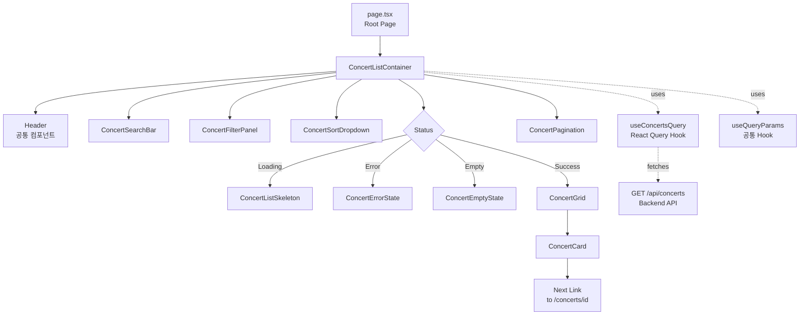
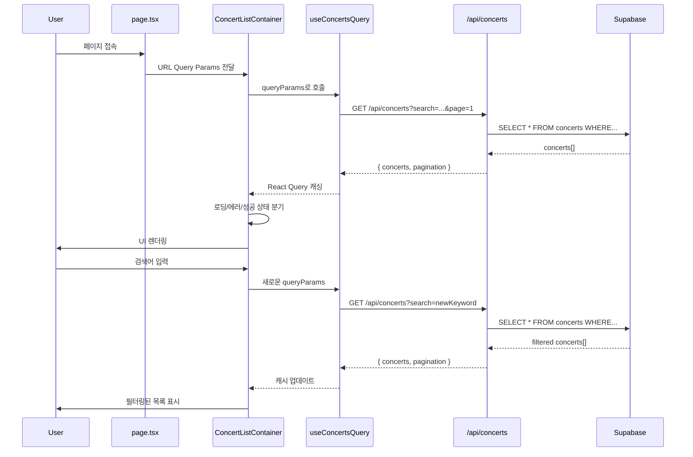
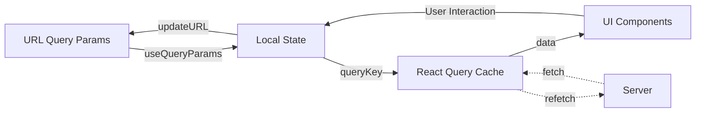

# 콘서트 목록 (Home) 페이지 구현 계획

## 1. 개요

### 1.1 페이지 정보
- **페이지 경로**: `/` (홈 페이지)
- **페이지 목적**: 예매 가능한 콘서트 목록을 조회하고 탐색하는 메인 랜딩 페이지
- **관련 유스케이스**: [Usecase 001: 콘서트 목록 조회 및 탐색](../../usecases/001/spec.md)

### 1.2 주요 기능
1. 예매 가능한 콘서트 목록 조회 및 표시
2. 검색 기능 (제목, 설명, 장소 기반)
3. 필터링 기능 (장르, 지역, 기간)
4. 정렬 기능 (최신순, 마감 임박순, 가나다순)
5. 페이지네이션
6. 콘서트 상세 페이지로 네비게이션

### 1.3 상태 관리 전략
- **서버 상태**: `@tanstack/react-query` 를 사용하여 콘서트 목록 데이터 캐싱 및 관리
- **로컬 UI 상태**: `useState` 를 사용하여 검색어, 필터, 정렬 조건 관리
- **URL 상태**: Query Parameters를 사용하여 필터/정렬 상태를 URL과 동기화 (북마크 및 공유 가능)

## 2. 모듈 구조 설계

### 2.1 백엔드 모듈

#### 2.1.1 API Route
- **위치**: `src/features/concerts/backend/route.ts`
- **설명**: 콘서트 목록 조회 API 엔드포인트 정의
- **엔드포인트**: `GET /api/concerts`

#### 2.1.2 Service
- **위치**: `src/features/concerts/backend/service.ts`
- **설명**: Supabase를 통한 콘서트 목록 조회 비즈니스 로직
- **주요 함수**:
  - `getConcerts()`: 콘서트 목록 조회 (필터, 정렬, 페이지네이션 지원)

#### 2.1.3 Schema
- **위치**: `src/features/concerts/backend/schema.ts`
- **설명**: Zod 스키마를 사용한 요청/응답 타입 정의
- **스키마**:
  - `ConcertQuerySchema`: Query Parameters 검증
  - `ConcertResponseSchema`: 단일 콘서트 응답
  - `ConcertsListResponseSchema`: 콘서트 목록 + 페이지네이션 응답
  - `ConcertTableRowSchema`: DB 테이블 row 타입

#### 2.1.4 Error
- **위치**: `src/features/concerts/backend/error.ts`
- **설명**: 콘서트 관련 에러 코드 정의
- **에러 코드**:
  - `CONCERT_FETCH_ERROR`: DB 조회 실패
  - `CONCERT_VALIDATION_ERROR`: 데이터 검증 실패

### 2.2 프론트엔드 모듈

#### 2.2.1 Page Component
- **위치**: `src/app/page.tsx`
- **설명**: 콘서트 목록 페이지 루트 컴포넌트 (Client Component)
- **책임**: URL Query Parameters 파싱 및 하위 컴포넌트 조합

#### 2.2.2 Main Container
- **위치**: `src/features/concerts/components/concert-list-container.tsx`
- **설명**: 콘서트 목록 조회 및 상태 관리를 담당하는 컨테이너 컴포넌트
- **책임**:
  - React Query를 통한 데이터 페칭
  - 로딩/에러 상태 처리
  - 하위 presentational 컴포넌트에 데이터 전달

#### 2.2.3 Search Bar
- **위치**: `src/features/concerts/components/concert-search-bar.tsx`
- **설명**: 검색어 입력 컴포넌트
- **Props**: `value`, `onChange`, `onSubmit`

#### 2.2.4 Filter Panel
- **위치**: `src/features/concerts/components/concert-filter-panel.tsx`
- **설명**: 필터 옵션 선택 컴포넌트 (장르, 지역, 기간)
- **Props**: `filters`, `onChange`

#### 2.2.5 Sort Dropdown
- **위치**: `src/features/concerts/components/concert-sort-dropdown.tsx`
- **설명**: 정렬 기준 선택 드롭다운
- **Props**: `value`, `onChange`

#### 2.2.6 Concert Card
- **위치**: `src/features/concerts/components/concert-card.tsx`
- **설명**: 개별 콘서트 정보를 표시하는 카드 컴포넌트
- **Props**: `concert` (id, title, imageUrl, venue, startDate, endDate)
- **재사용 가능**: 다른 페이지에서도 콘서트 정보를 표시할 때 재사용 가능

#### 2.2.7 Concert Grid
- **위치**: `src/features/concerts/components/concert-grid.tsx`
- **설명**: 콘서트 카드들을 그리드 레이아웃으로 배치하는 컴포넌트
- **Props**: `concerts[]`

#### 2.2.8 Pagination
- **위치**: `src/features/concerts/components/concert-pagination.tsx`
- **설명**: 페이지네이션 UI 컴포넌트
- **Props**: `currentPage`, `totalPages`, `onPageChange`

#### 2.2.9 Empty State
- **위치**: `src/features/concerts/components/concert-empty-state.tsx`
- **설명**: 조회 결과가 없을 때 표시되는 컴포넌트
- **Props**: `message`

#### 2.2.10 Error State
- **위치**: `src/features/concerts/components/concert-error-state.tsx`
- **설명**: 에러 발생 시 표시되는 컴포넌트
- **Props**: `error`, `onRetry`

#### 2.2.11 Loading Skeleton
- **위치**: `src/features/concerts/components/concert-list-skeleton.tsx`
- **설명**: 로딩 중 표시되는 스켈레톤 UI
- **재사용 가능**: 다른 로딩 상황에서도 활용 가능

#### 2.2.12 Header Component
- **위치**: `src/components/layout/header.tsx` (공통 모듈)
- **설명**: 페이지 상단 헤더 (로고, 예약 조회 버튼)
- **재사용 가능**: 모든 페이지에서 공통으로 사용

### 2.3 데이터 페칭 Hook

#### 2.3.1 useConcertsQuery
- **위치**: `src/features/concerts/hooks/useConcertsQuery.ts`
- **설명**: 콘서트 목록을 조회하는 React Query 커스텀 훅
- **Parameters**: `{ search?, genre?, region?, startDate?, endDate?, sort?, page?, limit? }`
- **Returns**: `{ data, isLoading, isError, error, refetch }`

### 2.4 공통 유틸리티 및 타입

#### 2.4.1 DTO (Data Transfer Object)
- **위치**: `src/features/concerts/lib/dto.ts`
- **설명**: 백엔드 스키마를 클라이언트에서 재사용하기 위한 재노출
- **Export**:
  - `ConcertResponse`
  - `ConcertsListResponse`
  - `ConcertQueryParams`

#### 2.4.2 Constants
- **위치**: `src/features/concerts/constants/index.ts`
- **설명**: 콘서트 관련 상수 정의
- **Constants**:
  - `DEFAULT_PAGE_SIZE`: 20
  - `SORT_OPTIONS`: ['latest', 'deadline', 'alphabetical']
  - `CACHE_TIME`: 60000 (1분)

#### 2.4.3 URL 상태 관리 Hook (공통)
- **위치**: `src/hooks/useQueryParams.ts` (공통 모듈)
- **설명**: URL Query Parameters를 관리하는 커스텀 훅
- **재사용 가능**: 다른 페이지에서도 URL 상태 관리 시 사용

#### 2.4.4 날짜 포맷 유틸리티 (공통)
- **위치**: `src/lib/utils/date.ts` (공통 모듈)
- **설명**: `date-fns`를 활용한 날짜 포맷 유틸리티
- **Functions**: `formatConcertDate(startDate, endDate)`, `formatShortDate(date)`

## 3. 아키텍처 다이어그램

### 3.1 컴포넌트 계층 구조



### 3.2 데이터 플로우



### 3.3 상태 관리 구조



## 4. 상세 구현 계획

### 4.1 백엔드 구현

#### 4.1.1 Database Query
```typescript
// src/features/concerts/backend/service.ts

export const getConcerts = async (
  client: SupabaseClient,
  params: ConcertQueryParams
): Promise<HandlerResult<ConcertsListResponse, ConcertServiceError, unknown>> => {
  // 1. 기본 쿼리 구성
  let query = client
    .from('concerts')
    .select('id, title, description, image_url, venue, start_date, end_date, status', { count: 'exact' })
    .eq('status', 'published');

  // 2. 검색 조건 적용 (ILIKE)
  if (params.search) {
    query = query.or(
      `title.ilike.%${params.search}%,description.ilike.%${params.search}%,venue.ilike.%${params.search}%`
    );
  }

  // 3. 필터 조건 적용
  if (params.genre) {
    query = query.eq('genre', params.genre);
  }
  if (params.region) {
    query = query.eq('region', params.region);
  }
  if (params.startDate) {
    query = query.gte('start_date', params.startDate);
  }
  if (params.endDate) {
    query = query.lte('end_date', params.endDate);
  }

  // 4. 정렬 적용
  switch (params.sort) {
    case 'latest':
      query = query.order('created_at', { ascending: false });
      break;
    case 'deadline':
      query = query.order('start_date', { ascending: true });
      break;
    case 'alphabetical':
      query = query.order('title', { ascending: true });
      break;
    default:
      query = query.order('created_at', { ascending: false });
  }

  // 5. 페이지네이션 적용
  const page = params.page ?? 1;
  const limit = params.limit ?? DEFAULT_PAGE_SIZE;
  const from = (page - 1) * limit;
  const to = from + limit - 1;
  query = query.range(from, to);

  // 6. 쿼리 실행
  const { data, error, count } = await query;

  if (error) {
    return failure(500, concertErrorCodes.fetchError, error.message);
  }

  // 7. 데이터 검증 및 변환
  const concerts = data.map(row => ({
    id: row.id,
    title: row.title,
    description: row.description,
    imageUrl: row.image_url ?? fallbackImage(row.id),
    venue: row.venue,
    startDate: row.start_date,
    endDate: row.end_date,
  }));

  // 8. 페이지네이션 메타데이터 계산
  const totalItems = count ?? 0;
  const totalPages = Math.ceil(totalItems / limit);

  return success({
    concerts,
    pagination: {
      currentPage: page,
      totalPages,
      totalItems,
      itemsPerPage: limit,
    },
  });
};
```

#### 4.1.2 API Route Handler
```typescript
// src/features/concerts/backend/route.ts

export const registerConcertRoutes = (app: Hono<AppEnv>) => {
  app.get('/concerts', async (c) => {
    const queryParams = c.req.query();
    const parsedParams = ConcertQuerySchema.safeParse(queryParams);

    if (!parsedParams.success) {
      return respond(
        c,
        failure(
          400,
          'INVALID_QUERY_PARAMS',
          'The provided query parameters are invalid.',
          parsedParams.error.format()
        )
      );
    }

    const supabase = getSupabase(c);
    const logger = getLogger(c);

    const result = await getConcerts(supabase, parsedParams.data);

    if (!result.ok) {
      const errorResult = result as ErrorResult<ConcertServiceError, unknown>;

      if (errorResult.error.code === concertErrorCodes.fetchError) {
        logger.error('Failed to fetch concerts', errorResult.error.message);
      }

      return respond(c, result);
    }

    return respond(c, result);
  });
};
```

#### 4.1.3 Schema Definition
```typescript
// src/features/concerts/backend/schema.ts

export const ConcertQuerySchema = z.object({
  search: z.string().optional(),
  genre: z.string().optional(),
  region: z.string().optional(),
  startDate: z.string().datetime().optional(),
  endDate: z.string().datetime().optional(),
  sort: z.enum(['latest', 'deadline', 'alphabetical']).optional(),
  page: z.coerce.number().int().positive().optional().default(1),
  limit: z.coerce.number().int().positive().max(100).optional().default(20),
});

export type ConcertQueryParams = z.infer<typeof ConcertQuerySchema>;

export const ConcertResponseSchema = z.object({
  id: z.string().uuid(),
  title: z.string(),
  description: z.string().nullable(),
  imageUrl: z.string().url(),
  venue: z.string(),
  startDate: z.string().datetime(),
  endDate: z.string().datetime(),
});

export type ConcertResponse = z.infer<typeof ConcertResponseSchema>;

export const PaginationSchema = z.object({
  currentPage: z.number().int().positive(),
  totalPages: z.number().int().nonnegative(),
  totalItems: z.number().int().nonnegative(),
  itemsPerPage: z.number().int().positive(),
});

export const ConcertsListResponseSchema = z.object({
  concerts: z.array(ConcertResponseSchema),
  pagination: PaginationSchema,
});

export type ConcertsListResponse = z.infer<typeof ConcertsListResponseSchema>;
```

### 4.2 프론트엔드 구현

#### 4.2.1 React Query Hook
```typescript
// src/features/concerts/hooks/useConcertsQuery.ts

export const useConcertsQuery = (params: ConcertQueryParams) => {
  return useQuery({
    queryKey: ['concerts', params],
    queryFn: async () => {
      try {
        const queryString = new URLSearchParams(
          Object.entries(params).filter(([_, v]) => v !== undefined) as [string, string][]
        ).toString();

        const { data } = await apiClient.get(`/api/concerts?${queryString}`);
        return ConcertsListResponseSchema.parse(data);
      } catch (error) {
        const message = extractApiErrorMessage(error, 'Failed to fetch concerts.');
        throw new Error(message);
      }
    },
    staleTime: CACHE_TIME,
    enabled: true,
  });
};
```

#### 4.2.2 URL Query Params Hook
```typescript
// src/hooks/useQueryParams.ts (공통 모듈)

export const useQueryParams = <T extends Record<string, string | undefined>>() => {
  const router = useRouter();
  const searchParams = useSearchParams();

  const params = useMemo(() => {
    const result: Record<string, string | undefined> = {};
    searchParams.forEach((value, key) => {
      result[key] = value;
    });
    return result as T;
  }, [searchParams]);

  const setParams = useCallback(
    (newParams: Partial<T>) => {
      const current = new URLSearchParams(searchParams.toString());

      Object.entries(newParams).forEach(([key, value]) => {
        if (value === undefined || value === null || value === '') {
          current.delete(key);
        } else {
          current.set(key, String(value));
        }
      });

      router.push(`?${current.toString()}`, { scroll: false });
    },
    [router, searchParams]
  );

  return { params, setParams };
};
```

#### 4.2.3 Container Component
```typescript
// src/features/concerts/components/concert-list-container.tsx

export const ConcertListContainer = () => {
  const { params, setParams } = useQueryParams<ConcertQueryParams>();

  const [localSearch, setLocalSearch] = useState(params.search ?? '');

  const query = useConcertsQuery({
    search: params.search,
    genre: params.genre,
    region: params.region,
    startDate: params.startDate,
    endDate: params.endDate,
    sort: params.sort ?? 'latest',
    page: params.page ? Number(params.page) : 1,
    limit: DEFAULT_PAGE_SIZE,
  });

  const handleSearchSubmit = (e: React.FormEvent) => {
    e.preventDefault();
    setParams({ search: localSearch, page: '1' });
  };

  const handleFilterChange = (filterKey: string, value: string) => {
    setParams({ [filterKey]: value, page: '1' });
  };

  const handleSortChange = (sort: string) => {
    setParams({ sort, page: '1' });
  };

  const handlePageChange = (page: number) => {
    setParams({ page: String(page) });
  };

  if (query.isLoading) {
    return <ConcertListSkeleton />;
  }

  if (query.isError) {
    return (
      <ConcertErrorState
        error={query.error.message}
        onRetry={() => query.refetch()}
      />
    );
  }

  if (!query.data?.concerts.length) {
    return <ConcertEmptyState message="조회 가능한 콘서트가 없습니다." />;
  }

  return (
    <div className="space-y-6">
      <Header />

      <div className="container mx-auto px-4">
        <ConcertSearchBar
          value={localSearch}
          onChange={(value) => setLocalSearch(value)}
          onSubmit={handleSearchSubmit}
        />

        <div className="flex gap-4">
          <ConcertFilterPanel
            filters={{
              genre: params.genre,
              region: params.region,
              startDate: params.startDate,
              endDate: params.endDate,
            }}
            onChange={handleFilterChange}
          />

          <ConcertSortDropdown
            value={params.sort ?? 'latest'}
            onChange={handleSortChange}
          />
        </div>

        <ConcertGrid concerts={query.data.concerts} />

        <ConcertPagination
          currentPage={query.data.pagination.currentPage}
          totalPages={query.data.pagination.totalPages}
          onPageChange={handlePageChange}
        />
      </div>
    </div>
  );
};
```

#### 4.2.4 Concert Card Component
```typescript
// src/features/concerts/components/concert-card.tsx

export const ConcertCard = ({ concert }: { concert: ConcertResponse }) => {
  const dateRange = formatConcertDate(concert.startDate, concert.endDate);

  return (
    <Link href={`/concerts/${concert.id}`}>
      <div className="group cursor-pointer rounded-lg border border-slate-800 bg-slate-950/60 overflow-hidden transition-all hover:shadow-lg hover:scale-105">
        <div className="relative aspect-video">
          <Image
            src={concert.imageUrl}
            alt={concert.title}
            fill
            className="object-cover"
            sizes="(max-width: 768px) 100vw, (max-width: 1200px) 50vw, 33vw"
          />
        </div>

        <div className="p-4 space-y-2">
          <h3 className="text-lg font-semibold text-slate-100 line-clamp-2 group-hover:text-emerald-400 transition-colors">
            {concert.title}
          </h3>

          <div className="flex items-center gap-2 text-sm text-slate-400">
            <Calendar className="w-4 h-4" />
            <span>{dateRange}</span>
          </div>

          <div className="flex items-center gap-2 text-sm text-slate-400">
            <MapPin className="w-4 h-4" />
            <span className="line-clamp-1">{concert.venue}</span>
          </div>
        </div>
      </div>
    </Link>
  );
};
```

## 5. API 명세

### 5.1 GET /api/concerts

**설명**: 예매 가능한 콘서트 목록을 조회합니다.

**Query Parameters**:
| Parameter | Type | Required | Description | Example |
|-----------|------|----------|-------------|---------|
| search | string | No | 검색 키워드 (title, description, venue) | "방탄소년단" |
| genre | string | No | 장르 필터 | "pop" |
| region | string | No | 지역 필터 | "서울" |
| startDate | ISO 8601 | No | 시작 날짜 필터 | "2025-11-01T00:00:00Z" |
| endDate | ISO 8601 | No | 종료 날짜 필터 | "2025-12-31T23:59:59Z" |
| sort | enum | No | 정렬 기준 (latest, deadline, alphabetical) | "latest" |
| page | number | No | 페이지 번호 (default: 1) | 1 |
| limit | number | No | 페이지당 항목 수 (default: 20, max: 100) | 20 |

**Response 200 OK**:
```json
{
  "concerts": [
    {
      "id": "uuid",
      "title": "콘서트 제목",
      "description": "콘서트 설명",
      "imageUrl": "https://picsum.photos/seed/uuid/800/450",
      "venue": "올림픽공원 체조경기장",
      "startDate": "2025-11-01T19:00:00Z",
      "endDate": "2025-11-01T21:00:00Z"
    }
  ],
  "pagination": {
    "currentPage": 1,
    "totalPages": 5,
    "totalItems": 100,
    "itemsPerPage": 20
  }
}
```

**Response 400 Bad Request**:
```json
{
  "error": {
    "code": "INVALID_QUERY_PARAMS",
    "message": "The provided query parameters are invalid.",
    "details": { ... }
  }
}
```

**Response 500 Internal Server Error**:
```json
{
  "error": {
    "code": "CONCERT_FETCH_ERROR",
    "message": "Failed to fetch concerts from database."
  }
}
```

## 6. 에러 핸들링 전략

### 6.1 에러 타입별 처리

| 에러 타입 | HTTP 상태 | 처리 방법 |
|-----------|-----------|-----------|
| 네트워크 오류 | - | 토스트 메시지 표시, 재시도 버튼 제공 |
| 서버 오류 | 500 | 에러 상태 컴포넌트 표시, 재시도 버튼 제공 |
| 잘못된 파라미터 | 400 | 파라미터 초기화 후 재시도 |
| 빈 결과 | 200 (empty array) | Empty State 컴포넌트 표시 |

### 6.2 React Query Error Boundary
```typescript
// src/app/error.tsx

export default function Error({
  error,
  reset,
}: {
  error: Error & { digest?: string };
  reset: () => void;
}) {
  return (
    <ConcertErrorState
      error={error.message}
      onRetry={reset}
    />
  );
}
```

## 7. 성능 최적화

### 7.1 React Query 캐싱 전략
```typescript
// 1분 동안 캐시 유지
staleTime: 60 * 1000

// 백그라운드 refetch 비활성화 (사용자 액션에만 의존)
refetchOnWindowFocus: false
refetchOnMount: false
```

### 7.2 이미지 최적화
- Next.js `Image` 컴포넌트 사용
- `sizes` 속성으로 반응형 이미지 로딩
- Lazy loading 기본 적용
- Placeholder blur 사용 (picsum.photos 활용)

### 7.3 컴포넌트 메모이제이션
```typescript
// ConcertCard는 concert prop이 변경될 때만 리렌더링
export const ConcertCard = React.memo(ConcertCardComponent, (prev, next) => {
  return prev.concert.id === next.concert.id;
});
```

### 7.4 Pagination 대신 Infinite Scroll 고려
- 초기 구현: Pagination
- 향후 개선: `useInfiniteQuery` 를 사용한 무한 스크롤

## 8. 접근성 (A11y)

### 8.1 ARIA 속성
```typescript
<nav aria-label="콘서트 목록 필터">
  <ConcertFilterPanel />
</nav>

<main aria-label="콘서트 목록">
  <ConcertGrid />
</main>

<nav aria-label="페이지네이션">
  <ConcertPagination />
</nav>
```

### 8.2 키보드 네비게이션
- 모든 인터랙티브 요소는 Tab 키로 접근 가능
- Enter 키로 콘서트 카드 클릭 (Link 컴포넌트 사용)
- Escape 키로 필터 패널 닫기

### 8.3 스크린 리더 지원
```typescript
<button aria-label="검색어 '방탄소년단'으로 콘서트 검색">
  검색
</button>

<div role="status" aria-live="polite">
  {query.data?.pagination.totalItems}개의 콘서트가 검색되었습니다.
</div>
```

## 9. 반응형 디자인

### 9.1 Breakpoints
```typescript
// Tailwind CSS 기본 breakpoints 사용
// sm: 640px
// md: 768px
// lg: 1024px
// xl: 1280px
```

### 9.2 Grid Layout
```typescript
// Mobile: 1 column
// Tablet: 2 columns
// Desktop: 3-4 columns

<div className="grid grid-cols-1 md:grid-cols-2 lg:grid-cols-3 xl:grid-cols-4 gap-6">
  {concerts.map(concert => (
    <ConcertCard key={concert.id} concert={concert} />
  ))}
</div>
```

## 10. 테스트 전략

### 10.1 단위 테스트 (Unit Tests)

#### Service Layer Test
```typescript
// src/features/concerts/backend/service.test.ts

describe('getConcerts', () => {
  it('should return concerts with default pagination', async () => {
    const mockClient = createMockSupabaseClient();
    const result = await getConcerts(mockClient, {});

    expect(result.ok).toBe(true);
    expect(result.data.concerts).toHaveLength(20);
    expect(result.data.pagination.currentPage).toBe(1);
  });

  it('should filter concerts by search keyword', async () => {
    const mockClient = createMockSupabaseClient();
    const result = await getConcerts(mockClient, { search: 'BTS' });

    expect(result.ok).toBe(true);
    expect(result.data.concerts.every(c =>
      c.title.includes('BTS') || c.description?.includes('BTS') || c.venue.includes('BTS')
    )).toBe(true);
  });

  it('should sort concerts by deadline', async () => {
    const mockClient = createMockSupabaseClient();
    const result = await getConcerts(mockClient, { sort: 'deadline' });

    expect(result.ok).toBe(true);
    const dates = result.data.concerts.map(c => new Date(c.startDate));
    expect(dates).toEqual([...dates].sort((a, b) => a.getTime() - b.getTime()));
  });

  it('should handle database errors gracefully', async () => {
    const mockClient = createMockSupabaseClient({ shouldFail: true });
    const result = await getConcerts(mockClient, {});

    expect(result.ok).toBe(false);
    expect(result.error.code).toBe(concertErrorCodes.fetchError);
  });
});
```

#### React Query Hook Test
```typescript
// src/features/concerts/hooks/useConcertsQuery.test.ts

describe('useConcertsQuery', () => {
  it('should fetch concerts successfully', async () => {
    const { result } = renderHook(() => useConcertsQuery({}), {
      wrapper: createQueryClientWrapper(),
    });

    await waitFor(() => expect(result.current.isSuccess).toBe(true));
    expect(result.current.data?.concerts).toBeDefined();
  });

  it('should handle API errors', async () => {
    mockApiClient.get.mockRejectedValueOnce(new Error('Network error'));

    const { result } = renderHook(() => useConcertsQuery({}), {
      wrapper: createQueryClientWrapper(),
    });

    await waitFor(() => expect(result.current.isError).toBe(true));
    expect(result.current.error?.message).toContain('Failed to fetch concerts');
  });

  it('should cache query results', async () => {
    const { result, rerender } = renderHook(() => useConcertsQuery({}), {
      wrapper: createQueryClientWrapper(),
    });

    await waitFor(() => expect(result.current.isSuccess).toBe(true));
    const firstData = result.current.data;

    rerender();
    expect(result.current.data).toBe(firstData); // Same reference (cached)
  });
});
```

### 10.2 통합 테스트 (Integration Tests)

#### Component Integration Test
```typescript
// src/features/concerts/components/concert-list-container.test.tsx

describe('ConcertListContainer', () => {
  it('should render concerts list', async () => {
    render(<ConcertListContainer />, { wrapper: createAppWrapper() });

    expect(screen.getByRole('status')).toHaveTextContent('Loading');

    await waitFor(() => {
      expect(screen.queryByRole('status')).not.toBeInTheDocument();
    });

    expect(screen.getAllByRole('link')).toHaveLength(20);
  });

  it('should filter concerts by search', async () => {
    const { user } = render(<ConcertListContainer />, { wrapper: createAppWrapper() });

    const searchInput = screen.getByPlaceholderText('콘서트 검색');
    const searchButton = screen.getByRole('button', { name: /검색/ });

    await user.type(searchInput, 'BTS');
    await user.click(searchButton);

    await waitFor(() => {
      const concertCards = screen.getAllByRole('link');
      expect(concertCards.length).toBeGreaterThan(0);
    });
  });

  it('should navigate to next page', async () => {
    const { user } = render(<ConcertListContainer />, { wrapper: createAppWrapper() });

    await waitFor(() => {
      expect(screen.getByText('1 / 5')).toBeInTheDocument();
    });

    const nextButton = screen.getByRole('button', { name: /다음/ });
    await user.click(nextButton);

    await waitFor(() => {
      expect(screen.getByText('2 / 5')).toBeInTheDocument();
    });
  });

  it('should show empty state when no concerts found', async () => {
    mockApiClient.get.mockResolvedValueOnce({
      data: { concerts: [], pagination: { currentPage: 1, totalPages: 0, totalItems: 0, itemsPerPage: 20 } }
    });

    render(<ConcertListContainer />, { wrapper: createAppWrapper() });

    await waitFor(() => {
      expect(screen.getByText('조회 가능한 콘서트가 없습니다.')).toBeInTheDocument();
    });
  });

  it('should show error state and retry', async () => {
    mockApiClient.get.mockRejectedValueOnce(new Error('Network error'));

    const { user } = render(<ConcertListContainer />, { wrapper: createAppWrapper() });

    await waitFor(() => {
      expect(screen.getByText(/Network error/)).toBeInTheDocument();
    });

    mockApiClient.get.mockResolvedValueOnce({
      data: mockConcertsResponse,
    });

    const retryButton = screen.getByRole('button', { name: /재시도/ });
    await user.click(retryButton);

    await waitFor(() => {
      expect(screen.queryByText(/Network error/)).not.toBeInTheDocument();
    });
  });
});
```

### 10.3 E2E 테스트 (Playwright)

```typescript
// e2e/concert-list.spec.ts

test.describe('Concert List Page', () => {
  test('should display concert list on homepage', async ({ page }) => {
    await page.goto('/');

    await expect(page.getByRole('heading', { name: /콘서트 목록/ })).toBeVisible();
    await expect(page.locator('[data-testid="concert-card"]')).toHaveCount(20);
  });

  test('should search concerts', async ({ page }) => {
    await page.goto('/');

    await page.getByPlaceholder('콘서트 검색').fill('BTS');
    await page.getByRole('button', { name: /검색/ }).click();

    await page.waitForURL(/search=BTS/);
    await expect(page.locator('[data-testid="concert-card"]').first()).toContainText('BTS');
  });

  test('should navigate to concert detail', async ({ page }) => {
    await page.goto('/');

    const firstConcert = page.locator('[data-testid="concert-card"]').first();
    const concertTitle = await firstConcert.locator('h3').textContent();

    await firstConcert.click();

    await page.waitForURL(/\/concerts\/[a-f0-9-]+/);
    await expect(page.getByRole('heading', { level: 1 })).toContainText(concertTitle!);
  });

  test('should persist filters in URL', async ({ page }) => {
    await page.goto('/');

    await page.getByRole('button', { name: /필터/ }).click();
    await page.getByRole('combobox', { name: /장르/ }).selectOption('pop');
    await page.getByRole('button', { name: /적용/ }).click();

    await expect(page).toHaveURL(/genre=pop/);

    await page.reload();
    await expect(page).toHaveURL(/genre=pop/);
  });

  test('should handle pagination', async ({ page }) => {
    await page.goto('/');

    await expect(page.getByText('1 / 5')).toBeVisible();

    await page.getByRole('button', { name: /다음/ }).click();
    await page.waitForURL(/page=2/);

    await expect(page.getByText('2 / 5')).toBeVisible();
  });
});
```

## 11. QA 체크리스트

### 11.1 기능 테스트
- [ ] 콘서트 목록이 정상적으로 로딩되는가?
- [ ] 검색 기능이 정상 작동하는가?
- [ ] 필터 기능 (장르, 지역, 기간)이 정상 작동하는가?
- [ ] 정렬 기능 (최신순, 마감 임박순, 가나다순)이 정상 작동하는가?
- [ ] 페이지네이션이 정상 작동하는가?
- [ ] 콘서트 카드 클릭 시 상세 페이지로 이동하는가?
- [ ] 조회 결과가 없을 때 Empty State가 표시되는가?
- [ ] 에러 발생 시 Error State와 재시도 버튼이 표시되는가?

### 11.2 URL 상태 관리
- [ ] 검색/필터/정렬 조건이 URL에 반영되는가?
- [ ] URL을 직접 입력해도 올바른 필터가 적용되는가?
- [ ] 뒤로가기/앞으로가기 버튼이 정상 작동하는가?
- [ ] URL 공유 시 동일한 필터가 적용되는가?
- [ ] 북마크 후 재방문 시 필터가 유지되는가?

### 11.3 성능
- [ ] 초기 로딩 시간이 3초 이내인가?
- [ ] 페이지 전환 시 부드럽게 작동하는가?
- [ ] 이미지가 Lazy Loading 되는가?
- [ ] React Query 캐싱이 정상 작동하는가?
- [ ] 불필요한 리렌더링이 발생하지 않는가?

### 11.4 반응형 디자인
- [ ] 모바일 (320px ~ 767px)에서 정상 작동하는가?
- [ ] 태블릿 (768px ~ 1023px)에서 정상 작동하는가?
- [ ] 데스크톱 (1024px+)에서 정상 작동하는가?
- [ ] 그리드 레이아웃이 화면 크기에 따라 적응하는가?

### 11.5 접근성
- [ ] 키보드만으로 모든 기능에 접근 가능한가?
- [ ] 스크린 리더가 콘텐츠를 올바르게 읽는가?
- [ ] 색상 대비가 WCAG AA 기준을 충족하는가?
- [ ] Focus indicator가 명확하게 표시되는가?

### 11.6 브라우저 호환성
- [ ] Chrome (최신 버전) 정상 작동
- [ ] Firefox (최신 버전) 정상 작동
- [ ] Safari (최신 버전) 정상 작동
- [ ] Edge (최신 버전) 정상 작동

### 11.7 에러 핸들링
- [ ] 네트워크 오류 시 적절한 메시지가 표시되는가?
- [ ] 서버 오류 시 500 에러 페이지가 표시되는가?
- [ ] 재시도 버튼이 정상 작동하는가?
- [ ] 잘못된 URL 파라미터가 무시되거나 초기화되는가?

## 12. 구현 순서 및 마일스톤

### Phase 1: 백엔드 구축 (2-3일)
1. ✅ 데이터베이스 스키마 확인 (이미 완료)
2. 🔲 백엔드 스키마 정의 (`schema.ts`)
3. 🔲 백엔드 서비스 레이어 구현 (`service.ts`)
4. 🔲 백엔드 라우트 핸들러 구현 (`route.ts`)
5. 🔲 에러 코드 정의 (`error.ts`)
6. 🔲 Hono 앱에 라우트 등록
7. 🔲 Postman/Thunder Client로 API 테스트

### Phase 2: 프론트엔드 기본 구조 (2-3일)
1. 🔲 DTO 및 공통 타입 정의 (`dto.ts`)
2. 🔲 React Query Hook 구현 (`useConcertsQuery.ts`)
3. 🔲 URL Query Params Hook 구현 (`useQueryParams.ts`)
4. 🔲 날짜 포맷 유틸리티 구현 (`date.ts`)
5. 🔲 Container 컴포넌트 구현 (`concert-list-container.tsx`)
6. 🔲 Loading Skeleton 구현
7. 🔲 Error State 구현
8. 🔲 Empty State 구현

### Phase 3: UI 컴포넌트 구현 (3-4일)
1. 🔲 Header 컴포넌트 구현 (공통 모듈)
2. 🔲 Concert Card 컴포넌트 구현
3. 🔲 Concert Grid 컴포넌트 구현
4. 🔲 Search Bar 컴포넌트 구현
5. 🔲 Filter Panel 컴포넌트 구현
6. 🔲 Sort Dropdown 컴포넌트 구현
7. 🔲 Pagination 컴포넌트 구현
8. 🔲 Page 컴포넌트 조합 (`app/page.tsx`)

### Phase 4: 스타일링 및 반응형 (1-2일)
1. 🔲 Tailwind CSS 스타일 적용
2. 🔲 반응형 그리드 레이아웃 구현
3. 🔲 Hover/Focus 상태 스타일
4. 🔲 애니메이션 및 전환 효과

### Phase 5: 테스트 및 QA (2-3일)
1. 🔲 백엔드 단위 테스트 작성
2. 🔲 React Query Hook 테스트 작성
3. 🔲 컴포넌트 통합 테스트 작성
4. 🔲 E2E 테스트 작성 (Playwright)
5. 🔲 QA 체크리스트 검증
6. 🔲 버그 수정 및 리팩토링

### Phase 6: 성능 최적화 및 배포 (1-2일)
1. 🔲 React Query 캐싱 전략 최적화
2. 🔲 이미지 최적화 (Next.js Image)
3. 🔲 컴포넌트 메모이제이션
4. 🔲 Lighthouse 성능 점수 확인
5. 🔲 프로덕션 빌드 테스트
6. 🔲 배포 및 모니터링

**총 예상 기간**: 11-17일

## 13. 참고 자료 및 문서

- [PRD: 콘서트 예매 시스템](../../prd.md)
- [유저플로우 문서](../../userflow.md)
- [데이터베이스 설계 문서](../../database.md)
- [Usecase 001: 콘서트 목록 조회 및 탐색](../../usecases/001/spec.md)
- [Next.js App Router 공식 문서](https://nextjs.org/docs/app)
- [TanStack Query 공식 문서](https://tanstack.com/query/latest/docs/react/overview)
- [Tailwind CSS 공식 문서](https://tailwindcss.com/docs)
- [Supabase JavaScript Client 문서](https://supabase.com/docs/reference/javascript)

---

**작성일**: 2025-10-14
**작성자**: Claude Code (AI Agent)
**문서 버전**: 1.0.0
