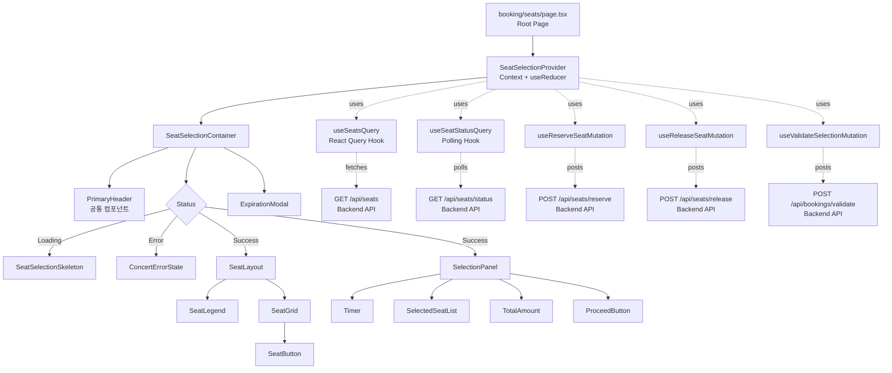
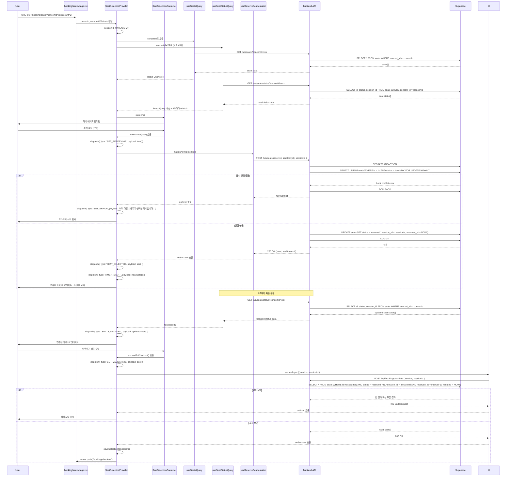
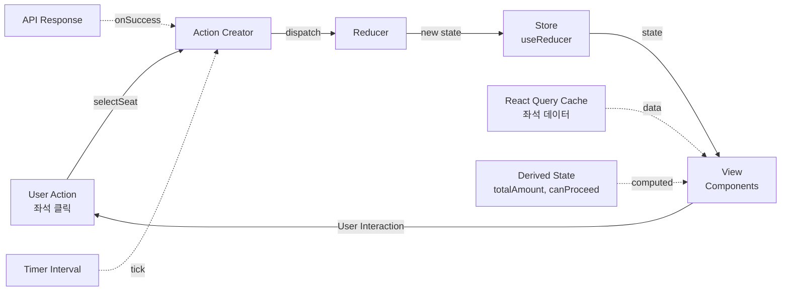

# 좌석 선택 (Seat Selection) 페이지 구현 계획

## 1. 개요

### 1.1 페이지 정보
- **페이지 경로**: `/booking/seats` (Query Parameters: concertId, numberOfTickets)
- **페이지 목적**: 사용자가 선택한 인원수에 맞춰 좌석 배치도를 확인하고 원하는 좌석을 임시 선점하여 예약 정보 입력 단계로 진행
- **관련 유스케이스**: [Usecase 003: 좌석 선택](../../usecases/003/spec.md)

### 1.2 주요 기능
1. 좌석 배치도 조회 및 표시 (등급별 색상 구분)
2. 좌석 선택 (임시 선점 - 10분 타임아웃)
3. 좌석 선택 해제
4. 실시간 좌석 상태 동기화 (5초마다 폴링)
5. 세션 타이머 관리 (10분 카운트다운)
6. 선택 검증 및 예약 진행 (다음 단계로 이동)
7. 동시 선점 충돌 처리
8. 페이지 이탈 시 좌석 해제

### 1.3 상태 관리 전략
- **로컬 UI 상태**: Context API + `useReducer` (Flux 패턴)를 사용하여 좌석 선택 상태 관리
- **서버 상태**: `@tanstack/react-query` 를 사용하여 좌석 데이터 캐싱 및 실시간 동기화
- **세션 관리**: `sessionStorage`를 통한 세션 데이터 복구 및 전달
- **URL 상태**: Query Parameters를 통한 `concertId`, `numberOfTickets` 전달

## 2. 모듈 구조 설계

### 2.1 백엔드 모듈

#### 2.1.1 API Route
- **위치**: `src/features/seats/backend/route.ts` (신규 feature)
- **설명**: 좌석 관련 API 엔드포인트 정의
- **새 엔드포인트**:
  - `GET /api/seats?concertId={id}` - 좌석 배치도 조회
  - `GET /api/seats/status?concertId={id}` - 좌석 실시간 상태 조회 (폴링용)
  - `POST /api/seats/reserve` - 좌석 임시 선점
  - `POST /api/seats/release` - 좌석 선점 해제
  - `POST /api/bookings/validate` - 선택 검증

#### 2.1.2 Service
- **위치**: `src/features/seats/backend/service.ts`
- **설명**: Supabase를 통한 좌석 선점/해제 비즈니스 로직
- **주요 함수**:
  - `getSeats()`: 콘서트의 전체 좌석 배치도 조회
  - `getSeatStatus()`: 좌석 상태만 조회 (실시간 동기화용)
  - `reserveSeats()`: 좌석 임시 선점 (트랜잭션 + FOR UPDATE NOWAIT)
  - `releaseSeats()`: 좌석 선점 해제
  - `validateSeatSelection()`: 선택 검증 (세션 ID, 타임아웃 확인)

#### 2.1.3 Schema
- **위치**: `src/features/seats/backend/schema.ts`
- **설명**: Zod 스키마를 사용한 요청/응답 타입 정의
- **스키마**:
  - `SeatQuerySchema`: concertId 쿼리 파라미터 검증
  - `SeatSchema`: 개별 좌석 정보
  - `SeatsResponseSchema`: 좌석 목록 응답
  - `ReserveSeatRequestSchema`: 좌석 선점 요청
  - `ReleaseSeatRequestSchema`: 좌석 해제 요청
  - `ValidateSelectionRequestSchema`: 선택 검증 요청

#### 2.1.4 Error
- **위치**: `src/features/seats/backend/error.ts`
- **설명**: 좌석 관련 에러 코드 정의
- **에러 코드**:
  - `SEAT_FETCH_ERROR`: 좌석 조회 실패
  - `SEAT_RESERVE_CONFLICT`: 동시 선점 충돌
  - `SEAT_NOT_AVAILABLE`: 선택 불가능한 좌석
  - `SESSION_EXPIRED`: 세션 타임아웃
  - `INVALID_SELECTION`: 잘못된 선택 (인원수 불일치 등)

### 2.2 프론트엔드 모듈

#### 2.2.1 Page Component
- **위치**: `src/app/booking/seats/page.tsx`
- **설명**: 좌석 선택 페이지 루트 컴포넌트 (Client Component)
- **책임**: Query Parameters 파싱 및 Provider 래핑

#### 2.2.2 Context Provider
- **위치**: `src/features/seats/context/seat-selection-context.tsx`
- **설명**: 좌석 선택 상태를 관리하는 Context Provider (useReducer + Flux 패턴)
- **책임**:
  - 좌석 선택/해제 상태 관리
  - 타이머 관리 (10분 카운트다운)
  - React Query 훅 통합
  - Derived State 계산 (총 금액, 검증 상태 등)
  - 세션 스토리지 관리

#### 2.2.3 Main Container
- **위치**: `src/features/seats/components/seat-selection-container.tsx`
- **설명**: 좌석 선택 UI의 최상위 컨테이너 컴포넌트
- **책임**:
  - Context Provider 소비
  - 로딩/에러 상태 처리
  - 하위 presentational 컴포넌트 조합

#### 2.2.4 Seat Layout
- **위치**: `src/features/seats/components/seat-layout.tsx`
- **설명**: 좌석 배치도 전체 레이아웃
- **Props**: `seats[]`

#### 2.2.5 Seat Grid
- **위치**: `src/features/seats/components/seat-grid.tsx`
- **설명**: 좌석들을 그리드로 배치하는 컴포넌트
- **Props**: `seats[]`, `onSeatClick`

#### 2.2.6 Seat Button
- **위치**: `src/features/seats/components/seat-button.tsx`
- **설명**: 개별 좌석 버튼 컴포넌트
- **Props**: `seat`, `isSelected`, `isMySelection`, `onClick`, `disabled`
- **재사용 가능**: 좌석 UI가 필요한 다른 곳에서도 사용 가능

#### 2.2.7 Seat Legend
- **위치**: `src/features/seats/components/seat-legend.tsx`
- **설명**: 등급별 색상 범례 컴포넌트
- **Props**: `grades[]`

#### 2.2.8 Selection Panel
- **위치**: `src/features/seats/components/selection-panel.tsx`
- **설명**: 화면 우측에 고정된 선택 정보 패널
- **하위 컴포넌트**:
  - `Timer`: 남은 시간 타이머
  - `SelectedSeatList`: 선택한 좌석 목록
  - `TotalAmount`: 총 결제 금액
  - `ProceedButton`: 예약하기 버튼

#### 2.2.9 Timer
- **위치**: `src/features/seats/components/timer.tsx`
- **설명**: 남은 시간을 표시하는 타이머 컴포넌트 (MM:SS)
- **Props**: `remainingSeconds`, `timerColor`

#### 2.2.10 Selected Seat List
- **위치**: `src/features/seats/components/selected-seat-list.tsx`
- **설명**: 선택한 좌석 목록 및 각 좌석의 정보 표시
- **Props**: `selectedSeats[]`, `onRemove`

#### 2.2.11 Proceed Button
- **위치**: `src/features/seats/components/proceed-button.tsx`
- **설명**: 예약하기 버튼 컴포넌트
- **Props**: `disabled`, `onClick`, `isValidating`

#### 2.2.12 Expiration Modal
- **위치**: `src/features/seats/components/expiration-modal.tsx`
- **설명**: 세션 만료 시 표시되는 모달
- **Props**: `isOpen`, `onReset`

#### 2.2.13 Error State
- **위치**: 기존 `src/features/concerts/components/concert-error-state.tsx` 재사용
- **설명**: 에러 발생 시 표시되는 컴포넌트

#### 2.2.14 Loading Skeleton
- **위치**: `src/features/seats/components/seat-selection-skeleton.tsx`
- **설명**: 로딩 중 표시되는 스켈레톤 UI

#### 2.2.15 Header Component
- **위치**: 기존 `src/components/layout/header.tsx` 재사용 (PrimaryHeader)
- **설명**: 페이지 상단 헤더

### 2.3 데이터 페칭 Hook

#### 2.3.1 useSeatsQuery
- **위치**: `src/features/seats/hooks/useSeatsQuery.ts`
- **설명**: 전체 좌석 배치도를 조회하는 React Query 커스텀 훅
- **Parameters**: `concertId: string`
- **Returns**: `{ data, isLoading, isError, error, refetch }`

#### 2.3.2 useSeatStatusQuery
- **위치**: `src/features/seats/hooks/useSeatStatusQuery.ts`
- **설명**: 실시간 좌석 상태를 폴링하는 React Query 커스텀 훅
- **Parameters**: `concertId: string, enabled: boolean`
- **Returns**: `{ data, isLoading, isError, error }`
- **특징**: `refetchInterval: 5000` (5초마다 자동 갱신)

#### 2.3.3 useReserveSeatMutation
- **위치**: `src/features/seats/hooks/useReserveSeatMutation.ts`
- **설명**: 좌석 선점 Mutation 훅
- **Returns**: `{ mutate, mutateAsync, isLoading, isError, error }`

#### 2.3.4 useReleaseSeatMutation
- **위치**: `src/features/seats/hooks/useReleaseSeatMutation.ts`
- **설명**: 좌석 해제 Mutation 훅
- **Returns**: `{ mutate, mutateAsync, isLoading, isError, error }`

#### 2.3.5 useValidateSelectionMutation
- **위치**: `src/features/seats/hooks/useValidateSelectionMutation.ts`
- **설명**: 선택 검증 Mutation 훅
- **Returns**: `{ mutate, mutateAsync, isLoading, isError, error }`

### 2.4 공통 유틸리티 및 타입

#### 2.4.1 DTO (Data Transfer Object)
- **위치**: `src/features/seats/lib/dto.ts`
- **설명**: 백엔드 스키마를 클라이언트에서 재사용하기 위한 재노출
- **Export**:
  - `Seat`
  - `SeatsResponse`
  - `SeatStatus`
  - `ReserveSeatRequest`
  - `ReleaseSeatRequest`

#### 2.4.2 Constants
- **위치**: `src/features/seats/constants/index.ts`
- **설명**: 좌석 선택 관련 상수 정의
- **Constants**:
  - `SEAT_COLORS`: { vip: '#FFD700', r: '#FF6B6B', s: '#4ECDC4', a: '#95E1D3' }
  - `SEAT_GRADE_LABELS`: { vip: 'VIP', r: 'R석', s: 'S석', a: 'A석' }
  - `SESSION_TIMEOUT_MINUTES`: 10
  - `SESSION_TIMEOUT_MS`: 600000 (10분)
  - `POLLING_INTERVAL`: 5000 (5초)

#### 2.4.3 Reducer & Actions
- **위치**: `src/features/seats/lib/reducer.ts`
- **설명**: Flux 패턴의 Reducer 및 Action 정의
- **Actions**:
  - `SEAT_SELECTED`
  - `SEAT_RELEASED`
  - `SEATS_UPDATED`
  - `TIMER_START`
  - `TIMER_TICK`
  - `TIMER_STOP`
  - `TIMER_EXPIRED`
  - `SET_ERROR`
  - `SET_RESERVING`
  - `SET_RELEASING`
  - `SET_VALIDATING`
  - `RESET_STATE`

#### 2.4.4 Session Storage Utils
- **위치**: `src/features/seats/lib/session-storage.ts`
- **설명**: 세션 스토리지 관리 유틸리티
- **Functions**:
  - `saveSelectionToSession()`: 선택 정보 저장
  - `loadSelectionFromSession()`: 선택 정보 복구
  - `clearSelectionFromSession()`: 선택 정보 삭제

#### 2.4.5 Validation Utils
- **위치**: `src/features/seats/lib/validation.ts`
- **설명**: 좌석 선택 검증 로직
- **Functions**:
  - `canSelectSeat()`: 좌석 선택 가능 여부 검증
  - `isSessionExpired()`: 세션 타임아웃 확인

#### 2.4.6 ROUTES 상수 (공통)
- **위치**: 기존 `src/constants/app.ts` 확장
- **추가 상수**:
  - `ROUTES.checkout: (concertId: string, sessionId: string) => `/booking/checkout?concertId=${concertId}&sessionId=${sessionId}`

## 3. 아키텍처 다이어그램

### 3.1 컴포넌트 계층 구조



### 3.2 데이터 플로우



### 3.3 상태 관리 구조 (Flux 패턴)



## 4. 상세 구현 계획

### 4.1 백엔드 구현

#### 4.1.1 Schema Definition

```typescript
// src/features/seats/backend/schema.ts

import { z } from 'zod';

// 좌석 조회 쿼리 파라미터
export const SeatQuerySchema = z.object({
  concertId: z.string().uuid(),
});

export type SeatQuery = z.infer<typeof SeatQuerySchema>;

// 좌석 상태 enum
export const SeatStatusSchema = z.enum(['available', 'reserved', 'booked']);
export type SeatStatus = z.infer<typeof SeatStatusSchema>;

// 좌석 등급 enum (기존 concerts schema 재사용)
export const SeatGradeSchema = z.enum(['vip', 'r', 's', 'a']);
export type SeatGrade = z.infer<typeof SeatGradeSchema>;

// 개별 좌석 정보
export const SeatSchema = z.object({
  id: z.string().uuid(),
  concertId: z.string().uuid(),
  section: z.string(),
  rowNumber: z.string(),
  seatNumber: z.string(),
  grade: SeatGradeSchema,
  price: z.number().int().nonnegative(),
  status: SeatStatusSchema,
  sessionId: z.string().nullable(),
  reservedAt: z.string().nullable(),
});

export type Seat = z.infer<typeof SeatSchema>;

// 좌석 목록 응답
export const SeatsResponseSchema = z.object({
  seats: z.array(SeatSchema),
});

export type SeatsResponse = z.infer<typeof SeatsResponseSchema>;

// 좌석 상태 (실시간 동기화용)
export const SeatStatusItemSchema = z.object({
  id: z.string().uuid(),
  status: SeatStatusSchema,
  sessionId: z.string().nullable(),
});

export const SeatStatusResponseSchema = z.object({
  seats: z.array(SeatStatusItemSchema),
});

export type SeatStatusResponse = z.infer<typeof SeatStatusResponseSchema>;

// 좌석 선점 요청
export const ReserveSeatRequestSchema = z.object({
  seatIds: z.array(z.string().uuid()).min(1),
  sessionId: z.string().uuid(),
});

export type ReserveSeatRequest = z.infer<typeof ReserveSeatRequestSchema>;

// 좌석 해제 요청
export const ReleaseSeatRequestSchema = z.object({
  seatIds: z.array(z.string().uuid()).min(1),
  sessionId: z.string().uuid(),
});

export type ReleaseSeatRequest = z.infer<typeof ReleaseSeatRequestSchema>;

// 선택 검증 요청
export const ValidateSelectionRequestSchema = z.object({
  seatIds: z.array(z.string().uuid()).min(1),
  sessionId: z.string().uuid(),
});

export type ValidateSelectionRequest = z.infer<typeof ValidateSelectionRequestSchema>;

// 선택 검증 응답
export const ValidateSelectionResponseSchema = z.object({
  valid: z.boolean(),
  seats: z.array(SeatSchema),
});

export type ValidateSelectionResponse = z.infer<typeof ValidateSelectionResponseSchema>;
```

#### 4.1.2 Service Implementation

```typescript
// src/features/seats/backend/service.ts

import type { SupabaseClient } from '@supabase/supabase-js';
import {
  failure,
  success,
  type HandlerResult,
} from '@/backend/http/response';
import {
  type Seat,
  type SeatsResponse,
  type SeatStatusResponse,
  type ReserveSeatRequest,
  type ReleaseSeatRequest,
  type ValidateSelectionRequest,
  type ValidateSelectionResponse,
} from '@/features/seats/backend/schema';
import {
  seatErrorCodes,
  type SeatServiceError,
} from '@/features/seats/backend/error';

const SEATS_TABLE = 'seats';
const AVAILABLE_STATUS = 'available';
const RESERVED_STATUS = 'reserved';
const SESSION_TIMEOUT_MINUTES = 10;

/**
 * 전체 좌석 배치도 조회
 */
export const getSeats = async (
  client: SupabaseClient,
  concertId: string
): Promise<HandlerResult<SeatsResponse, SeatServiceError, unknown>> => {
  const { data, error } = await client
    .from(SEATS_TABLE)
    .select('*')
    .eq('concert_id', concertId)
    .order('section, row_number, seat_number');

  if (error) {
    return failure(500, seatErrorCodes.fetchError, error.message);
  }

  const seats: Seat[] = data.map((row) => ({
    id: row.id,
    concertId: row.concert_id,
    section: row.section,
    rowNumber: row.row_number,
    seatNumber: row.seat_number,
    grade: row.grade,
    price: row.price,
    status: row.status,
    sessionId: row.session_id,
    reservedAt: row.reserved_at,
  }));

  return success({ seats });
};

/**
 * 좌석 상태 조회 (실시간 동기화용)
 */
export const getSeatStatus = async (
  client: SupabaseClient,
  concertId: string
): Promise<HandlerResult<SeatStatusResponse, SeatServiceError, unknown>> => {
  const { data, error } = await client
    .from(SEATS_TABLE)
    .select('id, status, session_id')
    .eq('concert_id', concertId);

  if (error) {
    return failure(500, seatErrorCodes.fetchError, error.message);
  }

  const seats = data.map((row) => ({
    id: row.id,
    status: row.status,
    sessionId: row.session_id,
  }));

  return success({ seats });
};

/**
 * 좌석 임시 선점 (트랜잭션 + FOR UPDATE NOWAIT)
 */
export const reserveSeats = async (
  client: SupabaseClient,
  request: ReserveSeatRequest
): Promise<HandlerResult<{ seats: Seat[] }, SeatServiceError, unknown>> => {
  const { seatIds, sessionId } = request;

  try {
    // 1. 트랜잭션 시작 및 좌석 락 획득
    const { data: lockData, error: lockError } = await client.rpc(
      'reserve_seats_with_lock',
      {
        p_seat_ids: seatIds,
        p_session_id: sessionId,
      }
    );

    if (lockError) {
      // Lock conflict 또는 이미 예약된 좌석
      if (lockError.code === '55P03') {
        return failure(
          409,
          seatErrorCodes.reserveConflict,
          'Seat is already being reserved by another user.'
        );
      }

      return failure(500, seatErrorCodes.fetchError, lockError.message);
    }

    // 2. 업데이트된 좌석 정보 조회
    const { data, error } = await client
      .from(SEATS_TABLE)
      .select('*')
      .in('id', seatIds)
      .eq('session_id', sessionId);

    if (error) {
      return failure(500, seatErrorCodes.fetchError, error.message);
    }

    if (data.length !== seatIds.length) {
      return failure(
        400,
        seatErrorCodes.notAvailable,
        'Some seats are not available.'
      );
    }

    const seats: Seat[] = data.map((row) => ({
      id: row.id,
      concertId: row.concert_id,
      section: row.section,
      rowNumber: row.row_number,
      seatNumber: row.seat_number,
      grade: row.grade,
      price: row.price,
      status: row.status,
      sessionId: row.session_id,
      reservedAt: row.reserved_at,
    }));

    return success({ seats });
  } catch (err) {
    return failure(
      500,
      seatErrorCodes.fetchError,
      err instanceof Error ? err.message : 'Unknown error'
    );
  }
};

/**
 * 좌석 선점 해제
 */
export const releaseSeats = async (
  client: SupabaseClient,
  request: ReleaseSeatRequest
): Promise<HandlerResult<{ success: boolean }, SeatServiceError, unknown>> => {
  const { seatIds, sessionId } = request;

  const { error } = await client
    .from(SEATS_TABLE)
    .update({
      status: AVAILABLE_STATUS,
      session_id: null,
      reserved_at: null,
    })
    .in('id', seatIds)
    .eq('session_id', sessionId);

  if (error) {
    return failure(500, seatErrorCodes.fetchError, error.message);
  }

  return success({ success: true });
};

/**
 * 선택 검증 (세션 유효성 및 타임아웃 확인)
 */
export const validateSeatSelection = async (
  client: SupabaseClient,
  request: ValidateSelectionRequest
): Promise<HandlerResult<ValidateSelectionResponse, SeatServiceError, unknown>> => {
  const { seatIds, sessionId } = request;

  // reserved_at + 10분 > NOW() 조건으로 유효한 좌석만 조회
  const { data, error } = await client
    .from(SEATS_TABLE)
    .select('*')
    .in('id', seatIds)
    .eq('status', RESERVED_STATUS)
    .eq('session_id', sessionId)
    .gte('reserved_at', new Date(Date.now() - SESSION_TIMEOUT_MINUTES * 60 * 1000).toISOString());

  if (error) {
    return failure(500, seatErrorCodes.fetchError, error.message);
  }

  const isValid = data.length === seatIds.length;

  if (!isValid) {
    return failure(
      400,
      seatErrorCodes.sessionExpired,
      'Session expired or seats have been released.'
    );
  }

  const seats: Seat[] = data.map((row) => ({
    id: row.id,
    concertId: row.concert_id,
    section: row.section,
    rowNumber: row.row_number,
    seatNumber: row.seat_number,
    grade: row.grade,
    price: row.price,
    status: row.status,
    sessionId: row.session_id,
    reservedAt: row.reserved_at,
  }));

  return success({ valid: isValid, seats });
};
```

#### 4.1.3 Supabase RPC 함수 (SQL)

좌석 선점 시 FOR UPDATE NOWAIT를 사용하기 위해 Supabase RPC 함수를 생성합니다.

```sql
-- supabase/migrations/XXXX_create_reserve_seats_function.sql

CREATE OR REPLACE FUNCTION reserve_seats_with_lock(
  p_seat_ids UUID[],
  p_session_id TEXT
)
RETURNS VOID
LANGUAGE plpgsql
AS $$
BEGIN
  -- 1. FOR UPDATE NOWAIT로 좌석 락 획득
  PERFORM id
  FROM seats
  WHERE id = ANY(p_seat_ids)
    AND status = 'available'
  FOR UPDATE NOWAIT;

  -- 2. 좌석 상태 업데이트
  UPDATE seats
  SET status = 'reserved',
      session_id = p_session_id,
      reserved_at = NOW()
  WHERE id = ANY(p_seat_ids)
    AND status = 'available';

  -- 3. 업데이트된 행 수 확인
  IF NOT FOUND THEN
    RAISE EXCEPTION 'One or more seats are not available';
  END IF;
END;
$$;
```

#### 4.1.4 Route Handler

```typescript
// src/features/seats/backend/route.ts

import { Hono } from 'hono';
import type { AppEnv } from '@/backend/hono/context';
import { getSupabase } from '@/backend/middleware/supabase';
import { getLogger } from '@/backend/middleware/context';
import { respond, failure } from '@/backend/http/response';
import {
  getSeats,
  getSeatStatus,
  reserveSeats,
  releaseSeats,
  validateSeatSelection,
} from '@/features/seats/backend/service';
import {
  SeatQuerySchema,
  ReserveSeatRequestSchema,
  ReleaseSeatRequestSchema,
  ValidateSelectionRequestSchema,
} from '@/features/seats/backend/schema';

export const registerSeatRoutes = (app: Hono<AppEnv>) => {
  // GET /api/seats?concertId={id}
  app.get('/seats', async (c) => {
    const queryParams = c.req.query();
    const parsedParams = SeatQuerySchema.safeParse(queryParams);

    if (!parsedParams.success) {
      return respond(
        c,
        failure(
          400,
          'INVALID_QUERY_PARAMS',
          'The provided query parameters are invalid.',
          parsedParams.error.format()
        )
      );
    }

    const supabase = getSupabase(c);
    const result = await getSeats(supabase, parsedParams.data.concertId);

    return respond(c, result);
  });

  // GET /api/seats/status?concertId={id}
  app.get('/seats/status', async (c) => {
    const queryParams = c.req.query();
    const parsedParams = SeatQuerySchema.safeParse(queryParams);

    if (!parsedParams.success) {
      return respond(
        c,
        failure(
          400,
          'INVALID_QUERY_PARAMS',
          'The provided query parameters are invalid.',
          parsedParams.error.format()
        )
      );
    }

    const supabase = getSupabase(c);
    const result = await getSeatStatus(supabase, parsedParams.data.concertId);

    return respond(c, result);
  });

  // POST /api/seats/reserve
  app.post('/seats/reserve', async (c) => {
    const body = await c.req.json();
    const parsedBody = ReserveSeatRequestSchema.safeParse(body);

    if (!parsedBody.success) {
      return respond(
        c,
        failure(
          400,
          'INVALID_REQUEST_BODY',
          'The provided request body is invalid.',
          parsedBody.error.format()
        )
      );
    }

    const supabase = getSupabase(c);
    const logger = getLogger(c);

    const result = await reserveSeats(supabase, parsedBody.data);

    if (!result.ok) {
      logger.error('Failed to reserve seats', result.error.message);
    }

    return respond(c, result);
  });

  // POST /api/seats/release
  app.post('/seats/release', async (c) => {
    const body = await c.req.json();
    const parsedBody = ReleaseSeatRequestSchema.safeParse(body);

    if (!parsedBody.success) {
      return respond(
        c,
        failure(
          400,
          'INVALID_REQUEST_BODY',
          'The provided request body is invalid.',
          parsedBody.error.format()
        )
      );
    }

    const supabase = getSupabase(c);
    const result = await releaseSeats(supabase, parsedBody.data);

    return respond(c, result);
  });

  // POST /api/bookings/validate
  app.post('/bookings/validate', async (c) => {
    const body = await c.req.json();
    const parsedBody = ValidateSelectionRequestSchema.safeParse(body);

    if (!parsedBody.success) {
      return respond(
        c,
        failure(
          400,
          'INVALID_REQUEST_BODY',
          'The provided request body is invalid.',
          parsedBody.error.format()
        )
      );
    }

    const supabase = getSupabase(c);
    const logger = getLogger(c);

    const result = await validateSeatSelection(supabase, parsedBody.data);

    if (!result.ok) {
      logger.error('Failed to validate selection', result.error.message);
    }

    return respond(c, result);
  });
};
```

#### 4.1.5 Error Codes

```typescript
// src/features/seats/backend/error.ts

export const seatErrorCodes = {
  fetchError: 'SEAT_FETCH_ERROR',
  reserveConflict: 'SEAT_RESERVE_CONFLICT',
  notAvailable: 'SEAT_NOT_AVAILABLE',
  sessionExpired: 'SESSION_EXPIRED',
  invalidSelection: 'INVALID_SELECTION',
} as const;

export type SeatServiceError =
  (typeof seatErrorCodes)[keyof typeof seatErrorCodes];
```

#### 4.1.6 Hono App 등록

```typescript
// src/backend/hono/app.ts (수정)

import { registerSeatRoutes } from '@/features/seats/backend/route';

export const createHonoApp = () => {
  // ... 기존 코드 ...

  registerExampleRoutes(app);
  registerConcertRoutes(app);
  registerSeatRoutes(app); // 신규 추가

  singletonApp = app;

  return app;
};
```

### 4.2 프론트엔드 구현

#### 4.2.1 Constants

```typescript
// src/features/seats/constants/index.ts

export const SEAT_COLORS = {
  vip: '#FFD700',
  r: '#FF6B6B',
  s: '#4ECDC4',
  a: '#95E1D3',
} as const;

export const SEAT_GRADE_LABELS = {
  vip: 'VIP',
  r: 'R석',
  s: 'S석',
  a: 'A석',
} as const;

export const SESSION_TIMEOUT_MINUTES = 10;
export const SESSION_TIMEOUT_MS = 600000; // 10분
export const POLLING_INTERVAL = 5000; // 5초

export const TIMER_COLOR_THRESHOLDS = {
  WARNING: 180, // 3분
  DANGER: 60, // 1분
} as const;
```

#### 4.2.2 Reducer & Actions

```typescript
// src/features/seats/lib/reducer.ts

import type { Seat } from '@/features/seats/lib/dto';

export type SeatAction =
  | { type: 'SEAT_SELECTED'; payload: Seat }
  | { type: 'SEAT_RELEASED'; payload: string } // seatId
  | { type: 'SEATS_UPDATED'; payload: Seat[] }
  | { type: 'TIMER_START'; payload: Date }
  | { type: 'TIMER_TICK' }
  | { type: 'TIMER_STOP' }
  | { type: 'TIMER_EXPIRED' }
  | { type: 'SET_ERROR'; payload: string | null }
  | { type: 'SET_RESERVING'; payload: boolean }
  | { type: 'SET_RELEASING'; payload: boolean }
  | { type: 'SET_VALIDATING'; payload: boolean }
  | { type: 'RESET_STATE' };

export interface SeatSelectionState {
  selectedSeats: Seat[];
  sessionId: string;
  timerStartedAt: Date | null;
  remainingSeconds: number;
  isTimerActive: boolean;
  numberOfTickets: number;
  concertId: string;
  isReserving: boolean;
  isReleasing: boolean;
  isValidating: boolean;
  error: string | null;
}

export const createInitialState = (
  concertId: string,
  numberOfTickets: number,
  sessionId: string
): SeatSelectionState => ({
  selectedSeats: [],
  sessionId,
  timerStartedAt: null,
  remainingSeconds: 600, // 10분
  isTimerActive: false,
  numberOfTickets,
  concertId,
  isReserving: false,
  isReleasing: false,
  isValidating: false,
  error: null,
});

export function seatSelectionReducer(
  state: SeatSelectionState,
  action: SeatAction
): SeatSelectionState {
  switch (action.type) {
    case 'SEAT_SELECTED':
      return {
        ...state,
        selectedSeats: [...state.selectedSeats, action.payload],
        timerStartedAt: state.timerStartedAt || new Date(),
        isTimerActive: true,
        isReserving: false,
      };

    case 'SEAT_RELEASED':
      const newSelectedSeats = state.selectedSeats.filter(
        (seat) => seat.id !== action.payload
      );
      return {
        ...state,
        selectedSeats: newSelectedSeats,
        isTimerActive: newSelectedSeats.length > 0,
        timerStartedAt: newSelectedSeats.length > 0 ? state.timerStartedAt : null,
        isReleasing: false,
      };

    case 'SEATS_UPDATED':
      // 실시간 동기화로 인해 내가 선택한 좌석이 변경된 경우 제거
      const validSelectedSeats = state.selectedSeats.filter((selected) =>
        action.payload.some(
          (seat) =>
            seat.id === selected.id &&
            seat.status === 'reserved' &&
            seat.sessionId === state.sessionId
        )
      );
      return {
        ...state,
        selectedSeats: validSelectedSeats,
      };

    case 'TIMER_START':
      return {
        ...state,
        timerStartedAt: action.payload,
        isTimerActive: true,
        remainingSeconds: 600,
      };

    case 'TIMER_TICK':
      return {
        ...state,
        remainingSeconds: Math.max(0, state.remainingSeconds - 1),
      };

    case 'TIMER_STOP':
      return {
        ...state,
        isTimerActive: false,
      };

    case 'TIMER_EXPIRED':
      return {
        ...state,
        isTimerActive: false,
        remainingSeconds: 0,
        selectedSeats: [],
      };

    case 'SET_ERROR':
      return {
        ...state,
        error: action.payload,
      };

    case 'SET_RESERVING':
      return {
        ...state,
        isReserving: action.payload,
      };

    case 'SET_RELEASING':
      return {
        ...state,
        isReleasing: action.payload,
      };

    case 'SET_VALIDATING':
      return {
        ...state,
        isValidating: action.payload,
      };

    case 'RESET_STATE':
      return createInitialState(state.concertId, state.numberOfTickets, state.sessionId);

    default:
      return state;
  }
}
```

#### 4.2.3 Context Provider (핵심)

```typescript
// src/features/seats/context/seat-selection-context.tsx

"use client";

import React, {
  createContext,
  useContext,
  useReducer,
  useMemo,
  useEffect,
  useCallback,
} from 'react';
import { useRouter } from 'next/navigation';
import { v4 as uuidv4 } from 'uuid';
import {
  seatSelectionReducer,
  createInitialState,
  type SeatSelectionState,
} from '@/features/seats/lib/reducer';
import { useSeatsQuery } from '@/features/seats/hooks/useSeatsQuery';
import { useSeatStatusQuery } from '@/features/seats/hooks/useSeatStatusQuery';
import { useReserveSeatMutation } from '@/features/seats/hooks/useReserveSeatMutation';
import { useReleaseSeatMutation } from '@/features/seats/hooks/useReleaseSeatMutation';
import { useValidateSelectionMutation } from '@/features/seats/hooks/useValidateSelectionMutation';
import { saveSelectionToSession } from '@/features/seats/lib/session-storage';
import type { Seat } from '@/features/seats/lib/dto';
import { ROUTES } from '@/constants/app';
import { TIMER_COLOR_THRESHOLDS } from '@/features/seats/constants';

interface SeatSelectionContextValue {
  // State
  state: SeatSelectionState;

  // Derived State
  totalAmount: number;
  canProceed: boolean;
  isOverCapacity: boolean;
  formattedTime: string;
  timerColor: 'black' | 'orange' | 'red';

  // Actions
  selectSeat: (seat: Seat) => Promise<void>;
  releaseSeat: (seatId: string) => Promise<void>;
  proceedToCheckout: () => Promise<void>;
  clearError: () => void;

  // React Query States
  isLoadingSeats: boolean;
  seatsError: string | null;
}

const SeatSelectionContext = createContext<SeatSelectionContextValue | null>(null);

export const useSeatSelection = () => {
  const context = useContext(SeatSelectionContext);
  if (!context) {
    throw new Error('useSeatSelection must be used within SeatSelectionProvider');
  }
  return context;
};

type SeatSelectionProviderProps = {
  children: React.ReactNode;
  concertId: string;
  numberOfTickets: number;
};

export function SeatSelectionProvider({
  children,
  concertId,
  numberOfTickets,
}: SeatSelectionProviderProps) {
  const router = useRouter();
  const sessionId = useMemo(() => uuidv4(), []);

  const [state, dispatch] = useReducer(
    seatSelectionReducer,
    createInitialState(concertId, numberOfTickets, sessionId)
  );

  // 1. 좌석 배치도 조회
  const { data: seatsData, isLoading: isLoadingSeats, error: seatsError } = useSeatsQuery(concertId);

  // 2. 실시간 좌석 상태 동기화 (5초마다 폴링)
  const { data: seatStatusData } = useSeatStatusQuery(concertId, !!seatsData);

  // 3. 좌석 선점 Mutation
  const reserveSeatMutation = useReserveSeatMutation();

  // 4. 좌석 해제 Mutation
  const releaseSeatMutation = useReleaseSeatMutation();

  // 5. 선택 검증 Mutation
  const validateSelectionMutation = useValidateSelectionMutation();

  // 6. 타이머 효과
  useEffect(() => {
    if (!state.isTimerActive) return;

    const interval = setInterval(() => {
      dispatch({ type: 'TIMER_TICK' });

      if (state.remainingSeconds <= 1) {
        dispatch({ type: 'TIMER_EXPIRED' });
      }
    }, 1000);

    return () => clearInterval(interval);
  }, [state.isTimerActive, state.remainingSeconds]);

  // 7. 실시간 상태 동기화 효과
  useEffect(() => {
    if (seatStatusData && seatsData) {
      // seatStatusData를 기반으로 전체 좌석 데이터 업데이트
      const updatedSeats = seatsData.seats.map((seat) => {
        const statusUpdate = seatStatusData.seats.find((s) => s.id === seat.id);
        if (statusUpdate) {
          return {
            ...seat,
            status: statusUpdate.status,
            sessionId: statusUpdate.sessionId,
          };
        }
        return seat;
      });

      dispatch({ type: 'SEATS_UPDATED', payload: updatedSeats });
    }
  }, [seatStatusData, seatsData]);

  // 8. 페이지 이탈 시 처리
  useEffect(() => {
    const handleBeforeUnload = (e: BeforeUnloadEvent) => {
      if (state.selectedSeats.length > 0) {
        e.preventDefault();
        e.returnValue = '선택한 좌석이 해제됩니다. 정말로 나가시겠습니까?';

        // Best Effort: 좌석 해제 시도
        releaseSeatMutation.mutate({
          seatIds: state.selectedSeats.map((s) => s.id),
          sessionId: state.sessionId,
        });
      }
    };

    window.addEventListener('beforeunload', handleBeforeUnload);
    return () => window.removeEventListener('beforeunload', handleBeforeUnload);
  }, [state.selectedSeats, state.sessionId, releaseSeatMutation]);

  // 9. Derived State 계산
  const totalAmount = useMemo(
    () => state.selectedSeats.reduce((sum, seat) => sum + seat.price, 0),
    [state.selectedSeats]
  );

  const canProceed = useMemo(
    () =>
      state.selectedSeats.length === state.numberOfTickets &&
      state.remainingSeconds > 0,
    [state.selectedSeats.length, state.numberOfTickets, state.remainingSeconds]
  );

  const isOverCapacity = state.selectedSeats.length > state.numberOfTickets;

  const formattedTime = useMemo(() => {
    const minutes = Math.floor(state.remainingSeconds / 60);
    const seconds = state.remainingSeconds % 60;
    return `${minutes.toString().padStart(2, '0')}:${seconds.toString().padStart(2, '0')}`;
  }, [state.remainingSeconds]);

  const timerColor: 'black' | 'orange' | 'red' = useMemo(() => {
    if (state.remainingSeconds > TIMER_COLOR_THRESHOLDS.WARNING) return 'black';
    if (state.remainingSeconds > TIMER_COLOR_THRESHOLDS.DANGER) return 'orange';
    return 'red';
  }, [state.remainingSeconds]);

  // 10. 액션 함수
  const selectSeat = useCallback(
    async (seat: Seat) => {
      // 검증
      if (seat.status !== 'available') {
        dispatch({ type: 'SET_ERROR', payload: '이미 선택된 좌석입니다.' });
        return;
      }

      if (state.selectedSeats.length >= state.numberOfTickets) {
        dispatch({
          type: 'SET_ERROR',
          payload: `선택 가능한 좌석 수를 초과했습니다. (${state.selectedSeats.length}/${state.numberOfTickets}석)`,
        });
        return;
      }

      // API 호출
      dispatch({ type: 'SET_RESERVING', payload: true });

      try {
        const result = await reserveSeatMutation.mutateAsync({
          seatIds: [seat.id],
          sessionId: state.sessionId,
        });

        if (result.seats && result.seats.length > 0) {
          dispatch({ type: 'SEAT_SELECTED', payload: result.seats[0] });
        }
      } catch (error) {
        dispatch({
          type: 'SET_ERROR',
          payload: error instanceof Error ? error.message : '좌석 선택에 실패했습니다.',
        });
        dispatch({ type: 'SET_RESERVING', payload: false });
      }
    },
    [state.selectedSeats, state.numberOfTickets, state.sessionId, reserveSeatMutation]
  );

  const releaseSeat = useCallback(
    async (seatId: string) => {
      dispatch({ type: 'SET_RELEASING', payload: true });

      try {
        await releaseSeatMutation.mutateAsync({
          seatIds: [seatId],
          sessionId: state.sessionId,
        });

        dispatch({ type: 'SEAT_RELEASED', payload: seatId });
      } catch (error) {
        dispatch({
          type: 'SET_ERROR',
          payload: error instanceof Error ? error.message : '좌석 해제에 실패했습니다.',
        });
        dispatch({ type: 'SET_RELEASING', payload: false });
      }
    },
    [state.sessionId, releaseSeatMutation]
  );

  const proceedToCheckout = useCallback(async () => {
    if (!canProceed) {
      dispatch({
        type: 'SET_ERROR',
        payload: `${state.numberOfTickets - state.selectedSeats.length}석을 더 선택해주세요.`,
      });
      return;
    }

    dispatch({ type: 'SET_VALIDATING', payload: true });

    try {
      const result = await validateSelectionMutation.mutateAsync({
        seatIds: state.selectedSeats.map((s) => s.id),
        sessionId: state.sessionId,
      });

      if (result.valid) {
        // 세션 스토리지에 저장
        saveSelectionToSession({
          concertId: state.concertId,
          sessionId: state.sessionId,
          numberOfTickets: state.numberOfTickets,
          selectedSeats: state.selectedSeats,
          expiresAt: new Date(Date.now() + 600000).toISOString(),
        });

        // 다음 페이지로 이동
        router.push(ROUTES.checkout(state.concertId, state.sessionId));
      }
    } catch (error) {
      dispatch({
        type: 'SET_ERROR',
        payload: error instanceof Error ? error.message : '검증에 실패했습니다.',
      });
      dispatch({ type: 'SET_VALIDATING', payload: false });
    }
  }, [
    canProceed,
    state.selectedSeats,
    state.sessionId,
    state.concertId,
    state.numberOfTickets,
    validateSelectionMutation,
    router,
  ]);

  const clearError = useCallback(() => {
    dispatch({ type: 'SET_ERROR', payload: null });
  }, []);

  const value: SeatSelectionContextValue = {
    state,
    totalAmount,
    canProceed,
    isOverCapacity,
    formattedTime,
    timerColor,
    selectSeat,
    releaseSeat,
    proceedToCheckout,
    clearError,
    isLoadingSeats,
    seatsError: seatsError ? seatsError.message : null,
  };

  return (
    <SeatSelectionContext.Provider value={value}>
      {children}
    </SeatSelectionContext.Provider>
  );
}
```

## 5. 구현 단계

### Phase 1: 백엔드 기반 구축
1. Supabase RPC 함수 생성 (`reserve_seats_with_lock`)
2. Schema 정의 (`src/features/seats/backend/schema.ts`)
3. Error Codes 정의 (`src/features/seats/backend/error.ts`)
4. Service 레이어 구현 (`src/features/seats/backend/service.ts`)
5. Route Handler 구현 (`src/features/seats/backend/route.ts`)
6. Hono App에 라우터 등록

### Phase 2: 프론트엔드 상태 관리
1. Constants 정의 (`src/features/seats/constants/index.ts`)
2. DTO 재노출 (`src/features/seats/lib/dto.ts`)
3. Reducer 및 Actions 구현 (`src/features/seats/lib/reducer.ts`)
4. Session Storage Utils (`src/features/seats/lib/session-storage.ts`)
5. Validation Utils (`src/features/seats/lib/validation.ts`)

### Phase 3: React Query 훅
1. `useSeatsQuery` - 좌석 배치도 조회
2. `useSeatStatusQuery` - 실시간 상태 폴링
3. `useReserveSeatMutation` - 좌석 선점
4. `useReleaseSeatMutation` - 좌석 해제
5. `useValidateSelectionMutation` - 선택 검증

### Phase 4: Context Provider 구현
1. Context 인터페이스 정의
2. Provider 구현 (useReducer + React Query 통합)
3. 타이머 로직
4. 실시간 동기화 로직
5. 페이지 이탈 처리

### Phase 5: UI 컴포넌트
1. 로딩/에러 상태 컴포넌트
2. Seat Button, Seat Grid, Seat Layout
3. Selection Panel (Timer, SelectedSeatList, ProceedButton)
4. Expiration Modal
5. Container 컴포넌트

### Phase 6: Page 통합 및 테스트
1. Page Component (`src/app/booking/seats/page.tsx`)
2. Query Parameters 파싱
3. ROUTES 상수 추가
4. E2E 테스트
5. 성능 최적화

## 6. 테스트 전략

### 6.1 단위 테스트
- Reducer 테스트 (모든 액션 타입)
- Validation Utils 테스트
- Session Storage Utils 테스트

### 6.2 통합 테스트
- API 엔드포인트 테스트 (동시 선점 충돌 시나리오 포함)
- React Query 훅 테스트

### 6.3 E2E 테스트
- 정상 플로우: 좌석 선택 → 예약하기
- 동시 선점 충돌 처리
- 타임아웃 처리
- 페이지 이탈 후 좌석 해제 확인

## 7. 성능 고려사항

### 7.1 최적화
- React.memo를 활용한 SeatButton 최적화
- useMemo/useCallback을 통한 불필요한 리렌더링 방지
- 폴링 간격 조정 (5초가 적절한지 검토)

### 7.2 네트워크
- 좌석 상태 폴링 시 변경된 데이터만 전송 고려
- 낙관적 업데이트로 UX 개선

## 8. 보안 고려사항

### 8.1 세션 보안
- 세션 ID는 UUID v4로 생성하여 예측 불가능하게 유지
- 서버에서 세션 ID 및 타임아웃 검증 필수

### 8.2 동시성 제어
- FOR UPDATE NOWAIT로 데이터베이스 레벨 동시성 보장
- 트랜잭션을 통한 원자성 보장

## 9. 에러 처리

### 9.1 주요 에러 시나리오
1. **동시 선점 충돌**: 토스트 메시지 표시, 다른 좌석 선택 유도
2. **세션 타임아웃**: 모달 표시, 처음부터 다시 시작
3. **네트워크 에러**: 재시도 버튼 제공
4. **검증 실패**: 에러 메시지와 함께 좌석 선택 화면으로 되돌림

### 9.2 사용자 피드백
- 명확한 에러 메시지
- 로딩 인디케이터
- 실시간 피드백 (좌석 색상 변화)

## 10. 배포 전 체크리스트

- [ ] Supabase RPC 함수 배포 완료
- [ ] 환경 변수 설정 완료
- [ ] API 엔드포인트 테스트 통과
- [ ] E2E 테스트 통과
- [ ] 성능 테스트 통과 (동시 접속 시뮬레이션)
- [ ] 보안 검토 완료
- [ ] 문서화 완료
- [ ] 코드 리뷰 완료

## 11. 향후 개선 사항

1. **WebSocket 기반 실시간 동기화**: 폴링 대신 WebSocket으로 전환하여 실시간성 향상
2. **좌석 추천 알고리즘**: 사용자가 원하는 좌석 등급 및 위치를 기반으로 최적 좌석 추천
3. **A/B 테스트**: 타이머 시간, 폴링 간격 등 최적 값 탐색
4. **모니터링 대시보드**: 좌석 선점 충돌률, 타임아웃률 등 지표 추적

---

**작성 완료**: 이 문서를 기반으로 좌석 선택 페이지 구현을 시작할 수 있습니다.
