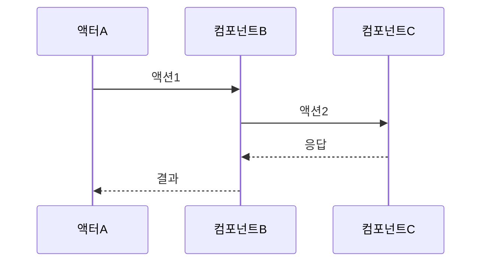

# 유스케이스 작성 템플릿

## 유스케이스 ID: UC-XXX

### 제목
[유스케이스 제목을 한 줄로 명확히 기술]

---

## 1. 개요

### 1.1 목적
[이 유스케이스가 달성하고자 하는 비즈니스 목표를 명확히 기술]

### 1.2 범위
[이 유스케이스가 다루는 기능적 범위 및 제외 사항]

### 1.3 액터
- **주요 액터**: [이 유스케이스를 시작하는 주체]
- **부 액터**: [유스케이스 실행에 참여하는 다른 주체들]

---

## 2. 선행 조건

[유스케이스 실행 전에 반드시 충족되어야 하는 조건들]

- 조건 1
- 조건 2
- ...

---

## 3. 참여 컴포넌트

[이 유스케이스에 참여하는 시스템 컴포넌트들]

- **컴포넌트 A**: 역할 설명
- **컴포넌트 B**: 역할 설명
- ...

---

## 4. 기본 플로우 (Basic Flow)

### 4.1 단계별 흐름

1. **[액터]**: [액션 설명]
   - 입력: [필요한 입력값]
   - 처리: [수행되는 처리]
   - 출력: [생성되는 출력]

2. **[컴포넌트]**: [액션 설명]
   - ...

3. ...

### 4.2 시퀀스 다이어그램

---

## 5. 대안 플로우 (Alternative Flows)

### 5.1 대안 플로우 1: [대안 시나리오 이름]

[기본 플로우와 다른 경로를 설명]

**시작 조건**: [어느 시점에서 분기되는지]

**단계**:
1. ...
2. ...

**결과**: [대안 플로우의 최종 상태]

---

## 6. 예외 플로우 (Exception Flows)

### 6.1 예외 상황 1: [예외 이름]

**발생 조건**: [예외가 발생하는 상황]

**처리 방법**:
1. ...
2. ...

**에러 코드**: `ERROR_CODE_XXX` (HTTP 상태 코드)

**사용자 메시지**: "[사용자에게 표시되는 메시지]"

---

## 7. 후행 조건 (Post-conditions)

### 7.1 성공 시

- **데이터베이스 변경**: [어떤 테이블에 어떤 변경이 발생하는지]
- **시스템 상태**: [시스템의 최종 상태]
- **외부 시스템**: [외부 시스템과의 상호작용 결과]

### 7.2 실패 시

- **데이터 롤백**: [어떤 데이터가 롤백되는지]
- **시스템 상태**: [실패 시 시스템 상태]

---

## 8. 비기능 요구사항

### 8.1 성능
- [응답 시간, 처리량 등]

### 8.2 보안
- [인증, 권한, 암호화 등]

### 8.3 가용성
- [시스템 가동 시간, 복구 시간 등]

---

## 9. UI/UX 요구사항

### 9.1 화면 구성
[필요한 UI 요소들]

### 9.2 사용자 경험
[사용자가 기대하는 인터랙션]

---

## 10. 테스트 시나리오

### 10.1 성공 케이스

| 테스트 케이스 ID | 입력값 | 기대 결과 |
|----------------|--------|----------|
| TC-XXX-01      | ...    | ...      |

### 10.2 실패 케이스

| 테스트 케이스 ID | 입력값 | 기대 결과 |
|----------------|--------|----------|
| TC-XXX-02      | ...    | ...      |

---

## 11. 관련 유스케이스

- **선행 유스케이스**: [이 유스케이스를 실행하기 전에 필요한 다른 유스케이스]
- **후행 유스케이스**: [이 유스케이스 이후에 실행될 수 있는 다른 유스케이스]
- **연관 유스케이스**: [관련된 다른 유스케이스들]

---

## 12. 변경 이력

| 버전 | 날짜 | 작성자 | 변경 내용 |
|------|------|--------|-----------|
| 1.0  | YYYY-MM-DD | [이름] | 초기 작성 |

---

## 부록

### A. 용어 정의
[유스케이스에서 사용된 전문 용어 설명]

### B. 참고 자료
[관련 문서, API 명세, 외부 링크 등]
