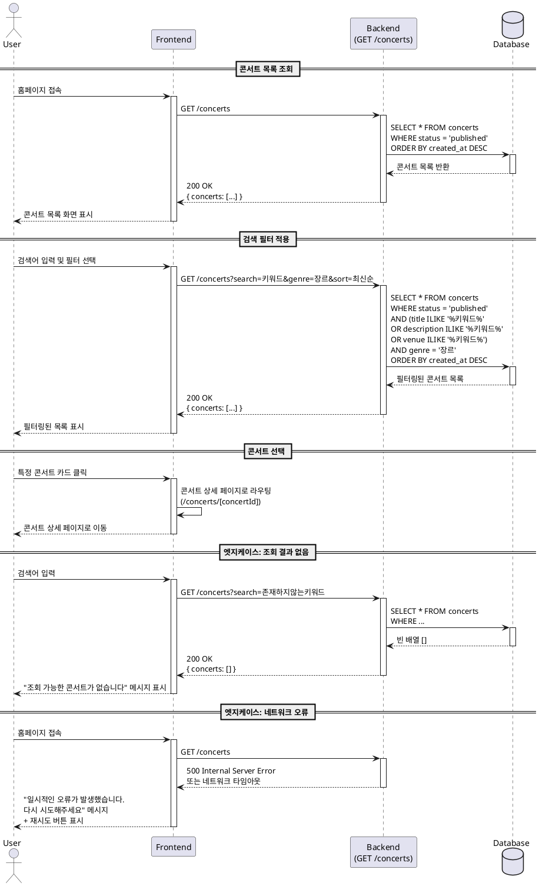

# Usecase 001: 콘서트 목록 조회 및 탐색

## Primary Actor
- **User (예매자)**: 콘서트 정보를 탐색하고 원하는 콘서트를 선택하려는 사용자

## Precondition
- 사용자가 콘서트 예매 시스템 웹사이트에 접속한 상태
- 시스템에 예매 가능한 상태(`published`)의 콘서트가 하나 이상 등록되어 있음

## Trigger
- 사용자가 홈페이지(콘서트 목록 페이지)에 접속
- 사용자가 검색, 필터, 정렬 기능을 사용하여 콘서트를 탐색
- 사용자가 특정 콘서트를 선택

## Main Scenario

### 1. 콘서트 목록 표시
1. 사용자가 홈페이지에 접속한다
2. 시스템은 데이터베이스에서 `status = 'published'` 인 콘서트 목록을 조회한다
3. 시스템은 조회된 콘서트 목록을 기본 정렬 순서(예: 최신순)로 화면에 표시한다
4. 각 콘서트 카드에는 다음 정보가 표시된다:
   - 대표 이미지
   - 콘서트 제목
   - 공연 기간 (시작일 ~ 종료일)
   - 공연 장소
   - 예매 가능 상태 표시

### 2. 검색 기능 사용
1. 사용자가 검색창에 키워드를 입력한다
2. 시스템은 콘서트 제목, 설명, 장소를 대상으로 입력된 키워드를 포함하는 콘서트를 필터링한다
3. 시스템은 필터링된 결과를 화면에 업데이트한다

### 3. 필터 기능 사용
1. 사용자가 필터 옵션을 선택한다 (예: 장르, 지역, 기간)
2. 시스템은 선택된 필터 조건에 맞는 콘서트만 조회한다
3. 시스템은 필터링된 결과를 화면에 업데이트한다

### 4. 정렬 기능 사용
1. 사용자가 정렬 기준을 선택한다 (예: 최신순, 마감 임박순, 가나다순)
2. 시스템은 선택된 정렬 기준에 따라 콘서트 목록을 재정렬한다
3. 시스템은 정렬된 결과를 화면에 업데이트한다

### 5. 콘서트 선택
1. 사용자가 관심 있는 콘서트 카드를 클릭한다
2. 시스템은 해당 콘서트의 상세 페이지(`/concerts/[concertId]`)로 이동한다

## Edge Cases

### EC-1: 조회 결과가 없는 경우
- **상황**: 검색 또는 필터 조건에 맞는 콘서트가 없음
- **처리**: 빈 목록 상태를 표시하고 "조회 가능한 콘서트가 없습니다" 메시지를 사용자에게 안내

### EC-2: 대량의 콘서트 목록
- **상황**: 조회 결과가 너무 많아 한 페이지에 표시하기 어려운 경우
- **처리**: 페이지네이션(Pagination) 또는 무한 스크롤(Infinite Scroll)을 적용하여 성능 저하 방지

### EC-3: 네트워크 오류
- **상황**: 콘서트 목록 조회 API 요청이 실패한 경우
- **처리**: 사용자에게 "일시적인 오류가 발생했습니다. 다시 시도해주세요" 메시지를 표시하고 재시도 버튼 제공

### EC-4: 데이터베이스 조회 지연
- **상황**: 서버 응답이 지연되는 경우
- **처리**: 로딩 스피너를 표시하여 데이터를 불러오는 중임을 사용자에게 알림

### EC-5: 콘서트 상태 변경
- **상황**: 사용자가 목록을 보는 동안 콘서트 상태가 `published`에서 `completed` 또는 `cancelled`로 변경된 경우
- **처리**: 목록에서 해당 콘서트를 자동으로 제거하거나, 사용자가 새로고침 시 업데이트된 목록 표시

## Business Rules

### BR-1: 콘서트 표시 조건
- 오직 `status = 'published'` 상태의 콘서트만 목록에 표시된다
- `draft`, `completed`, `cancelled` 상태의 콘서트는 목록에서 제외된다

### BR-2: 기본 정렬 순서
- 사용자가 별도의 정렬 기준을 선택하지 않은 경우, 최신 등록순(`created_at DESC`)으로 정렬된다

### BR-3: 검색 범위
- 검색은 콘서트의 `title`, `description`, `venue` 필드를 대상으로 수행된다
- 검색은 대소문자를 구분하지 않는다

### BR-4: 필터 조합
- 여러 필터를 동시에 적용할 수 있으며, 모든 조건을 만족하는 콘서트만 표시된다 (AND 조건)

### BR-5: 캐싱 정책
- 콘서트 목록은 1분 동안 캐시될 수 있다 (database.md의 성능 최적화 고려사항 참조)
- 실시간성이 중요한 경우 캐시 없이 조회한다

### BR-6: 페이지네이션 정책
- 한 페이지에 표시할 콘서트 수는 시스템 설정값을 따른다 (예: 20개)
- 페이지 번호는 1부터 시작한다

## Sequence Diagram



## API Specification

### GET /concerts

**Description**: 예매 가능한 콘서트 목록을 조회한다

**Query Parameters**:
- `search` (optional, string): 검색 키워드
- `genre` (optional, string): 장르 필터
- `region` (optional, string): 지역 필터
- `startDate` (optional, ISO 8601): 시작 날짜 필터
- `endDate` (optional, ISO 8601): 종료 날짜 필터
- `sort` (optional, enum): 정렬 기준 (latest, deadline, alphabetical)
- `page` (optional, number): 페이지 번호 (default: 1)
- `limit` (optional, number): 페이지당 항목 수 (default: 20)

**Response 200 OK**:
```json
{
  "concerts": [
    {
      "id": "uuid",
      "title": "콘서트 제목",
      "description": "콘서트 설명",
      "imageUrl": "https://example.com/image.jpg",
      "venue": "공연 장소",
      "startDate": "2025-11-01T19:00:00Z",
      "endDate": "2025-11-01T21:00:00Z",
      "status": "published"
    }
  ],
  "pagination": {
    "currentPage": 1,
    "totalPages": 5,
    "totalItems": 100,
    "itemsPerPage": 20
  }
}
```

**Response 500 Internal Server Error**:
```json
{
  "error": {
    "code": "INTERNAL_SERVER_ERROR",
    "message": "서버 오류가 발생했습니다"
  }
}
```

## UI/UX Requirements

### 콘서트 목록 페이지 레이아웃
- **헤더**: 로고, 예약 조회 버튼
- **검색바**: 키워드 입력 필드 + 검색 버튼
- **필터 영역**: 장르, 지역, 기간 필터 (드롭다운 또는 체크박스)
- **정렬 옵션**: 최신순, 마감 임박순, 가나다순 (드롭다운 또는 탭)
- **콘서트 그리드**: 카드 형태로 콘서트 목록 표시 (반응형 그리드)
- **페이지네이션**: 하단에 페이지 번호 또는 무한 스크롤

### 콘서트 카드 디자인
- 대표 이미지 (16:9 비율)
- 콘서트 제목 (최대 2줄, 초과 시 말줄임)
- 공연 날짜 아이콘 + 날짜 정보
- 공연 장소 아이콘 + 장소 정보
- Hover 시 그림자 효과 및 확대 애니메이션

### 상태 표시
- 로딩 중: 스켈레톤 UI 또는 스피너
- 빈 결과: 일러스트레이션 + 안내 문구
- 오류 발생: 에러 아이콘 + 메시지 + 재시도 버튼

## Related Usecases
- [Usecase 002: 콘서트 상세 정보 확인 및 인원 선택](../002/usecase.md) (다음 단계)
