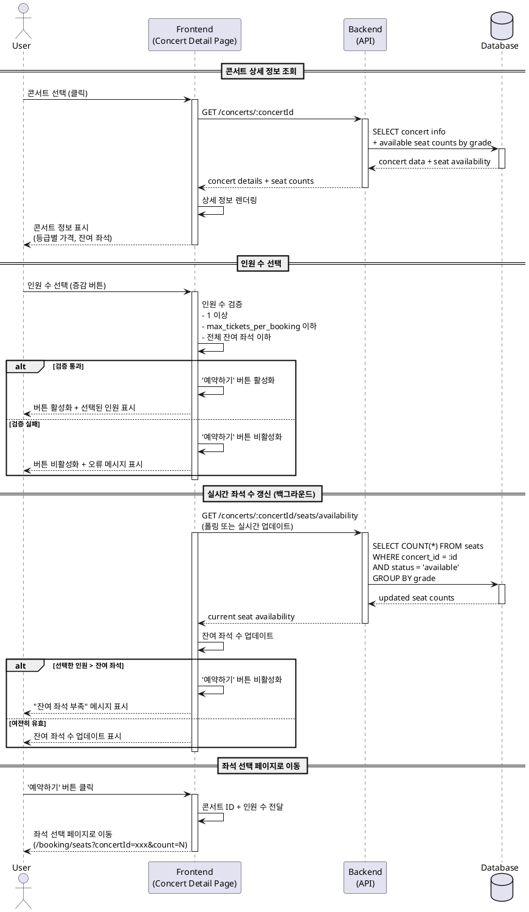

# UC-002: 콘서트 상세 정보 확인 및 인원 선택

## Primary Actor
- 예매자 (User)

## Precondition
- 사용자가 콘서트 목록 페이지에서 특정 콘서트를 선택하여 상세 페이지에 진입한 상태
- 해당 콘서트의 상태가 `published` (예매 가능)
- 해당 콘서트에 대한 좌석 정보가 데이터베이스에 존재

## Trigger
- 사용자가 콘서트 목록에서 특정 콘서트 카드를 클릭
- URL을 통한 직접 접근: `/concerts/:concertId`

## Main Scenario

### 1. 콘서트 상세 정보 조회
1. 사용자가 콘서트 목록에서 원하는 콘서트를 클릭
2. 시스템은 해당 콘서트 ID로 상세 정보를 조회
   - 콘서트 기본 정보 (제목, 설명, 이미지, 장소, 일시)
   - 등급별 가격 정보 (VIP, R, S, A)
   - 등급별 실시간 잔여 좌석 수 (`status = 'available'` 인 좌석 개수)
3. 시스템은 조회된 정보를 화면에 표시

### 2. 인원 수 선택
4. 사용자가 예매 인원 수를 선택 (증감 버튼 또는 드롭다운)
5. 시스템은 선택된 인원 수에 대해 다음을 실시간 검증
   - 인원 수가 1 이상인지 확인
   - 인원 수가 1회 최대 예매 가능 매수(`max_tickets_per_booking`, 기본값: 6매)를 초과하지 않는지 확인
   - 인원 수가 전체 잔여 좌석 수보다 많지 않은지 확인
6. 모든 검증을 통과하면 '예약하기' 버튼을 활성화
7. 검증에 실패하면 '예약하기' 버튼을 비활성화하고 적절한 피드백 메시지를 표시

### 3. 좌석 선택 페이지로 이동
8. 사용자가 '예약하기' 버튼을 클릭
9. 시스템은 다음 정보를 좌석 선택 페이지(`/booking/seats`)로 전달
   - 콘서트 ID
   - 선택된 인원 수
10. 좌석 선택 페이지로 이동

## Edge Cases

### EC-1: 잔여 좌석이 0인 경우
- **상황**: 페이지 진입 시 또는 실시간 갱신 시 전체 잔여 좌석이 0
- **처리**:
  - 인원 선택 UI를 비활성화
  - '예약하기' 버튼을 비활성화
  - "매진되었습니다" 메시지 표시

### EC-2: 인원 선택 중 잔여 좌석 감소
- **상황**: 사용자가 인원을 선택하는 동안 다른 사용자의 예매로 잔여 좌석이 감소하여 선택한 인원 수가 남은 좌석을 초과
- **처리**:
  - 실시간으로 잔여 좌석 수를 폴링(또는 실시간 업데이트)
  - 선택한 인원 수가 잔여 좌석을 초과하면 '예약하기' 버튼을 비활성화
  - "잔여 좌석이 부족합니다. 인원 수를 조정해주세요." 메시지 표시
  - 사용자가 인원 수를 조정할 수 있도록 유도

### EC-3: 최대 예매 가능 매수 초과
- **상황**: 사용자가 설정된 최대 예매 가능 매수(예: 6매)를 초과하여 선택 시도
- **처리**:
  - 증감 버튼 또는 드롭다운에서 최대값을 넘지 못하도록 UI 제한
  - "1회 최대 {max_tickets_per_booking}매까지만 예매 가능합니다." 메시지 표시

### EC-4: 콘서트가 존재하지 않거나 예매 불가 상태
- **상황**: 유효하지 않은 콘서트 ID로 접근하거나 콘서트 상태가 `published`가 아닌 경우
- **처리**:
  - 404 또는 적절한 오류 페이지 표시
  - "요청하신 콘서트를 찾을 수 없습니다." 또는 "현재 예매할 수 없는 콘서트입니다." 메시지 표시

### EC-5: 네트워크 오류 또는 API 조회 실패
- **상황**: 콘서트 상세 정보 또는 잔여 좌석 조회 중 네트워크 오류 발생
- **처리**:
  - 로딩 스피너 표시 후 오류 메시지 표시
  - "정보를 불러오는 중 오류가 발생했습니다. 다시 시도해주세요." 메시지와 재시도 버튼 제공

## Business Rules

### BR-1: 인원 수 제한
- 1회 예매 가능한 최소 인원: 1명
- 1회 예매 가능한 최대 인원: 콘서트별 `max_tickets_per_booking` 설정값 (기본값: 6매)
- 선택 가능한 최대 인원은 전체 잔여 좌석 수를 초과할 수 없음

### BR-2: 잔여 좌석 계산
- 잔여 좌석 = `status = 'available'` 인 좌석의 개수
- 임시 선점(`reserved`) 또는 예매 완료(`booked`) 좌석은 잔여 좌석에서 제외
- 등급별 잔여 좌석은 실시간으로 집계되어 표시

### BR-3: 실시간 좌석 수 갱신
- 좌석 수는 페이지 진입 시 조회
- 사용자가 인원을 선택하는 동안 주기적으로 갱신 (폴링 또는 실시간 업데이트)
- 잔여 좌석 변동 시 UI에 즉시 반영

### BR-4: 콘서트 예매 가능 조건
- 콘서트 상태가 `published` 일 때만 예매 가능
- 콘서트 상태가 `draft`, `completed`, `cancelled` 인 경우 예매 불가

### BR-5: 데이터 전달
- 좌석 선택 페이지로 이동 시 다음 정보를 전달:
  - `concertId`: 선택한 콘서트의 고유 ID
  - `numberOfTickets`: 선택한 인원 수
- 전달 방식: URL 파라미터 또는 상태 관리 라이브러리(Zustand)를 통한 전역 상태

## Sequence Diagram

## Non-Functional Requirements

### NFR-1: 성능
- 콘서트 상세 정보 조회 API 응답 시간: 500ms 이내
- 실시간 좌석 수 갱신 주기: 10초 이내 (폴링 방식) 또는 즉시 (WebSocket/Server-Sent Events)

### NFR-2: 가용성
- 서비스 가용성: 99.9% 이상
- 동시 접속자 수: 최소 1,000명 동시 처리 가능

### NFR-3: 사용성
- 인원 선택 UI는 직관적이어야 함 (증감 버튼 또는 드롭다운)
- 잔여 좌석 정보는 등급별로 명확하게 표시
- 버튼 활성화/비활성화 상태 변경 시 시각적 피드백 제공
- 오류 메시지는 사용자가 이해하기 쉬운 한국어로 표시

### NFR-4: 보안
- 콘서트 ID는 UUID 형식으로 예측 불가능하게 생성
- API 요청에는 적절한 Rate Limiting 적용 (예: IP당 분당 60회)

### NFR-5: 확장성
- 콘서트 수가 증가하거나 동시 접속자가 증가해도 성능 저하 없이 대응 가능
- 데이터베이스 인덱스 최적화 (`concerts.status`, `seats.concert_id`, `seats.status`)
