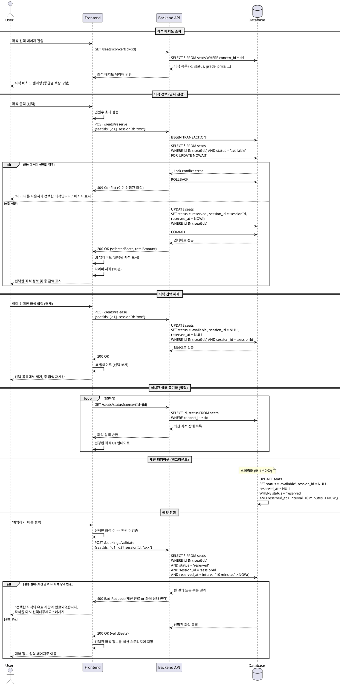

# 유스케이스 003: 좌석 선택

## 1. 유스케이스 설명

사용자가 콘서트 상세 페이지에서 선택한 인원수에 맞춰 좌석 배치도에서 원하는 좌석을 직접 선택하고, 선택한 좌석을 임시로 선점하여 다른 사용자가 해당 좌석을 예매하지 못하도록 하는 기능입니다. 좌석 선택이 완료되면 예약 정보 입력 단계로 진행됩니다.

## 2. Primary Actor

- **예매자 (User)**: 콘서트 티켓을 예매하려는 사용자

## 3. Precondition

- 사용자가 콘서트 상세 페이지에서 예매 인원수를 선택한 상태입니다.
- 콘서트에 예매 가능한 좌석이 최소 1석 이상 존재합니다.
- 선택한 인원수는 1회 최대 예매 가능 매수(기본값: 6매)를 초과하지 않습니다.

## 4. Trigger

- 사용자가 콘서트 상세 페이지에서 '예약하기' 버튼을 클릭하여 좌석 선택 페이지로 이동합니다.

## 5. Main Scenario

### 5.1 좌석 배치도 조회
1. 사용자가 좌석 선택 페이지에 진입합니다.
2. 시스템은 해당 콘서트의 전체 좌석 배치도 데이터를 조회합니다.
   - 좌석 ID, 구역, 행/열, 등급, 가격, 현재 상태(예매 가능/예매 완료/임시 선점)
3. 시스템은 좌석 상태별로 시각적으로 구분된 배치도를 화면에 출력합니다.
   - 예매 가능: 클릭 가능한 상태로 표시
   - 예매 완료: 선택 불가 상태로 표시 (회색 등)
   - 임시 선점(다른 사용자): 선택 불가 상태로 표시
4. 시스템은 이전 페이지에서 전달받은 인원수를 화면에 표시합니다.

### 5.2 좌석 선택
5. 사용자가 배치도에서 원하는 좌석을 클릭합니다.
6. 시스템은 다음을 검증합니다:
   - 해당 좌석이 '예매 가능' 상태인지 확인
   - 현재 선택한 좌석 총 개수가 인원수를 초과하지 않는지 확인
7. 검증 통과 시, 시스템은 해당 좌석을 임시 선점 상태로 변경합니다.
   - 좌석 상태를 'reserved'로 변경
   - 현재 세션 ID를 좌석에 연결
   - 선점 시각(reserved_at)을 기록
   - 10분 타임아웃을 설정
8. 시스템은 선택된 좌석을 UI에 '내 선택' 상태로 표시합니다.
9. 시스템은 선택한 좌석 정보(등급, 행/열, 가격)를 화면 우측 패널에 실시간으로 표시합니다.
10. 시스템은 총 결제 금액을 계산하여 표시합니다.

### 5.3 좌석 선택 해제
11. 사용자가 이미 선택한 좌석을 다시 클릭하면, 시스템은 해당 좌석의 선점을 해제합니다.
    - 좌석 상태를 'available'로 변경
    - session_id 및 reserved_at 정보를 제거
12. 시스템은 UI를 업데이트하여 선택 목록에서 해당 좌석을 제거하고 총 금액을 재계산합니다.

### 5.4 예약 진행
13. 사용자가 선택한 좌석 수가 인원수와 정확히 일치하면, '예약하기' 버튼이 활성화됩니다.
14. 사용자가 '예약하기' 버튼을 클릭합니다.
15. 시스템은 선택한 좌석들이 여전히 'reserved' 상태이고 현재 세션에 속하는지 최종 검증합니다.
16. 검증 통과 시, 선택된 좌석 정보를 다음 단계(예약 정보 입력 페이지)로 전달하며 이동합니다.

## 6. Edge Cases

### 6.1 동시 선점 실패
- **상황**: 사용자가 좌석을 클릭했으나, 동일한 순간 다른 사용자가 해당 좌석을 선점한 경우
- **처리**:
  - 시스템은 'FOR UPDATE NOWAIT' 락을 사용하여 즉시 실패를 감지합니다.
  - "이미 다른 사용자가 선택한 좌석입니다. 다른 좌석을 선택해주세요." 메시지를 표시합니다.
  - 좌석 배치도를 실시간으로 업데이트하여 해당 좌석을 '선택 불가' 상태로 변경합니다.

### 6.2 세션 타임아웃
- **상황**: 사용자가 좌석을 선택한 후 10분이 경과한 경우
- **처리**:
  - 백그라운드 스케줄러가 만료된 좌석의 상태를 'available'로 자동 복원합니다.
  - 프론트엔드에서 타이머를 표시하여 남은 시간을 실시간으로 안내합니다.
  - 타임아웃 발생 시, "선택 시간이 만료되었습니다. 좌석을 다시 선택해주세요." 메시지와 함께 페이지를 새로고침합니다.

### 6.3 실시간 좌석 변동
- **상황**: 사용자가 좌석 선택을 진행하는 도중 다른 사용자가 좌석을 예매 완료한 경우
- **처리**:
  - 주기적인 폴링(예: 5초마다) 또는 WebSocket을 통해 좌석 상태를 실시간으로 갱신합니다.
  - 예매 완료된 좌석을 '선택 불가' 상태로 UI를 업데이트합니다.
  - 필요시 "일부 좌석이 매진되었습니다." 토스트 메시지를 표시합니다.

### 6.4 인원수 초과 선택 시도
- **상황**: 사용자가 인원수보다 많은 좌석을 선택하려고 시도한 경우
- **처리**:
  - 클릭 이벤트를 무시하고, "선택 가능한 좌석 수를 초과했습니다. (N/M석 선택)" 메시지를 표시합니다.
  - '예약하기' 버튼을 비활성화 상태로 유지합니다.

### 6.5 선택한 좌석 수 부족
- **상황**: 사용자가 인원수보다 적은 좌석만 선택한 상태에서 '예약하기' 버튼을 누르려는 경우
- **처리**:
  - '예약하기' 버튼을 비활성화하고, "N석을 더 선택해주세요." 안내 메시지를 표시합니다.

### 6.6 네트워크 오류
- **상황**: 좌석 선점 API 호출 중 네트워크 오류가 발생한 경우
- **처리**:
  - "네트워크 오류가 발생했습니다. 다시 시도해주세요." 메시지를 표시합니다.
  - 해당 좌석의 UI 상태를 이전 상태로 롤백합니다.
  - 재시도 버튼을 제공합니다.

### 6.7 데이터베이스 오류
- **상황**: 좌석 선점 트랜잭션 중 데이터베이스 오류가 발생한 경우
- **처리**:
  - 트랜잭션을 자동으로 롤백합니다.
  - "일시적인 오류가 발생했습니다. 잠시 후 다시 시도해주세요." 메시지를 표시합니다.
  - 오류를 로깅하고 관리자에게 알림을 전송합니다.

## 7. Postcondition

### Success
- 사용자가 선택한 좌석들이 'reserved' 상태로 데이터베이스에 저장되어 있습니다.
- 각 좌석에는 현재 세션 ID와 선점 시각이 기록되어 있습니다.
- 선택한 좌석 정보(좌석 ID 목록, 총 금액)가 다음 단계로 전달됩니다.
- 사용자는 예약 정보 입력 페이지로 이동합니다.

### Failure
- 좌석 선점에 실패한 경우, 해당 좌석은 'reserved' 상태로 변경되지 않습니다.
- 사용자는 좌석 선택 페이지에 머물러 다른 좌석을 선택할 수 있습니다.

## 8. Business Rules

### BR-1: 좌석 임시 선점 시간 제한
- 좌석을 선택한 시점부터 **10분 이내**에 예약을 완료해야 합니다.
- 10분이 경과하면 선점된 좌석은 자동으로 '예매 가능' 상태로 복원됩니다.

### BR-2: 동시 선점 방지
- 동일한 좌석에 대해 **동시에 여러 사용자가 선점을 시도할 수 없습니다**.
- 데이터베이스 트랜잭션의 `FOR UPDATE NOWAIT` 락을 사용하여 선점 충돌을 즉시 감지합니다.

### BR-3: 인원수 일치 검증
- 사용자가 선택한 좌석의 총 개수는 **이전 단계에서 선택한 인원수와 정확히 일치**해야 합니다.
- 인원수보다 적거나 많은 좌석을 선택한 경우, '예약하기' 버튼이 비활성화됩니다.

### BR-4: 좌석 상태 관리
- 좌석은 다음 세 가지 상태 중 하나를 가집니다:
  - `available`: 예매 가능한 좌석
  - `reserved`: 임시 선점된 좌석 (세션 ID와 연결됨)
  - `booked`: 예매 완료된 좌석 (booking_id와 연결됨)

### BR-5: 세션 격리
- 각 사용자의 좌석 선점은 **세션 ID로 격리**됩니다.
- 사용자 A가 선점한 좌석은 사용자 B의 화면에서 '선택 불가' 상태로 표시됩니다.

### BR-6: 실시간 상태 동기화
- 좌석 배치도는 **실시간으로 업데이트**되어야 합니다.
- 권장 갱신 주기: 5초마다 폴링 또는 WebSocket을 통한 실시간 푸시

### BR-7: 최대 예매 가능 매수 제한
- 한 번에 선택할 수 있는 좌석 수는 **콘서트별 `max_tickets_per_booking` 값**을 초과할 수 없습니다.
- 기본값: 6매

### BR-8: 좌석 선점 해제
- 사용자가 선택한 좌석을 다시 클릭하면 **즉시 선점이 해제**됩니다.
- 해제된 좌석은 다른 사용자가 즉시 선택할 수 있습니다.

### BR-9: 트랜잭션 원자성
- 좌석 선점 과정은 **트랜잭션으로 보호**되어야 합니다.
- 선점 중 오류 발생 시, 모든 변경사항이 롤백됩니다.

## 9. Non-Functional Requirements

### NFR-1: 성능
- 좌석 배치도 로딩 시간은 **2초 이내**여야 합니다.
- 좌석 선택/해제 반응 시간은 **500ms 이내**여야 합니다.
- 동시 사용자 100명 이상을 처리할 수 있어야 합니다.

### NFR-2: 가용성
- 좌석 선택 API의 가용성은 **99.9% 이상**이어야 합니다.
- 데이터베이스 오류 발생 시, 자동으로 재시도합니다 (최대 3회).

### NFR-3: 데이터 정합성
- Race Condition에 의한 **이중 예매가 절대 발생하지 않아야** 합니다.
- 좌석 상태는 항상 데이터베이스의 단일 진실 공급원(Single Source of Truth)을 기준으로 합니다.

### NFR-4: 사용성
- 좌석 배치도는 **직관적으로 이해 가능**해야 합니다 (등급별 색상 구분, 선택/불가 상태 명확 표시).
- 남은 선택 시간(타이머)을 **명확하게 표시**하여 사용자가 시간 제약을 인지할 수 있어야 합니다.
- 선택한 좌석 정보와 총 금액을 **실시간으로 표시**하여 사용자가 선택 내역을 쉽게 확인할 수 있어야 합니다.

### NFR-5: 보안
- 세션 ID는 **예측 불가능한 랜덤 값**이어야 합니다 (UUID v4 권장).
- 좌석 선점 API는 **Rate Limiting**을 적용하여 악의적인 선점 공격을 방지합니다 (예: 1초당 10회).

### NFR-6: 확장성
- 콘서트당 최대 10,000석까지 처리할 수 있어야 합니다.
- 좌석 배치도는 페이지네이션 또는 가상 스크롤링을 적용하여 대규모 데이터를 효율적으로 렌더링합니다.

### NFR-7: 모니터링
- 좌석 선점 실패율을 **실시간으로 모니터링**합니다.
- 세션 타임아웃 발생 빈도를 추적하여 UX 개선에 활용합니다.

## 10. Sequence Diagram



## 11. Related APIs

### 11.1 좌석 배치도 조회
- **Endpoint**: `GET /api/seats`
- **Query Parameters**:
  - `concertId` (required): 콘서트 ID
- **Response**: 좌석 목록 (id, concert_id, section, row_number, seat_number, grade, price, status)

### 11.2 좌석 임시 선점
- **Endpoint**: `POST /api/seats/reserve`
- **Request Body**:
  ```json
  {
    "seatIds": ["uuid1", "uuid2"],
    "sessionId": "session-uuid"
  }
  ```
- **Response**: 선점된 좌석 정보 및 총 금액

### 11.3 좌석 선점 해제
- **Endpoint**: `POST /api/seats/release`
- **Request Body**:
  ```json
  {
    "seatIds": ["uuid1"],
    "sessionId": "session-uuid"
  }
  ```
- **Response**: 해제 성공 여부

### 11.4 좌석 상태 조회 (실시간 동기화)
- **Endpoint**: `GET /api/seats/status`
- **Query Parameters**:
  - `concertId` (required): 콘서트 ID
- **Response**: 좌석 ID와 현재 상태 목록

### 11.5 선택 검증
- **Endpoint**: `POST /api/bookings/validate`
- **Request Body**:
  ```json
  {
    "seatIds": ["uuid1", "uuid2"],
    "sessionId": "session-uuid"
  }
  ```
- **Response**: 검증 결과 (valid/invalid)

## 12. Database Operations

### 12.1 좌석 조회 쿼리
```sql
SELECT id, concert_id, section, row_number, seat_number,
       grade, price, status, session_id, reserved_at
FROM seats
WHERE concert_id = :concert_id
ORDER BY section, row_number, seat_number;
```

### 12.2 좌석 선점 쿼리 (트랜잭션)
```sql
BEGIN;
SELECT id, status FROM seats
WHERE id = ANY(:seat_ids) AND status = 'available'
FOR UPDATE NOWAIT;

UPDATE seats
SET status = 'reserved',
    session_id = :session_id,
    reserved_at = NOW()
WHERE id = ANY(:seat_ids);
COMMIT;
```

### 12.3 좌석 선점 해제 쿼리
```sql
UPDATE seats
SET status = 'available',
    session_id = NULL,
    reserved_at = NULL
WHERE id = ANY(:seat_ids) AND session_id = :session_id;
```

### 12.4 세션 타임아웃 정리 쿼리 (스케줄러)
```sql
UPDATE seats
SET status = 'available',
    session_id = NULL,
    reserved_at = NULL
WHERE status = 'reserved'
  AND reserved_at + interval '10 minutes' < NOW();
```

## 13. External Services

이 유스케이스는 외부 서비스와의 연동이 필요하지 않습니다. 모든 처리는 내부 시스템에서 완료됩니다.

## 14. UI/UX Requirements

### 14.1 좌석 배치도
- 등급별로 색상을 구분하여 표시 (예: VIP-금색, R-빨강, S-파랑, A-초록)
- 좌석 상태별 시각화:
  - 예매 가능: 밝은 색상, 클릭 가능
  - 예매 완료: 회색, 클릭 불가
  - 내 선택: 강조 색상 (예: 주황색), 클릭하면 해제

### 14.2 선택 정보 패널
- 화면 우측에 고정된 패널로 다음 정보 표시:
  - 선택한 인원수 / 필요한 인원수
  - 선택한 좌석 목록 (등급, 구역, 행/열, 가격)
  - 총 결제 금액
  - 남은 시간 (타이머)
  - '예약하기' 버튼 (활성화/비활성화 상태)

### 14.3 타이머
- 좌석 선점 후 남은 시간을 분:초 형태로 표시
- 3분 이하일 때 빨간색으로 강조
- 30초 이하일 때 깜빡이는 애니메이션

### 14.4 피드백 메시지
- 좌석 선점 성공: 토스트 메시지 (예: "좌석이 선택되었습니다.")
- 좌석 선점 실패: 에러 메시지 모달 또는 토스트
- 세션 만료: 전체 화면 알림 모달 + 페이지 새로고침 버튼

## 15. Acceptance Criteria

- [ ] 사용자가 좌석 배치도를 등급별/상태별로 구분하여 확인할 수 있다.
- [ ] 사용자가 예매 가능한 좌석을 클릭하여 선택할 수 있다.
- [ ] 사용자가 이미 선택한 좌석을 다시 클릭하여 선택을 해제할 수 있다.
- [ ] 선택한 좌석 수가 인원수와 일치할 때만 '예약하기' 버튼이 활성화된다.
- [ ] 동일한 좌석에 대해 동시 선점 시도 시, 먼저 선점한 사용자만 성공하고 나머지는 실패 메시지를 받는다.
- [ ] 좌석 선점 후 10분이 경과하면 자동으로 선점이 해제된다.
- [ ] 다른 사용자가 예매한 좌석은 실시간으로 '선택 불가' 상태로 업데이트된다.
- [ ] 선택한 좌석 정보와 총 금액이 실시간으로 화면에 표시된다.
- [ ] 남은 시간이 타이머로 표시되며, 시간 초과 시 명확한 안내가 제공된다.
- [ ] '예약하기' 버튼 클릭 시 선택한 좌석이 여전히 유효한지 최종 검증된다.
- [ ] 검증 통과 시 예약 정보 입력 페이지로 이동하며 선택한 좌석 정보가 전달된다.
