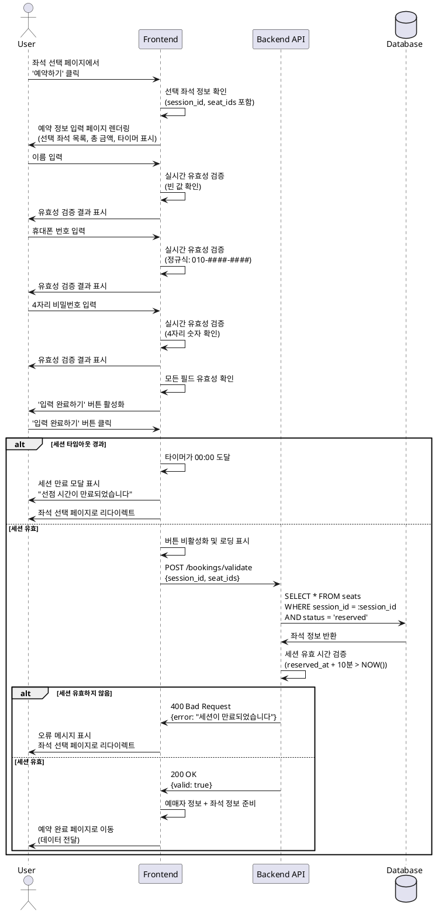

# 유스케이스 004: 예약 정보 입력

## 1. 유스케이스 설명

사용자가 좌석 선택을 완료한 후, 예약을 확정하기 위해 예매자 정보(이름, 휴대폰 번호)와 조회용 비밀번호를 입력하는 기능입니다. 모든 입력 필드는 실시간으로 유효성 검증이 수행되며, 세션 타임아웃 내에 입력을 완료해야 합니다.

## 2. Primary Actor

**예매자 (User)**: 콘서트 티켓을 예매하고자 하는 비회원 사용자

## 3. Precondition

1. 사용자가 좌석 선택 페이지에서 유효한 좌석을 선택 완료한 상태
2. 선택한 좌석이 `reserved` 상태로 임시 선점되어 있고, 세션 ID가 발급된 상태
3. 선택한 좌석의 임시 선점 시간이 만료되지 않은 상태 (reserved_at + 10분 이내)
4. 좌석 선택 페이지에서 예약 정보 입력 페이지로 정상적으로 전환된 상태

## 4. Trigger

사용자가 좌석 선택 페이지에서 '예약하기' 버튼을 클릭하여 예약 정보 입력 페이지로 진입

## 5. Main Scenario

1. **페이지 진입 및 초기화**
   - 시스템은 이전 페이지(좌석 선택)에서 전달받은 선택 좌석 정보(좌석 ID, 등급, 위치, 가격)를 화면에 표시
   - 시스템은 총 결제 금액을 계산하여 표시
   - 시스템은 세션 타임아웃 카운트다운 타이머를 화면에 표시 (예: "남은 시간: 09:45")

2. **예매자 정보 입력**
   - 사용자는 예매자 이름을 입력
   - 사용자는 휴대폰 번호를 입력 (형식: 010-1234-5678)
   - 사용자는 4자리 숫자로 구성된 조회용 비밀번호를 입력

3. **실시간 유효성 검증**
   - 시스템은 각 입력 필드에 대해 실시간으로 유효성을 검증:
     - 이름: 빈 값이 아닌지 확인 (최소 1자 이상)
     - 휴대폰 번호: 정규식 `010-\d{4}-\d{4}` 패턴과 일치하는지 확인
     - 비밀번호: 정확히 4자리 숫자인지 확인
   - 각 필드의 검증 결과를 즉시 UI에 반영 (오류 메시지 표시)

4. **폼 전체 유효성 확인**
   - 시스템은 모든 필수 입력 필드가 유효한 값으로 채워졌는지 확인
   - 모든 필드가 유효한 경우에만 '입력 완료하기' 버튼을 활성화

5. **입력 완료 요청**
   - 사용자가 '입력 완료하기' 버튼 클릭
   - 시스템은 최종적으로 세션 유효 시간을 검증
   - 세션이 유효한 경우, 입력된 예매자 정보와 선택 좌석 정보를 다음 단계(예약 완료)로 전달

6. **페이지 전환**
   - 시스템은 사용자를 예약 완료 페이지로 이동시킴

## 6. Edge Cases

### 6.1 세션 타임아웃 만료

**발생 조건**: 사용자가 정보를 입력하는 동안 임시 선점 시간(10분)이 경과

**처리 방법**:
- 시스템은 타이머가 00:00에 도달하면 즉시 모달 팝업을 표시
- "선점 시간이 만료되었습니다. 좌석을 다시 선택해주세요." 메시지 노출
- 사용자를 좌석 선택 페이지로 자동 리다이렉트
- 백엔드에서 해당 세션의 좌석을 `available` 상태로 복원

### 6.2 입력 형식 오류

**발생 조건**: 사용자가 올바르지 않은 형식으로 정보 입력

**처리 방법**:
- 각 필드별로 즉시 오류 메시지 표시:
  - 이름 빈 값: "이름을 입력해주세요."
  - 휴대폰 번호 형식 오류: "010-1234-5678 형식으로 입력해주세요."
  - 비밀번호 형식 오류: "4자리 숫자로 입력해주세요."
- '입력 완료하기' 버튼을 비활성화 상태로 유지

### 6.3 중복 제출 방지

**발생 조건**: 사용자가 '입력 완료하기' 버튼을 빠르게 여러 번 클릭

**처리 방법**:
- 첫 번째 클릭 후 버튼을 즉시 비활성화 처리
- 로딩 스피너를 표시하여 처리 중임을 명확히 안내
- 요청 처리가 완료되기 전까지 추가 클릭을 무시

### 6.4 페이지 새로고침 또는 뒤로가기

**발생 조건**: 사용자가 브라우저의 새로고침 또는 뒤로가기 버튼 사용

**처리 방법**:
- 브라우저 이벤트(`beforeunload`)를 감지하여 경고 메시지 표시
- "페이지를 나가면 선택한 좌석 정보가 사라집니다. 계속하시겠습니까?"
- 사용자가 확인하면 세션은 타임아웃까지 유지되지만, 입력 데이터는 초기화

### 6.5 네트워크 오류

**발생 조건**: 입력 완료 요청 중 네트워크 연결 실패

**처리 방법**:
- 오류 메시지 노출: "일시적인 오류가 발생했습니다. 다시 시도해주세요."
- '입력 완료하기' 버튼을 다시 활성화하여 재시도 가능하도록 처리
- 세션 타임아웃이 남아있는 동안에는 재시도 허용

## 7. Business Rules

### 7.1 예매자 정보 필수 입력 사항

- **이름**: 최소 1자 이상, 최대 50자 이내
- **휴대폰 번호**: 반드시 `010-####-####` 형식 (숫자만 허용)
- **비밀번호**: 정확히 4자리 숫자 (예: 1234)

### 7.2 세션 타임아웃

- 좌석 임시 선점 후 **10분 이내**에 예약 정보 입력을 완료해야 함
- 타임아웃 1분 전부터 경고 메시지를 표시하여 사용자에게 알림
- 타임아웃 경과 시 자동으로 좌석 선점이 해제되고 좌석 선택 페이지로 리다이렉트

### 7.3 비밀번호 보안

- 입력된 4자리 숫자 비밀번호는 백엔드에서 반드시 해시화하여 저장 (bcrypt, argon2 등)
- 프론트엔드에서는 비밀번호 입력 필드를 `type="password"`로 처리하여 마스킹

### 7.4 개인정보 보호

- 휴대폰 번호는 예매 조회 및 취소 시 본인 인증 수단으로만 사용
- 로그 기록 시 휴대폰 번호는 마스킹 처리 (예: 010-****-5678)
- 서버 응답 시 민감 정보는 최소화하여 전달

### 7.5 입력 데이터 정합성

- 모든 입력 필드는 프론트엔드와 백엔드 양쪽에서 동일한 검증 로직 적용
- XSS 공격 방지를 위해 입력값 sanitization 수행
- SQL Injection 방지를 위해 Prepared Statement 사용

### 7.6 중복 예매 방지

- 동일한 세션 ID로 중복하여 예약 완료 요청을 보낼 수 없도록 백엔드에서 검증
- 이미 처리된 세션 ID는 재사용 불가

## 8. Sequence Diagram



## 9. 관련 API

### 9.1 세션 유효성 검증

**Endpoint**: `POST /api/bookings/validate`

**Request Body**:
```json
{
  "session_id": "uuid",
  "seat_ids": ["uuid", "uuid"]
}
```

**Response (Success - 200 OK)**:
```json
{
  "valid": true,
  "remaining_seconds": 420
}
```

**Response (Error - 400 Bad Request)**:
```json
{
  "valid": false,
  "error": "세션이 만료되었습니다"
}
```

## 10. 관련 페이지

- **이전 페이지**: `/booking/seats` (좌석 선택)
- **현재 페이지**: `/booking/checkout` (예약 정보 입력)
- **다음 페이지**: `/booking/complete` (예약 완료)

## 11. 비기능적 요구사항

### 11.1 응답 시간

- 입력 필드 유효성 검증: 100ms 이내 (실시간 피드백)
- 세션 유효성 검증 API 응답: 500ms 이내

### 11.2 사용성

- 각 입력 필드에는 placeholder와 label을 명확히 제공
- 오류 메시지는 사용자 친화적인 언어로 작성 (기술 용어 지양)
- 타이머는 눈에 잘 띄는 위치에 배치하고, 1분 남았을 때 색상 변경 (빨간색)으로 경고

### 11.3 접근성

- 모든 입력 필드는 키보드로 접근 가능 (Tab 키 순서 지정)
- 오류 메시지는 스크린 리더에서 읽을 수 있도록 `aria-live` 속성 사용
- 버튼의 활성화/비활성화 상태를 `aria-disabled` 속성으로 명확히 표시

### 11.4 보안

- 비밀번호 입력 필드는 `type="password"`로 마스킹 처리
- HTTPS를 통한 암호화된 통신 필수
- 휴대폰 번호는 서버 로그에 마스킹 처리하여 기록
- 비밀번호는 백엔드에서 bcrypt/argon2 등 강력한 해싱 알고리즘으로 저장

### 11.5 성능

- 페이지 초기 로딩 시간: 1초 이내
- 타이머는 1초 간격으로 정확하게 업데이트
- 입력 필드 유효성 검증은 debounce (300ms) 처리하여 불필요한 재검증 방지
