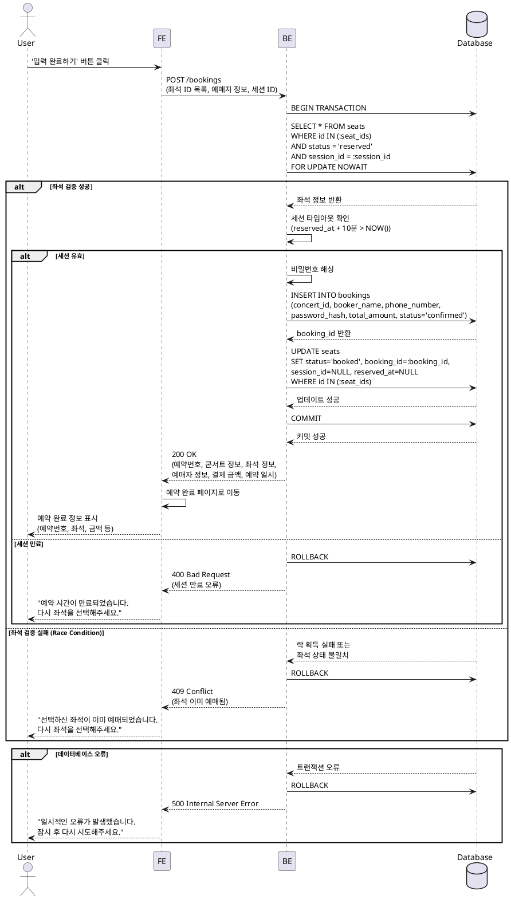

# UseCase 005: 예약 완료 및 확정

## Primary Actor

예매자 (User)

## Precondition

- 사용자가 콘서트를 선택하고 인원을 선택한 상태
- 좌석 선택 페이지에서 인원수에 맞게 좌석을 선택한 상태
- 선택한 좌석이 임시 선점(reserved) 상태로 세션에 저장된 상태
- 예약 정보 입력 페이지에서 모든 필수 정보(이름, 휴대폰 번호, 비밀번호)를 입력한 상태
- 입력한 정보의 유효성 검증이 완료된 상태

## Trigger

사용자가 예약 정보 입력 페이지에서 '입력 완료하기' 버튼을 클릭

## Main Scenario

1. **사용자**: 예약 정보 입력 페이지에서 선택한 좌석 정보를 최종 확인하고 '입력 완료하기' 버튼을 클릭
2. **FE**: 입력된 모든 정보(좌석 ID 목록, 예매자 정보, 세션 ID)를 예약 완료 API로 전송
3. **BE**: 데이터베이스 트랜잭션을 시작
4. **BE**: 선택한 좌석들의 현재 상태를 FOR UPDATE 락으로 조회하여 검증
   - 좌석 상태가 'reserved'인지 확인
   - 세션 ID가 요청한 세션 ID와 일치하는지 확인
   - 임시 선점 시간(reserved_at)이 만료되지 않았는지 확인 (10분 이내)
5. **BE**: 검증 통과 시, bookings 테이블에 새로운 예매 레코드 생성
   - 고유 예약번호(booking_id) 발급
   - 콘서트 ID, 예매자 이름, 휴대폰 번호, 비밀번호 해시, 총 결제 금액 저장
   - 예매 상태를 'confirmed'로 설정
6. **BE**: seats 테이블의 해당 좌석들 상태를 'booked'로 영구 변경
   - booking_id를 생성된 예매 ID로 설정
   - session_id와 reserved_at을 NULL로 초기화
7. **BE**: 데이터베이스 트랜잭션 커밋
8. **BE**: 예약 완료 응답 데이터 반환 (예약번호, 콘서트 정보, 좌석 정보, 예매자 정보, 결제 금액, 예약 일시)
9. **FE**: 예약 완료 페이지로 이동
10. **FE**: 생성된 고유 예약번호와 모든 예약 상세 정보를 화면에 표시
11. **FE**: '홈으로 돌아가기', '예약 조회하기' 등 네비게이션 버튼 제공

## Edge Cases

### 1. 좌석 상태 검증 실패 (Race Condition)

- **발생 상황**: 최종 검증 시점에 다른 사용자가 동일한 좌석을 먼저 예매 완료한 경우
- **처리 방법**:
  - 트랜잭션을 롤백
  - 사용자에게 "선택하신 좌석이 이미 예매되었습니다. 다시 좌석을 선택해주세요." 오류 메시지 표시
  - 좌석 선택 페이지로 리다이렉트

### 2. 세션 타임아웃 만료

- **발생 상황**: 예약 정보 입력 중 임시 선점 시간(10분)이 경과한 경우
- **처리 방법**:
  - 트랜잭션을 롤백
  - 사용자에게 "예약 시간이 만료되었습니다. 다시 좌석을 선택해주세요." 오류 메시지 표시
  - 좌석 선택 페이지로 리다이렉트

### 3. 데이터베이스 트랜잭션 오류

- **발생 상황**: 네트워크 장애, 데이터베이스 연결 오류 등으로 트랜잭션 중 오류 발생
- **처리 방법**:
  - 트랜잭션을 자동 롤백
  - 사용자에게 "일시적인 오류가 발생했습니다. 잠시 후 다시 시도해주세요." 오류 메시지 표시
  - 예약 정보 입력 페이지에서 재시도 버튼 제공

### 4. 세션 ID 불일치

- **발생 상황**: 다른 브라우저 탭에서 동시에 예매를 진행하거나, 세션이 변경된 경우
- **처리 방법**:
  - 트랜잭션을 롤백
  - 사용자에게 "유효하지 않은 세션입니다. 처음부터 다시 시도해주세요." 오류 메시지 표시
  - 콘서트 상세 페이지로 리다이렉트

### 5. 비밀번호 해싱 실패

- **발생 상황**: 비밀번호 해싱 라이브러리 오류 또는 시스템 리소스 부족
- **처리 방법**:
  - 예매 프로세스를 중단
  - 사용자에게 "시스템 오류가 발생했습니다. 잠시 후 다시 시도해주세요." 오류 메시지 표시
  - 오류를 로깅하여 모니터링

## Business Rules

### BR-1: 트랜잭션 처리
- 예약 완료는 반드시 데이터베이스 트랜잭션으로 처리되어야 함
- 예매 레코드 생성과 좌석 상태 변경은 원자적(atomic)으로 수행되어야 함
- 트랜잭션 실패 시 모든 변경사항이 롤백되어야 함

### BR-2: 좌석 상태 검증
- 최종 예매 시점에 좌석 상태를 FOR UPDATE 락으로 재검증해야 함
- 좌석 상태가 'reserved'이고, 세션 ID가 일치하며, 타임아웃이 경과하지 않은 경우에만 예매 가능

### BR-3: 세션 타임아웃
- 임시 선점 시간은 10분으로 제한
- reserved_at + 10분 이후에는 예매 불가
- 타임아웃 경과 시 백그라운드 작업으로 좌석 상태를 'available'로 자동 복원

### BR-4: 예약번호 발급
- 고유한 UUID 형식의 예약번호를 발급
- 예약번호는 예약 조회 및 취소 시 식별자로 사용

### BR-5: 비밀번호 보안
- 4자리 숫자 비밀번호는 반드시 해시화하여 저장 (bcrypt, argon2 등)
- 평문 비밀번호를 데이터베이스에 저장하거나 로그에 남기지 않음

### BR-6: 개인정보 보호
- 휴대폰 번호는 마스킹 처리하여 로그에 기록 금지
- 예매자 정보는 최소한의 필수 정보만 수집 (이름, 휴대폰 번호)

### BR-7: 동시성 제어
- FOR UPDATE NOWAIT를 사용하여 락 대기 시간 최소화
- 다른 트랜잭션이 이미 락을 보유한 경우 즉시 실패 처리

### BR-8: 데이터 무결성
- 예매 레코드 생성 후 반드시 좌석 테이블에 booking_id를 업데이트
- 좌석 상태가 'booked'인 경우 반드시 booking_id가 존재해야 함

## Sequence Diagram

