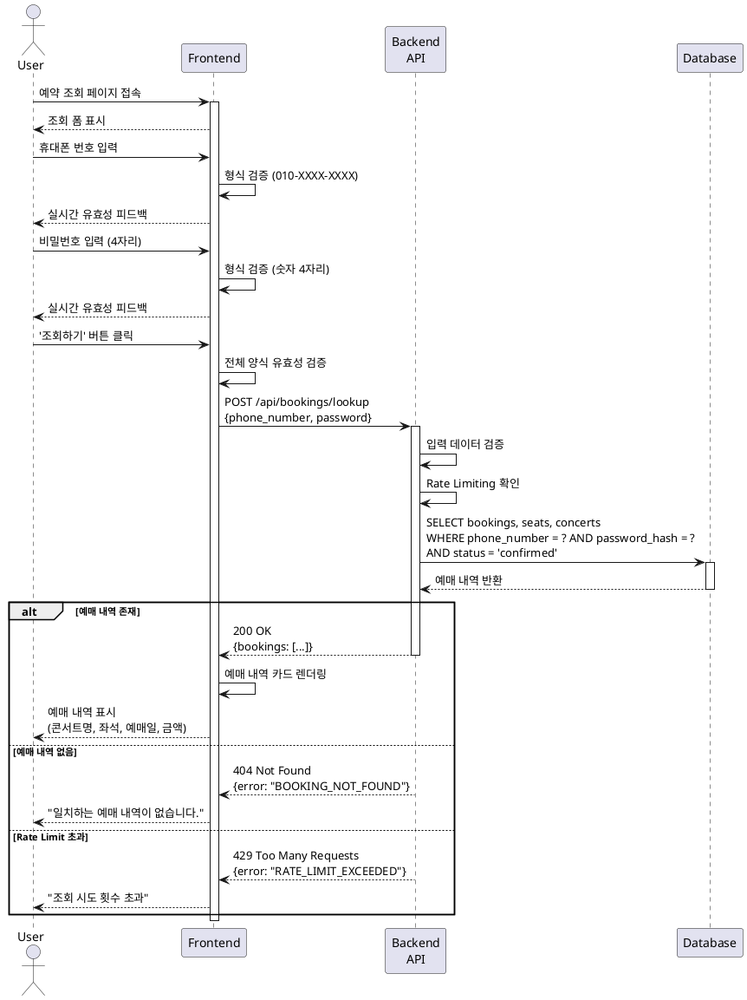

# UC-006: 예약 조회

## 1. 유스케이스 개요

사용자가 예매 시 입력했던 식별 정보(휴대폰 번호, 비밀번호)를 통해 본인의 예매 내역을 조회하는 기능입니다.
비회원 예매 시스템에서 사용자가 자신의 예매 내역을 확인하고 관리할 수 있도록 지원합니다.

## 2. Primary Actor

- **사용자 (예매자)**: 콘서트 예매를 완료한 사용자

## 3. Precondition

- 사용자가 이미 콘서트 예매를 완료한 상태여야 합니다.
- 사용자가 예매 시 입력했던 휴대폰 번호와 비밀번호를 기억하고 있어야 합니다.
- 예약 조회 페이지(`/lookup`)에 접근 가능해야 합니다.

## 4. Trigger

사용자가 예약 조회 페이지에 접속하여 휴대폰 번호와 비밀번호를 입력하고 '조회하기' 버튼을 클릭합니다.

## 5. Main Scenario

1. 사용자가 예약 조회 페이지(`/lookup`)에 접속합니다.
2. 사용자가 예매 시 입력했던 휴대폰 번호를 입력합니다.
3. 사용자가 예매 시 설정했던 4자리 숫자 비밀번호를 입력합니다.
4. 시스템이 입력된 정보의 형식을 검증합니다.
   - 휴대폰 번호: `010-XXXX-XXXX` 형식
   - 비밀번호: 4자리 숫자
5. 사용자가 '조회하기' 버튼을 클릭합니다.
6. 백엔드가 입력된 휴대폰 번호와 비밀번호로 데이터베이스를 조회합니다.
   - 비밀번호는 해시화된 값으로 비교합니다.
   - `bookings` 테이블에서 `status = 'confirmed'`인 예매 내역을 조회합니다.
7. 백엔드가 조회된 예매 내역과 함께 관련 좌석 정보를 반환합니다.
   - `bookings` 테이블과 `seats` 테이블을 조인하여 좌석 상세 정보 포함
   - 콘서트 정보도 함께 조회
8. 프론트엔드가 조회된 예매 내역을 배너 형태로 화면에 표시합니다.
   - 각 예매 건마다: 예약번호, 콘서트명, 좌석 정보, 예매 일시, 총 금액, '예약 취소' 버튼
9. 사용자가 예매 내역을 확인합니다.

## 6. Edge Cases

### 6.1 조회 실패 - 일치하는 정보 없음

- **상황**: 입력된 휴대폰 번호와 비밀번호 조합으로 일치하는 예매 내역이 없는 경우
- **처리**:
  - "입력하신 정보와 일치하는 예매 내역이 없습니다." 오류 메시지 표시
  - 입력 필드 초기화 또는 재입력 유도

### 6.2 입력 형식 오류

- **상황**: 휴대폰 번호 또는 비밀번호 형식이 올바르지 않은 경우
- **처리**:
  - 실시간 유효성 검증으로 입력 필드 하단에 오류 메시지 표시
  - '조회하기' 버튼 비활성화
  - 올바른 형식 안내

### 6.3 여러 건의 예매 내역 존재

- **상황**: 동일한 휴대폰 번호로 여러 콘서트를 예매한 경우
- **처리**:
  - 모든 예매 내역을 시간순(최신순)으로 정렬하여 표시
  - 각 예매 건을 구분하여 카드/배너 형태로 나열

### 6.4 취소된 예매 내역

- **상황**: 사용자가 이미 취소한 예매(`status = 'cancelled'`)가 있는 경우
- **처리**:
  - 기본적으로 `confirmed` 상태의 예매만 조회
  - 옵션: 취소된 내역도 함께 보기 기능 제공 (회색 처리 등으로 구분)

### 6.5 데이터베이스 조회 오류

- **상황**: 데이터베이스 연결 실패 또는 쿼리 오류 발생
- **처리**:
  - "일시적인 오류가 발생했습니다. 잠시 후 다시 시도해주세요." 메시지 표시
  - 백엔드 로그에 상세 오류 기록

### 6.6 비밀번호 연속 실패 (보안)

- **상황**: 동일한 휴대폰 번호로 짧은 시간에 여러 번 조회 실패
- **처리**:
  - Rate Limiting 적용 (예: 1분에 5회 제한)
  - "조회 시도 횟수를 초과했습니다. 잠시 후 다시 시도해주세요." 메시지 표시

## 7. Business Rules

### 7.1 조회 가능한 예매 상태

- `confirmed` (확정된 예매)만 기본 조회 대상입니다.
- `cancelled` (취소된 예매)는 별도 옵션으로 조회 가능합니다.

### 7.2 인증 정보

- 휴대폰 번호: `010-XXXX-XXXX` 형식 (총 13자, 하이픈 포함)
- 비밀번호: 4자리 숫자
- 비밀번호는 데이터베이스에 해시화되어 저장됩니다.

### 7.3 보안

- 비밀번호는 평문으로 전송되지만 HTTPS로 암호화됩니다.
- 조회 API는 Rate Limiting이 적용되어 brute-force 공격을 방지합니다.
- 조회 실패 시 구체적인 실패 이유(번호 오류 vs 비밀번호 오류)를 알려주지 않습니다.

### 7.4 조회 결과 정렬

- 여러 건의 예매가 있을 경우, 예매 일시(`created_at`) 기준 최신순으로 정렬합니다.

### 7.5 관련 정보 포함

조회 결과에는 다음 정보가 포함되어야 합니다:
- 예약번호 (`bookings.id`)
- 콘서트 정보 (제목, 일시, 장소)
- 좌석 정보 (구역, 행, 좌석번호, 등급, 가격)
- 예매 일시 (`bookings.created_at`)
- 총 결제 금액 (`bookings.total_amount`)

## 8. Postcondition

### 성공 시:
- 사용자가 자신의 예매 내역 목록을 확인할 수 있습니다.
- 각 예매 건에 대해 '예약 취소' 버튼이 제공됩니다.

### 실패 시:
- 사용자에게 적절한 오류 메시지가 표시됩니다.
- 입력 필드는 재입력이 가능한 상태로 유지됩니다.

## 9. 비기능적 요구사항

### 9.1 성능

- 예매 조회 응답 시간은 1초 이내여야 합니다.
- 데이터베이스 인덱스 활용:
  - `idx_bookings_phone_password` (phone_number, password_hash)
  - `idx_bookings_status` (status)

### 9.2 보안

- 비밀번호는 bcrypt 또는 argon2로 해시화하여 저장합니다.
- 조회 API에 Rate Limiting 적용 (1분당 5회 제한).
- 개인정보(휴대폰 번호)는 로그에 마스킹 처리합니다.

### 9.3 사용성

- 입력 필드는 실시간 유효성 검증을 제공합니다.
- 오류 메시지는 명확하고 이해하기 쉬워야 합니다.
- 조회 결과는 시각적으로 구분되고 읽기 쉬운 형태로 표시됩니다.

### 9.4 확장성

- 한 사용자가 수십 건의 예매를 가질 경우를 대비하여 페이지네이션 또는 무한 스크롤 고려.

## 10. API 명세

### 10.1 예약 조회 API

**Endpoint:** `POST /api/bookings/lookup`

**Request Body:**
```json
{
  "phone_number": "010-1234-5678",
  "password": "1234"
}
```

**Response (Success - 200):**
```json
{
  "success": true,
  "data": {
    "bookings": [
      {
        "id": "uuid",
        "concert": {
          "id": "uuid",
          "title": "콘서트 제목",
          "start_date": "2025-10-20T19:00:00Z",
          "venue": "공연장명"
        },
        "seats": [
          {
            "id": "uuid",
            "section": "A",
            "row_number": "1",
            "seat_number": "5",
            "grade": "vip",
            "price": 150000
          }
        ],
        "booker_name": "홍길동",
        "total_amount": 150000,
        "created_at": "2025-10-14T10:00:00Z"
      }
    ]
  }
}
```

**Response (Failure - 404):**
```json
{
  "success": false,
  "error": {
    "code": "BOOKING_NOT_FOUND",
    "message": "입력하신 정보와 일치하는 예매 내역이 없습니다."
  }
}
```

**Response (Failure - 429):**
```json
{
  "success": false,
  "error": {
    "code": "RATE_LIMIT_EXCEEDED",
    "message": "조회 시도 횟수를 초과했습니다. 잠시 후 다시 시도해주세요."
  }
}
```

## 11. Sequence Diagram



## 12. 관련 문서

- [PRD: 콘서트 예매 시스템](../../prd.md)
- [유저플로우: 6. 예약 조회](../../userflow.md#6-예약-조회)
- [데이터베이스 설계: 예약 조회](../../database.md#26-예약-조회)
- [UC-007: 예약 취소](../007/usecase.md)
