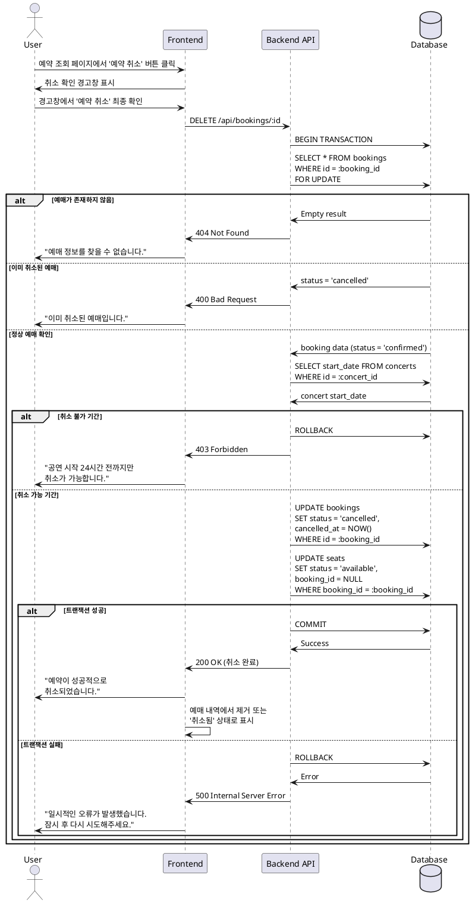

# 유스케이스 007: 예약 취소

## 1. 유스케이스 설명

사용자가 이전에 완료한 콘서트 예매를 조회한 후, 선택한 예매 건을 취소하고 해당 좌석을 다시 예매 가능 상태로 복원하는 기능입니다. 취소 가능 여부는 플랫폼의 환불 정책(예: 공연 24시간 전까지만 취소 가능)에 따라 결정되며, 취소가 완료되면 좌석은 즉시 다른 사용자가 예매할 수 있는 상태로 변경됩니다.

## 2. Primary Actor

- **User (예매자)**: 본인의 예매 내역을 조회하고 특정 예매를 취소하려는 사용자

## 3. Precondition

- 사용자가 예매 조회 페이지에서 본인의 예매 내역을 성공적으로 조회한 상태
- 조회된 예매 내역 중 취소하려는 예매 건의 상태가 'confirmed' (확정됨)
- 사용자가 예매 내역 배너에서 '예약 취소' 버튼을 볼 수 있는 상태

## 4. Trigger

- 사용자가 조회된 예매 내역 중 하나의 '예약 취소' 버튼을 클릭

## 5. Main Scenario

### 5.1 취소 요청 시작

1. 사용자가 예매 내역 배너에서 '예약 취소' 버튼을 클릭
2. 시스템이 취소 확인 경고창(Confirm Modal)을 표시
   - 경고창에는 취소할 예매 정보(콘서트명, 좌석, 금액 등)가 표시됨
   - "정말 취소하시겠습니까?" 메시지 표시

### 5.2 취소 확인

3. 사용자가 경고창에서 최종 '예약 취소' 버튼을 클릭
4. 시스템이 해당 예매 건의 고유 ID를 식별

### 5.3 취소 가능 여부 검증

5. 시스템이 플랫폼의 환불/취소 정책을 확인
   - 콘서트 시작 시간과 현재 시간을 비교
   - 취소 가능 기간(예: 공연 24시간 전까지) 내인지 검증

### 5.4 데이터베이스 트랜잭션 처리

6. 시스템이 데이터베이스 트랜잭션을 시작
7. `bookings` 테이블에서 해당 예매 레코드를 조회하고 락(FOR UPDATE)을 획득
8. 예매 상태를 'confirmed'에서 'cancelled'로 변경
9. 예매 레코드의 `cancelled_at` 필드에 현재 시간을 기록
10. `seats` 테이블에서 해당 예매와 연결된 모든 좌석을 조회
11. 좌석 상태를 'booked'에서 'available'로 변경
12. 좌석의 `booking_id` 필드를 NULL로 설정
13. 데이터베이스 트랜잭션을 커밋(Commit)

### 5.5 취소 완료 피드백

14. 시스템이 "예약이 성공적으로 취소되었습니다." 메시지를 표시
15. 예약 조회 페이지에서 해당 예매 내역 배너를 제거하거나 '취소된 예매' 상태로 표시 변경
16. 사용자는 예약 조회 페이지에 남아있거나 홈으로 이동 가능

## 6. Edge Cases

### 6.1 취소 불가 기간 (정책 위반)

- **상황**: 공연 시작 시간이 취소 가능 기간(예: 24시간) 이내로 임박한 경우
- **처리**:
  - 취소 요청을 거부
  - "죄송합니다. 공연 시작 24시간 전까지만 취소가 가능합니다." 메시지를 표시
  - 예매 상태는 변경되지 않음

### 6.2 이미 취소된 예매

- **상황**: 사용자가 동일한 예매 건에 대해 중복으로 취소 요청을 시도한 경우
- **처리**:
  - 예매 상태가 이미 'cancelled'임을 확인
  - "이미 취소된 예매입니다." 메시지를 표시
  - 추가 처리 없이 종료

### 6.3 데이터베이스 트랜잭션 실패

- **상황**: 취소 처리 중 데이터베이스 연결 오류, 락 타임아웃 등으로 트랜잭션 실패
- **처리**:
  - 트랜잭션을 롤백(Rollback)하여 데이터 불일치 방지
  - "일시적인 오류가 발생했습니다. 잠시 후 다시 시도해주세요." 메시지를 표시
  - 예매 및 좌석 상태는 원래 상태로 유지됨

### 6.4 동시 취소 요청 (Race Condition)

- **상황**: 동일한 예매 건에 대해 여러 요청이 동시에 들어온 경우
- **처리**:
  - FOR UPDATE 락을 통해 첫 번째 요청만 처리
  - 이후 요청은 "이미 처리 중인 요청입니다." 또는 "이미 취소된 예매입니다." 메시지 표시

### 6.5 존재하지 않는 예매 ID

- **상황**: 비정상적인 요청으로 존재하지 않는 예매 ID가 전달된 경우
- **처리**:
  - "예매 정보를 찾을 수 없습니다." 메시지를 표시
  - 예약 조회 페이지로 리다이렉트

## 7. Business Rules

### 7.1 취소 정책

- 공연 시작 시간 기준 24시간 전까지만 취소 가능
- 취소 가능 기간은 시스템 설정으로 관리되며, 콘서트별로 다른 정책 적용 가능

### 7.2 좌석 복원 정책

- 취소된 좌석은 즉시 'available' 상태로 변경되어 다른 사용자가 예매 가능
- 좌석 복원 시 예매자 정보(booking_id)는 완전히 제거됨

### 7.3 환불 정책

- 실제 결제가 구현된 경우, 취소 시점에 자동 환불 프로세스가 트리거되어야 함
- 현재 MVP에서는 예매 상태 변경만 처리

### 7.4 취소 이력 관리

- 취소된 예매는 'cancelled' 상태로 데이터베이스에 보존됨
- 취소 시간은 `cancelled_at` 필드에 기록되어 추후 분석 가능

### 7.5 데이터 무결성

- 예매 취소와 좌석 상태 변경은 하나의 트랜잭션으로 처리되어 원자성 보장
- 트랜잭션 실패 시 모든 변경사항이 롤백되어 데이터 일관성 유지

## 8. Sequence Diagram



## 9. API Specification

### 9.1 Endpoint

```
DELETE /api/bookings/:id
```

### 9.2 Request

**Path Parameters:**
- `id` (uuid, required): 취소할 예매의 고유 ID

**Headers:**
- `Content-Type: application/json`

**Body:** 없음

### 9.3 Response

**Success (200 OK):**
```json
{
  "success": true,
  "data": {
    "bookingId": "uuid",
    "status": "cancelled",
    "cancelledAt": "2025-10-14T10:30:00Z",
    "message": "예약이 성공적으로 취소되었습니다."
  }
}
```

**Error Responses:**

**404 Not Found:**
```json
{
  "success": false,
  "error": {
    "code": "BOOKING_NOT_FOUND",
    "message": "예매 정보를 찾을 수 없습니다."
  }
}
```

**400 Bad Request (이미 취소됨):**
```json
{
  "success": false,
  "error": {
    "code": "ALREADY_CANCELLED",
    "message": "이미 취소된 예매입니다."
  }
}
```

**403 Forbidden (취소 불가 기간):**
```json
{
  "success": false,
  "error": {
    "code": "CANCELLATION_NOT_ALLOWED",
    "message": "공연 시작 24시간 전까지만 취소가 가능합니다.",
    "details": {
      "concertStartTime": "2025-10-15T19:00:00Z",
      "cancellationDeadline": "2025-10-14T19:00:00Z"
    }
  }
}
```

**500 Internal Server Error:**
```json
{
  "success": false,
  "error": {
    "code": "INTERNAL_ERROR",
    "message": "일시적인 오류가 발생했습니다. 잠시 후 다시 시도해주세요."
  }
}
```

## 10. Non-Functional Requirements

### 10.1 Performance

- 취소 처리 응답 시간은 평균 500ms 이내
- 데이터베이스 트랜잭션 타임아웃은 5초로 설정
- 동시에 발생하는 취소 요청 간 충돌 방지를 위한 락 메커니즘 적용

### 10.2 Reliability

- 트랜잭션 원자성 보장: 예매 취소와 좌석 복원은 모두 성공하거나 모두 실패
- 시스템 장애 시 롤백을 통한 데이터 무결성 유지
- 취소 실패 시 사용자에게 명확한 오류 메시지 제공

### 10.3 Usability

- 사용자가 실수로 취소하는 것을 방지하기 위한 확인 경고창 제공
- 취소 불가 사유를 명확하게 안내
- 취소 완료 후 명확한 피드백 제공

### 10.4 Security

- 예매 ID를 통한 직접 접근 시, 해당 예매가 조회 요청한 사용자의 것인지 검증 필요
- 악의적인 대량 취소 요청 방지를 위한 Rate Limiting 적용
- 취소 로그를 기록하여 추후 감사(Audit) 가능

### 10.5 Maintainability

- 취소 정책(24시간 전까지)은 설정 파일이나 환경 변수로 관리
- 콘서트별 다른 취소 정책 적용 가능하도록 확장 가능한 구조
- 취소 이력이 데이터베이스에 보존되어 분석 및 통계 활용 가능
